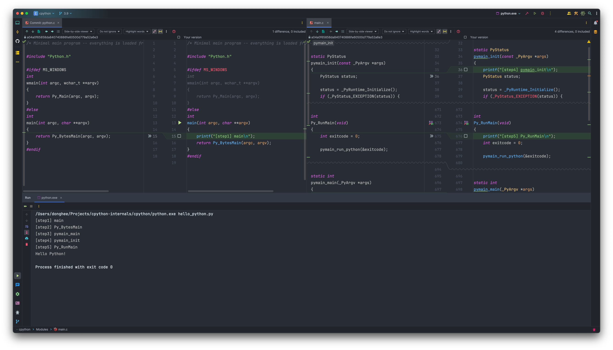
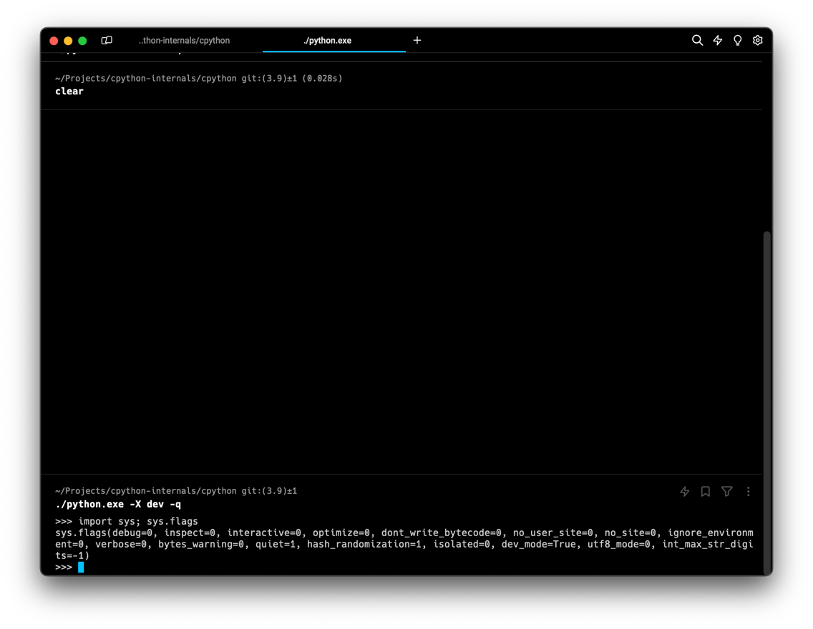
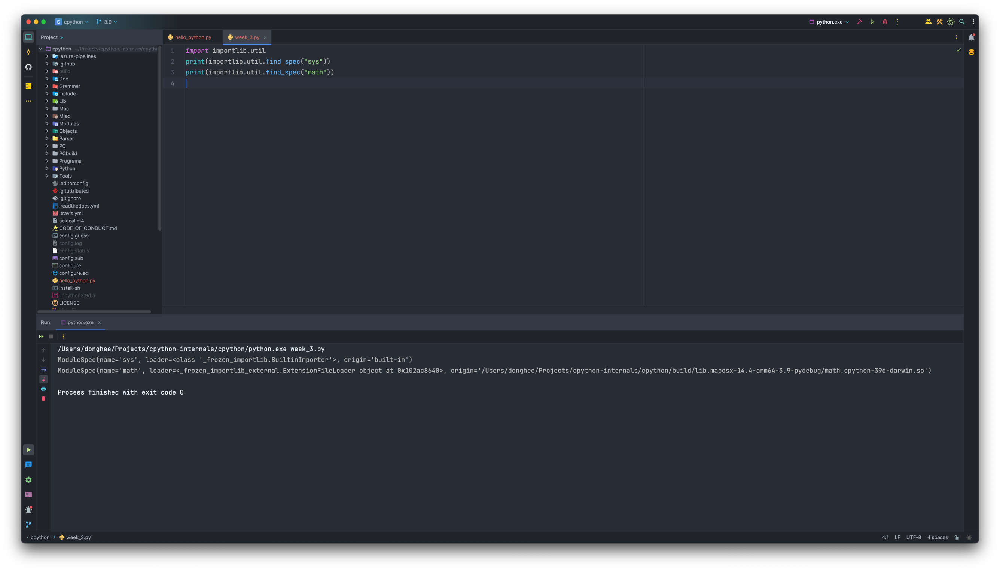

# 3주차

## [1] CPython 인터프리터 실행 과정 코드 레벨로 이해하기

<figure>
    
</figure>

## [2] 파이썬 세션에서 runtime flag 확인하기

<figure>
    
</figure>

## [3] `importlib.util.find_spec` 함수를 사용해서 원하는 모듈의 위치를 찾아보기

<figure>
    
</figure>