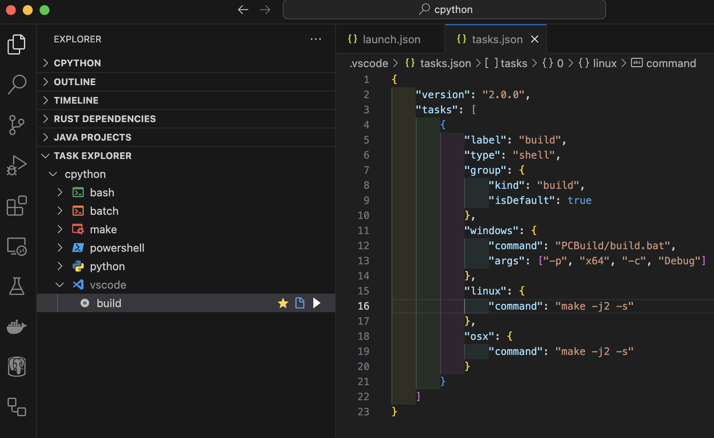

## CPython 소스코드 다운로드 및 환경 구성 (화면 캡쳐)

  

### 특이 사항
스터디 노션 환경 구성에 나온 정보대로 
git clone --branch 3.9 https://github.com/python/cpython
 
명령어만 사용하면 사이즈가 커서 RPC fail 에러 발생. 
그래서 뒤에 "--depth 1" 을 추가로 붙여 얕은 클론만 해둔 상태. 
필요한 경우 "git fetch --unshallow"로 다른 레포들도 갖고 와야 한다. 
*참고: https://eunjinii.tistory.com/128
  

## 스터디에서 이루고 싶은 목표, 함께 하게 된 소감 등
그동안 파이썬을 사용하면서 궁금했던 점들을 알아 가며 호기심을 해소할 수 있는 기회가 됐음 합니다!