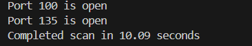

# 10주차

## Port Scanner: Multi Threading - 멀티스레딩 + 스레드 개수 제한
```python
import time
import socket
from concurrent.futures import ThreadPoolExecutor, as_completed

timeout = 1.0

def check_port(host: str, port: int) -> int:
    with socket.socket(socket.AF_INET, socket.SOCK_STREAM) as sock:
        sock.settimeout(timeout)
        result = sock.connect_ex((host, port))
        if result == 0:
            return port
    return None

def main():
    start = time.time()
    host = "localhost"  # Replace with a host you own
    open_ports = []
    
    with ThreadPoolExecutor(max_workers=10) as executor:
        futures = [executor.submit(check_port, host, port) for port in range(100, 200)]
        
        for future in as_completed(futures):
            port = future.result()
            if port is not None:
                open_ports.append(port)
    
    for port in open_ports:
        print(f"Port {port} is open")
    print(f"Completed scan in {time.time() - start:.2f} seconds")

if __name__ == '__main__':
    main()
```
<p align="center"></p>