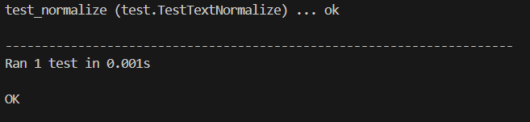

# 12주차

## unittest 사용해보기
```python
import unittest

def normalize(input_str):
    """
     인풋으로 받는 스트링에서 아래의 규칙으로 정규화된 스트링을 반환하는 함수입니다.
    * 모든 단어들은 소문자로 변환됨
    * 띄어쓰기는 한칸으로 되도록 함
    * 앞뒤 필요없는 띄어쓰기는 제거함
         Parameters:
             input_str (string): 영어로 된 대문자, 소문자, 띄어쓰기, 문장부호, 숫자로 이루어진 string
             ex - "   EXTRA   SPACE   "
         Returns:
             normalized_string (string): 정규회된 string
             ex - 'extra space'
         Examples:
             >>> import text_processing as tp
             >>> example = "   EXTRA   SPACE   "
             >>> tp.normalize(example)
             'extra space'
    """
    out = input_str.lower()
    out = out.strip()
    while '  ' in out:
        out = out.replace('  ', ' ')
    return out

class TestTextNormalize(unittest.TestCase):
    def test_normalize(self):
        test_str = "This is an example."
        pred = normalize(test_str)
        self.assertEqual(pred, "this is an example.")

        test_str = "   EXTRA   SPACE   "
        pred = normalize(test_str)
        self.assertEqual(pred, "extra space")

        test_str = "THIS IS ALL CAPS!!"
        pred = normalize(test_str)
        self.assertEqual(pred, "this is all caps!!")

        test_str = "                   "
        pred = normalize(test_str)
        self.assertEqual(pred, "")

        test_str = "this is all lower space..."
        pred = normalize(test_str)
        self.assertEqual(pred, "this is all lower space...")

        test_str = "  H  e  L    l   O   !"
        pred = normalize(test_str)
        self.assertEqual(pred, "h e l l o !")

        test_str = ""
        pred = normalize(test_str)
        self.assertEqual(pred, "")

        test_str = "........"
        pred = normalize(test_str)
        self.assertEqual(pred, "........")

        test_str = "EX  A M P     LE"
        pred = normalize(test_str)
        self.assertEqual(pred, "ex a m p le")

        test_str = "AbCd EfGh IjKl MnOp"
        pred = normalize(test_str)
        self.assertEqual(pred, "abcd efgh ijkl mnop")
```
<p align="center"></p>