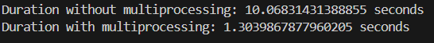

# 9주차

## 간단한 CPU-Bound Job을 만들고 멀티프로세싱을 적용한 코드와 아닌 코드를 작성해보기
```python
import time
import multiprocessing as mp

pool_size = 10

def cpu_task(a=1):
    time.sleep(1)

def no_multiprocessing_run():
    start_time = time.time()
    for _ in range(pool_size):
        cpu_task()
    end_time = time.time()
    print(f"Duration without multiprocessing: {end_time - start_time} seconds")

def multiprocessing_run():
    start_time = time.time()
    with mp.Pool(pool_size) as p:
        p.map(cpu_task, range(pool_size))
    end_time = time.time()
    print(f"Duration with multiprocessing: {end_time - start_time} seconds")

if __name__ == '__main__':
    no_multiprocessing_run()
    multiprocessing_run()
```
<p align="center"></p>