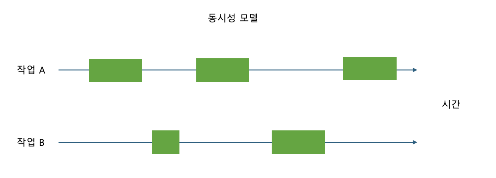
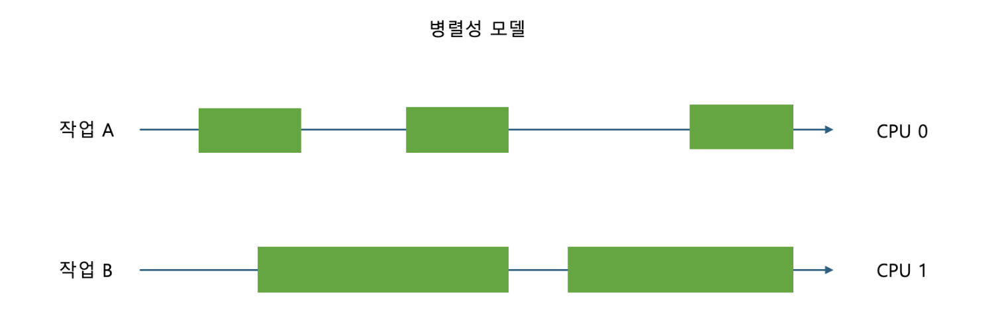

# 10. 병렬성과 동시성

## 개요

모든 운영체제의 핵심 기능은 실행 중인 프로세스를 관리하는 것이다.
모든 프로세스는 메모리와 CPU 같은 자원을 요청할 수 있다.

**프로세스는 작업 단위로 실행**되기 때문에 CPU에 자신이 사용할 시간을 요청한다.
이 요쳥을 받은 운영체제는 시간을 프로세스에 할당해주고 우선순위에 따라 스케줄링하며
어떤 프로세스가 CPU를 사용할지를 컨트롤한다.

동시성은 멀티태스킹 구현에 알맞은 해결책이긴 하지만
CPU를 나눠쓰기 때문에 한계가 있다.

때문에 여러 개의 코어 또는 CPU를 사용해 작업을 분산하는 방식으로
멀티태스킹을 수행하는 방법도 OS가 제공해준다.

즉, 컴퓨터는 병렬성과 동시성을 활용해 멀티태스킹을 처리한다.

- 병렬성 → CPU와 같은 연산 유닛들이 여러 개 필요
- 동시성 → 유휴 상태의 프로세스가 하나의 자원을 계속해서 차지하지 않도록 스케줄링 필요

## 병렬성과 동시성 모델

CPython은 병렬성과 동시성에 대해 다양한 접근 방식을 제공한다.
기본적으로 아래의 4가지 모델을 제공한다.

| 접근 방식      | 모델명          | 동시 실행 | 병렬 실행 |
| -------------- | --------------- | --------- | --------- |
| 쓰레딩         | threading       | O         | X         |
| 멀티프로세싱   | multiprocessing | O         | O         |
| 비동기         | asyncio         | O         | X         |
| 서브인터프리터 | subinterpreters | O         | O         |
