# 10.1 멀티 프로세스

## 프로세스 구조

CPython에서 프로세스에 대해 깊게 들어가보자.
CPython에서 프로세스는 컴파일된 CPython 인터프리터와 모듈로 구성된다.

즉, CPython에서 프로세스는 인터프리터이다 (프로세스 = 인터프리터)

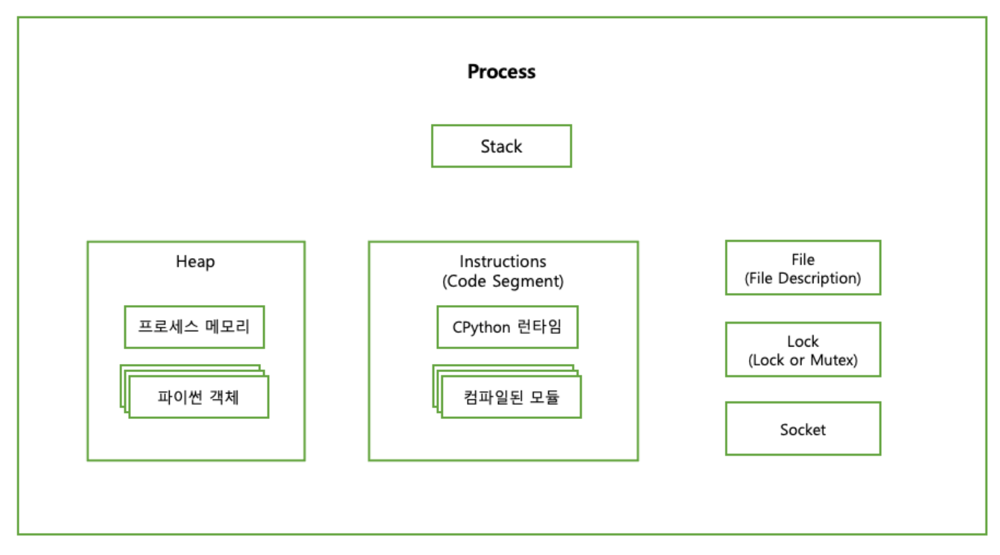

| 컴포넌트              | 설명                                                                                                                                                                 |
| --------------------- | -------------------------------------------------------------------------------------------------------------------------------------------------------------------- |
| 스택(Stack)           | 함수 호출, 지역 변수 및 제어 정보가 저장되는 메모리 영역                                                                                                             |
| 힙(Heap)              | 동적 메모리 할당에 사용되는 메모리 영역                                                                                                                              |
| 명령(Instructions)    | 운영체제가 파일 및 I/O 리소스에 접근하기 위해 사용하는 핸들, 프로세스가 파일을 읽거나 쓰기 위해 운영체제로부터 제공받아 사용                                         |
| 잠금(Lock 또는 Mutex) | 다중 쓰레드가 공유 자원에 동시에 접근하는 것을 제어하기 위해 사용되는 동기화 초기 값, Race Condition을 방지하기 위해 하나의 쓰레드만 자원에 접근 가능하도록 만들어줌 |
| 소켓(Socket)          | 네트워크 상 두 컴퓨터 간 통신 끝 점을 의미한다. TCP/IP 또는 UDP 통신과 같은 다양한 유형의 네트워크 통신에 사용                                                       |

위 컴포넌트들은 모두 인터프리터 상태의 구성요소이다.

프로세스는 시작되면 다음과 같은 항목들이 부여된다.

- 서브루틴 호출을 위한 메모리 스택(Stack)
- 힙(Heap)
- 파일이나 잠금(Lock) 또는 소켓(Socket) 접근 권한

그리고 컴퓨터의 CPU는 프로세스를 실행할 때 아래와 같은 추가 데이터가 필요하다.

- 프로그램 카운터(명령 포인터):
  - 프로그램 시퀸스의 어떤 명령을 실행 중인지 저장
- 프로그램 레지스터:
  - 실행 중인 명령이나, 명령을 실행하는 데 필요한 데이터를 보관

> 프로그램 카운터 : 현재 실행 중인 명령의 주소를 저장
> 프로그램 레지스터 : 현재 실행 중인 명령어와 관련된 데이터를 저장하고 처리

프로그램 레지스터와 프로그램 카운터는 프로세스에 저장된 명령 중 한 명령만 가리킨다.
즉, 한 번에 하나의 명령만 사용 가능하다.

이 방식은 CPython에서 아래와 같은 영향을 미친다.

- GIL(Global Interpreter Lock)
  - 한 번에 하나의 쓰레드만 파이썬의 바이트코드로 실행하도록 제한
  - 이는 멀티 쓰레딩 환경에서 동시 실행을 제한함
    단, I/O 바운드 작업은 GIL의 영향을 받지 않음 (파일 읽기/쓰기, 네트워크 통신 등…)
- 멀티코어 활용 부족
  - 멀티코어 환경에서 CPython의 GIL로 인해 효율적으로 코어를 사용하기는 어려움

때문에 파이썬에서 프로세스의 명령을 병렬로 실행하려면 아래의 2가지 방법을 사용할 수 있다.

1. 인터프리터 Fork (POSIX)

2. 새 인터프리터 프로세스 Spawn (POSIX/윈도우)

## 멀티프로세스를 활용한 병렬 실행

POSIX 시스템은 Fork API를 기본으로 제공한다.
때문에 어떤 프로세스든 이 API를 통해 자식 프로세스를 Fork 할 수 있다.

Fork 호출이 일어나면
현재 실행 중인 프로세스의 모든 Attribute를 복제해 새 프로세스를 생성한다.

이 때 부모의 힙과 레지스터, 카운터 위치도 새 프로세스로 복제된다.
즉, Fork로 생성한 프로세스는 복제 시점에서 부모 프로세스가 가지고 있는 모든 변수를 읽을 수 있다.

### POSIX에 프로세스 Fork 하기

화씨-섭씨 변환 프로그램을
순차적으로 값을 변환하는 방식에서
`fork()`를 이용해 자식 프로세스를 spawn하게 바꿔보자.

각 자식 프로세스는 fork 호출 뒤에서부터 실행을 이어나간다.

```c
#include <stdio.h>
#include <stdlib.h>
#include <unistd.h>

static const double five_ninths = 5.0/9.0;

double cesius(double fahrenheit) {
	return (fahrenheit - 32) * five_ninths;
}

int main(int argc, char** argv) {
	if (argc != 2)
		return -1;
	int number = atoi(argv[1]);
	for (int i = 1; i <= number; i++) {
		double f_value = 100 + (i * 10);

		pid_t child = fork();
		if (child == 0) {   // 자식 프로세스에서는 0이다.
			double c_value = celsius(f_value);
			printf("%f F is %f C (pid %d)\n", f_value, c_value, getpid());
		}
	}
	printf("Spawned %d processes from %d\n", number, getpid());
	return 0;
}
```

위 프로그램을 명령줄에서 실행하면 아래와 같은 결과가 출력된다.

```bash
$ ./thread_celsius 4
110.000000 F is 43.333333 C (pid 57179)
120.000000 F is 48.888889 C (pid 57180)
Spawned 4 processes from 57178
130.000000 F is 54.444444 C (pid 57181)
140.000000 F is 60.000000 C (pid 57182)

```

부모 프로세스(57178)가 자식 프로세스 4개를 spawn했다.
각 자식 프로세스는 `child = fork()` 이후부터 프로그램 실행을 이어 간다.
이때 `child`에는 `0`이 할당된다.

이후 계산을 완료하면 값을 출력한 후 프로세스를 종료한다.
마지막으로 부모 프로세스는 spawn한 프로세스 수와 자신의 PID를 출력한다.

Fork를 활용한 병렬 실행의 큰 단점은
자식 프로세스가 부모 프로세스의 완벽한 복제본이라는 점이다.

CPython의 경우 프로세스를 Fork 하면 2개 이상의 CPython 인터프리터가 실행되는 것과 같고
각 인터프리터가 모듈과 라이브러리를 따로 불러들이면서 상당한 오버헤드가 발생할 수 있다.

때문에 처리 중인 작업의 크기가
프로세스를 Fork할 때의 오버헤드보다 클 때 사용하는 것이 좋다

> 작업의 크기나 시간이 충분히 커서,
> 프로세스를 Fork 하는 데 드는 시간 비용보다
> 작업을 병렬로 처리하는 것이 더 효율적이라 판단될 때

<details>
<summary>연관된 소스 파일 목록</summary>
다음은 멀티프로세싱과 관련된 소스 파일 목록이다.

| 파일                        | 목적                                                            |
| --------------------------- | --------------------------------------------------------------- |
| Lib/multiprocessing         | multiprocessing 패키지의 파이썬 소스 파일                       |
| Modules/\_posixsubprocess.c | POSIX fork() 시스템 콜을 래핑하는 C 확장 모듈                   |
| Modules/\_winapi.c          | 윈도우 커널 API를 제공하는 C 확장 모듈                          |
| PC/msvcrtmodule.c           | 마이크로소프트 비주얼 C 런타임 라이브러리의 파이썬용 인터페이스 |

</details>

### Spawn과 Fork

파이썬의 `multiprocessing` 패키지는 아래의 3가지 병렬 프로세싱 방법을 제공한다.

1. 인터프리터 Fork (POSIX 전용)
2. 새 인터프리터 프로세스 Spawn (POSIX / 윈도우)
3. fork 서버를 실행한 후에 원하는 수 만큼의 프로세스를 fork (POSIX 전용)

> windows/macOS는 Spawn을 기본으로 사용하고 리눅스에서는 Fork를 사용한다.
> `multiprocessing.set_start_method()`를 사용해 변경할 수 있다.

**인터프리터 Fork (POSIX)**

기존 프로세스를 Fork 하여 새로운 프로세스를 생성
새 프로세스는 복제 시점에서 부모 프로세스와 완전히 동일함

> 부모 프로세스의 상태를 그대로 복제 → 동일한 인터프리터 상태로 시작

**새 인터프리터 프로세스 Spawn (POSIX/윈도우)**

새로운 인터프리터 프로세스를 생성하여 독립적인 메모리 공간에서 프로세스를 실행한다.
때문에 부모 프로세스와 독립적인 메모리 공간을 사용한다.

> 새로운 프로세스를 생성 → 초기화된 인터프리터로 시작

**Fork 서버를 실행한 후에 원하는 수 만큼의 프로세스를 Fork (POSIX)**

별도의 프로세스를 Fork 서버로 만들어 둔 후,
필요한 만큼의 프로세스를 이 서버를 통해 fork한다.

부모 프로세스가 아닌 별도의 서버 프로세스를 통해 Fork하는 방식이다.

Fork 서버를 통해 프로세스를 생성하기 때문에 메모리 효율성이 높아진다.
또한 여러 프로세스를 빠르게 생성할 수 있다.

```python
import multiprocessing as mp
import os

def to_celsius(f):
	c = (f - 32) * (5/9)
	pid = os.getpid()
	print(f"{f}F is {c}C (pid {pid})")

if __name__ == '__main__':
	mp.set_start_method('spawn')
	p = mp.Process(target=to_celsius, args=(110,))
	p.start()
```

`multiprocessing` API는 한 프로세스뿐 아니라 여러 개의 프로세스를 시작하고
프로세스에 데이터를 제공할 수 있는 편리한 방법들을 제공한다.
`Pool` 클래스도 그 중 하나이다.

아래는 spawn 방식으로 프로세스 4개를 생성하여 계산하는 예제이다.

```python
import multiprocessing as mp
import os

def to_celsius(f):
	c = (f - 32) * (5/9)
	pid = os.getpid()
	print(f"{f}F is {c}C (pid {pid})")

if __name__ == '__main__':
	mp.set_start_method('spawn')
	with mp.Pool(4) as pool:
		pool.map(to_celsius, range(110, 150, 10))
```

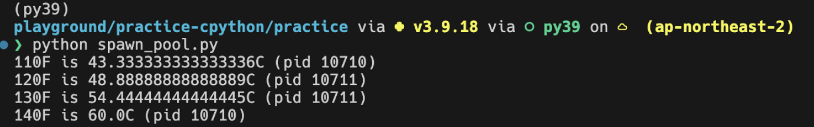

CPython 인터프리터는 상당한 오버헤드가 있기 때문에
`Pool` 은 각각의 프로세스를 Worker로 사용해서
작업이 완료된 프로세스를 재사용한다.

아래와 같이 Worker가 한 가지 작업만 수행하도록 아래와 같이 제한할 수도 있다.

```python
import multiprocessing as mp
import os

def to_celsius(f):
	c = (f - 32) * (5/9)
	pid = os.getpid()
	print(f"{f}F is {c}C (pid {pid})")

if __name__ == '__main__':
	mp.set_start_method('spawn')
	with mp.Pool(4, maxtasksperchild=1) as pool:
		pool.map(to_celsius, range(110, 150, 10))
```

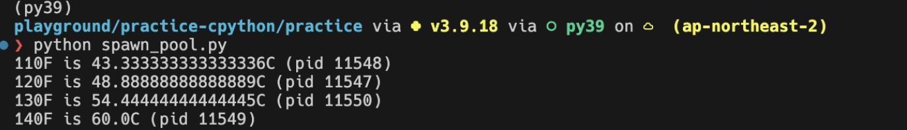

→ 재사용 기준

### 자식 프로세스의 생성 과정

```python
import multiprocessing as mp
import os

def to_celsius(f):
	c = (f - 32) * (5/9)
	pid = os.getpid()
	print(f"{f}F is {c}C (pid {pid})")

if __name__ == '__main__':
	mp.set_start_method('spawn')
	with mp.Pool(4, maxtasksperchild=1) as pool:
	  # 이 부분이 pickle을 통한 데이터 전송이 이루어지는 부분
		pool.map(to_celsius, range(110, 150, 10))
```

위 예제에서는 부모 프로세스에서 존재하는 데이터를 `pool.map` 을 통해
자식에게 `pickle` 형태로 전달한다.

즉, `map` 메소드 호출 시 자동으로 `pickle` 을 통한 자식 프로세스로의 데이터 전송이 된다는 것이다.

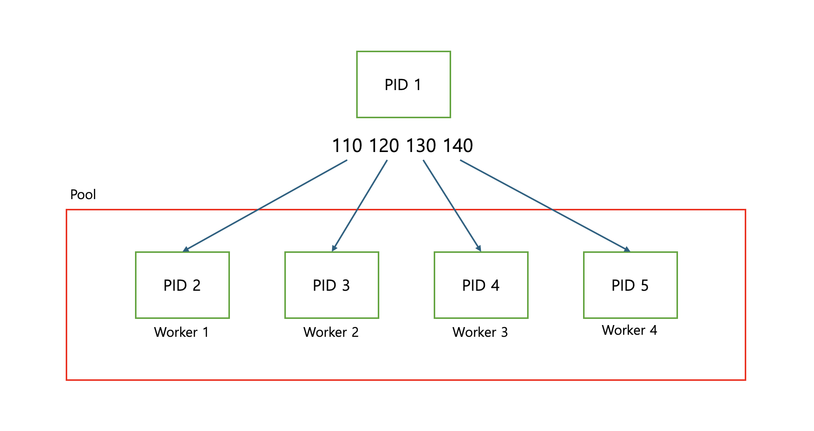

### Pipe로 자식 프로세스에 데이터 전송하기

OS가 자식 프로세스를 생성하면 생성된 프로세스는
부모 프로세스의 초기화 데이터를 먼저 기다린다.

자식 프로세스가 가장 먼저 기다리게 될 초기화 데이터는 아래와 같다.

1. 준비 데이터(Preparation Data) 객체

- 실행 디렉터리, 시작 방법, 명령줄 인자 등과 같은 부모 프로세스의 정보를 일부 담고 있는 딕셔너리
  ```python
  >>> import multiprocessing.spawn
  >>> import pprint
  >>> pprint.pprint(multiprocessing.spawn.get_preparation_data("example"))
  {'authkey': b'\x1b\x7f\x80\xa8\xc5\x03\xed# \xeb;\xb6\x15~\xae\xd0\xf4\x97:\xb5'
              b'w\x1a\x02\xce\xb29\xdd\x18\x0bx\xc8\xbe',
   'dir': '/Users/wooy0ng/Desktop/playground/practice-cpython/practice',
   'log_to_stderr': False,
   'name': 'example',
   'orig_dir': '/Users/wooy0ng/Desktop/playground/practice-cpython/practice',
   'start_method': 'spawn',
   'sys_argv': [''],
  ```

2. `BaseProcess` 의 자식 클래스 인스턴스

- 호출 방식과 운영 체제에 따라 아래의 `BaseProcess` 의 자식 클래스 중 하나를 인스턴스화 한다
  - POSIX: `ForkProcess` 클래스를 인스턴스화한다.
  - 윈도우: `SpawnProcess` 클래스를 인스턴스화한다.

위 2개의 초기화 데이터는 모두 `pickle` 로 직렬화되어
부모 프로세스의 파이프 스트림으로 전송된다.

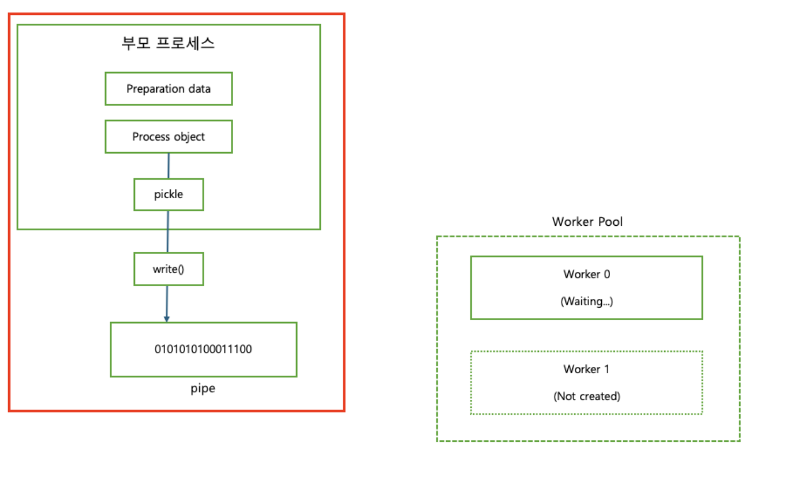

여기까지 정리하자면, 초기화 과정은 다음과 같이 정리할 수 있다.

1. 자식 프로세스를 생성한다. (Spawn 또는 Fork 방식으로)
2. 자식 프로세스는 부모 프로세스로부터 준비 데이터 객체, BaseProcess의 자식 클래스 인스턴스를 받는다.

   → 자식 프로세스는 부모로부터 초기화 데이터를 `pickle` 형태로 Pipe를 통해 전달받는다.

3. 초기화된 자식 프로세스는 준비 상태가 되며,
   언제든지 부모로부터 작업 인자(함수의 인자)를 받을 준비를 한다.

---

## 자식 프로세스 실행하기

자식 프로세스의 실행은 시작점인 `multiprocessing.spawn.spawn_main()` 로부터 시작된다.

(인자로 **pipe_handle** 과 **parent_pid**(window 일 경우), **tracked_fd**(posix 일 경우)를 받는다.)

**multiprocessing/spawn.py**

```python
def spawn_main(pipe_handle, parent_pid=None, tracker_fd=None):
    '''
    Run code specified by data received over pipe
    '''
    assert is_forking(sys.argv), "Not forking"
    if sys.platform == 'win32':
        import msvcrt
        import _winapi

        if parent_pid is not None:
            source_process = _winapi.OpenProcess(
                _winapi.SYNCHRONIZE | _winapi.PROCESS_DUP_HANDLE,
                False, parent_pid)
        else:
            source_process = None
        new_handle = reduction.duplicate(pipe_handle,
                                         source_process=source_process)


        fd = msvcrt.open_osfhandle(new_handle, os.O_RDONLY)
        parent_sentinel = source_process


    else:
        from . import resource_tracker
        resource_tracker._resource_tracker._fd = tracker_fd

        fd = pipe_handle
        parent_sentinel = os.dup(pipe_handle)


    exitcode = _main(fd, parent_sentinel)
    sys.exit(exitcode) # 반환 값을 프로세스의 종료 코드로 사용하고 인터프리터를 종료
```

이 함수는 fd, parent_sentinel 를 인자로 넘겨 `_main`을 호출하고 반환 값을 프로세스의 종료 코드로 사용한 후 인터프리터를 종료하는 함수이다.

`_main`은 fd 바이트 스트림의 이진 데이터를 역직렬화 하는 함수이다.

**fd:** 직렬화된 이진 데이터를 읽기 위한 `파일 디스크립터`

**parent_sentinel:** 자식 프로세스가 실행되는 도중 부모 프로세스가 종료됐는 지 감시하는 부모 프로세스 감시자 역할, `프로세스 핸들` 혹은 `파일 디스크립터`

두 시스템에서 **parent_sentinel 구현이** **system platform**에 따라 구현이 다른 것을 알 수 있다. 이는 각 시스템의 프로세스를 핸들링 하는 방식이 다르기 때문이다.

이번엔 `_main` 함수에 대해 자세히 알아보자.


가장 먼저 들어오는 데이터는 준비 데이터를 담고 있는 `dict`다. 그 다음으로 들어오는 건 `SpawnProcess` 인스턴스인데 이후 이 인스턴스의 `_bootstrap()`을 호출한다.

**multiprocessing/spawn.py**

```python
def _main(fd, parent_sentinel):
    with os.fdopen(fd, 'rb', closefd=True) as from_parent:
        process.current_process()._inheriting = True
        try:
            preparation_data = reduction.pickle.load(from_parent)
            prepare(preparation_data)
            self = reduction.pickle.load(from_parent)
        finally:
            del process.current_process()._inheriting
    return self._bootstrap(parent_sentinel)
```

`_bootstrap()`은 역직렬화된 데이터로부터 `BaseProcess` 인스턴스를 생성하고 마지막으로 `BaseProcess.run()`으로 실행 대상 함수를 주어진 인자와 함께 호출한다.

```python
def run(self):
    '''
    Method to be run in sub-process; can be overridden in sub-class
    '''
    if self._target:
        self._target(*self._args, **self._kwargs)
```

(표준 run() 메소드는 객체의 생성자에 target 인자로 전달된 콜러블 객체를 호출하는데 *args* 와 *kwargs* 인자를 각각 위치 인자와 키워드 인자로 사용합니다.)

이후 `self._bootstrap()`이 반환한 종료 코드가 종료 코드로 설정되고 자식 프로세스는 종료된다.

부모 프로세스는 이러한 과정을 통해 모듈과 실행할 함수를 직렬화하고 자식 프로세스도 이 과정을 통해 전송된 인스턴스를 역직렬화하고 함수를 인자와 함께 호출하고 반환한다.

자식 프로세스가 시작되면 더 이상 이렇게 데이터를 교환할 수 없다. 자식 프로세스가 시작된 이후에는 `Queue`와 `Pipe`를 확장한 객체를 이용해 데이터를 교체한다.

프로세스를 풀에서 생성한 경우라면 생성된 첫번째 프로세스는 준비가 완료된 후 대기 상태로 들어가고 부모 프로세스는 이러한 과정을 반복하며 다음 워커에게 데이터를 전송한다.

다음 워커는 데이터를 전달 받은 후 자신의 상태를 초기화하고 실행 대상 함수를 실행한다.

(초기화 후에는 어떤 데이터든 큐와 파이프로만 교환할 수 있다.)

## 큐와 파이프를 사용해 데이터 교환하기

지금까지 자식 프로세스를 스폰하는 방법과 파이프를 직렬화 스트림으로 사용하여 자식 프로세스에 실행할 함수와 그 인자를 전달하는 방법에 대해 알아보았다.

프로세스 간 통신에는 작업 특성에 따라 `큐와 파이프` 두 가지 방법을 사용할 수 있다. 큐와 파이프에 대해 자세히 알아보기 전에 운영체제가 `세마포어`라는 변수를 사용하여 자원을 적절하지 못한 접근으로부터 보호하는 방법에 대해 알아보자.

### 세마포어

다양한 멀티프로세싱 메커니즘들이 자원이 잠겼거나 대기 중이거나 잠기지 않았다는 신호를 보내는 방법으로 세마포어를 사용한다. 운영 체제는 파일과 소켓 등 자원을 잠그기 위한 단순한 가변 타입으로 `이진 세마포어`를 사용한다.

한 프로세스가 파일이나 네트워크 소켓에 쓰고 있을 때, 다른 프로세스가 같은 파일에 쓰기 시작하면 데이터가 바로 손상된다. 이를 방지하기 위해 세마포어를 사용해 잠근다.

### **세마포어의 정의와 작동 방식**

- **P 연산 (acquire 또는 wait)**: 세마포어의 값을 감소시키는 연산이다. 만약 세마포어의 값이 0이면 (즉, 자원이 모두 사용 중이면), 프로세스는 세마포어가 0보다 커질 때까지 (자원이 해제될 때까지) 대기한다.
  ```c
  p(sem) {
  	while sem=0 do wait;
      sem--;
  }
  ```
- **V 연산 (release 또는 signal)**: 세마포어의 값을 증가시키는 연산이다. 이 연산은 다른 프로세스들이 자원을 사용할 수 있도록 세마포어 값을 증가시킨다.
  ```c
  v(sem) {
  	sem++;
  	if (대기중인 프로세스가 있다면)
      	대기 중인 첫 번째 프로세스 동작시킴
  }
  ```

세마포어는 **스레드 안정성과 프로세스 안정성을 모두 보장**하기 때문에 Cpython은 멀티프로세싱에 세마포어를 사용한다. 동일한 세마포어에 대한 잠재적인 읽기 또는 쓰기 데드락은 운영체제가 처리한다.

이러한 세마포어 API 구현은 C 확장 모듈 `Module/_multiprocessing/semaphore.c`에서 찾을 수 있다.

이 확장 모듈은 세마포어를 생성, 잠금, 해제할 수 있는 통일된 인터페이스를 제공한다.

운영체제 세마포어 API 호출은 운영 체제에 따라 다른 구현으로 컴파일되는 일련의 매크로를 통해 이루어진다.

윈도우에서는 <winbase.h> API 함수들이 매크로에 사용된다.

```c
#define SEM_CREATE(name, val, max) CreateSemaphore(NULL, val, max, NULL)
#define SEM_CLOSE(sem) (CloseHandle(sem) ? 0 : -1)
#define SEM_GETVALUE(sem, pval) _GetSemaphoreValue(sem, pval)
#define SEM_UNLINK(name) 0
```

posix에서는 <semaphore.h> API들이 사용된다.

```c
#define SEM_CREATE(name, val, max) sem_open(name, O_CREAT | O_EXCL, 0600, val)
#define SEM_CLOSE(sem) sem_close(sem)
#define SEM_GETVALUE(sem, pval) sem_getvalue(sem, pval)
#define SEM_UNLINK(name) sem_unlink(name)
```

## Queue

큐는 여러 프로세스 간에 작은 데이터를 주고받기 좋은 방법이다.

이전에도 사용한 멀티프로세싱 예제에 `multiprocessing.Manager()` 인스턴스와 두 개의 큐를 적용해 보자.

1. `inputs`로 화씨 데이터를 입력
2. `outputs`로 변환된 섭씨 데이터를 출력

두 개의 워커를 사용할 수 있도록 풀 크기를 2로 변경하자.

```python
import multiprocessing as mp
def to_celsius(input: mp.Queue, output: mp.Queue):
    f = input.get()
    # Time-consuming task ...
    c = (f - 32) * (5/9)
    output.put(c)

if __name__ == '__main__':
    mp.set_start_method('spawn')
    pool_manager = mp.Manager()
    with mp.Pool(2) as pool:
        inputs = pool_manager.Queue()
        outputs = pool_manager.Queue()
        input_values = list(range(110, 150, 10)) # [110, 120, 130, 140]
        for i in input_values:
            inputs.put(i)
            pool.apply(to_celsius, (inputs, outputs))
        for f in input_values:
            print(outputs.get(block=False))
```

실행하면 `outputs` 큐에서 반환된 튜플의 리스트를 출력한다.

```python
# output
43.333333333333336
48.88888888888889
54.44444444444445
60.0
```

먼저 부모 프로세스가 `inputs` 큐에 입력값을 삽입하면 첫 번째 워커가 큐에서 객체를 꺼낸다. `.get`을 사용해 큐에서 객체를 꺼낼 때 큐 객체는 세마포어 잠금을 사용한다.

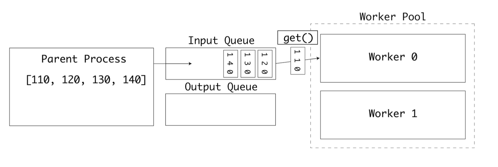

첫번째 워커가 작업 중이라면 두번째 워커가 큐에서 다음 값을 꺼낸다

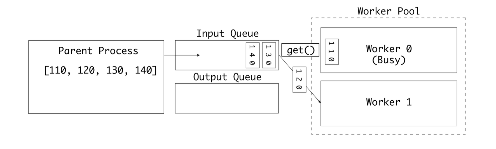

첫번째 워커는 계산을 완료하고 결과를 outputs 큐에 삽입한다.

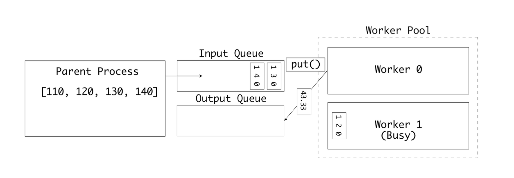

두 큐는 각각 출력과 입력을 위해 사용된다. 최종적으로는 모든 입력값이 처리되고 `outputs` 큐가 가득채워진다. 이후 부모 프로세스가 결괏값들을 출력한다.

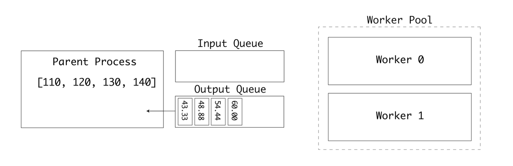

이 예제를 통해 워커 풀이 큐에서 불연속적으로 수신한 작은 값들을 `병렬로 처리한 후` 그 결과를 호스트 프로세스로 전송하는 방법에 대해 알아보았다.

화씨-섭씨 변환은 사실 병렬 실행에 적합하다고 볼 수 없는 작고 사소한 연산 작업이다. 워커 프로세스가 cpu 집약적인 연산을 수행하는 경우라면 멀티 cpu 또는 멀티코어 컴퓨터에서 큰 성능 향상을 얻을 수 있을 것이다.

### 파이프

`multiprocessing` 패키지는 `Pipe` 타입을 제공한다. 파이프를 인스턴스화하면 부모 쪽 연결과 자식 쪽 연결, 두 개의 연결이 반환된다. 두 연결 모두 데이터를 보낼 수도, 받을 수도 있다.

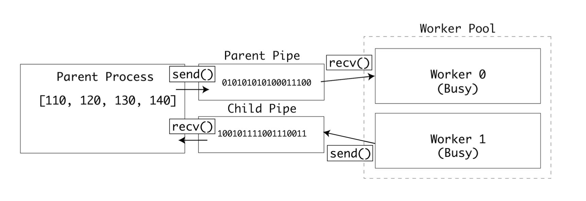

예제에 파이프를 적용하려면 `pool.apply()`를 `pool.apply_async()`로 변경해야 한다. 변경하면 다음 프로세스가 논블로킹으로 실행된다.

```python
import multiprocessing as mp

def to_celsius(child_pipe):
    f = child_pipe.recv()
    # Time-consuming task ...
    c = (f - 32) * (5 / 9)
    child_pipe.send(c)

if __name__ == '__main__':
    mp.set_start_method('spawn')
    pool_manager = mp.Manager()
    with mp.Pool(2) as pool:
        parent_pipe, child_pipe = mp.Pipe()
        results = []
        for input in range(110, 150, 10):
            parent_pipe.send(input)
            results.append(pool.apply_async(to_celsius,
                                            args=(child_pipe,)))
            print(results)
            print("Got {0:.2f}".format(parent_pipe.recv()))
        parent_pipe.close()
        child_pipe.close()
```

이 줄에서는 여러 프로세스가 동시에 부모 파이프에서 값을 읽어 버릴 수도 있다.

`f = child_pipe.recv()`

또한 이 줄에서는 여러 프로세스가 동시에 자식 파이프에 값을 써 버릴 수도 있다.

`child_pipe.send(c)`

이런 위험상황이 실제로 발생하면 데이터 교환 중에 데이터가 손상될 것이다.

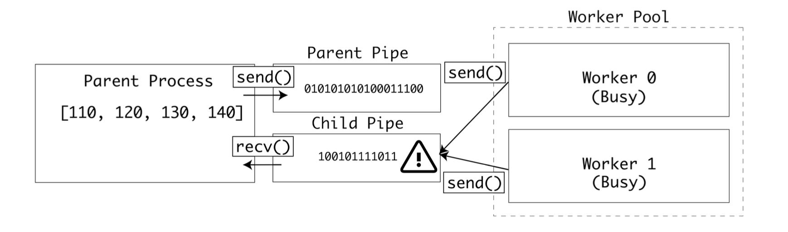

이런 상황을 막기 위해 운영 체제의 세마포어 잠금을 적용하면 모든 자식 프로세스는 똑같은 파이프에 쓰거나 읽을 때 잠금을 확인한다.

잠금이 필요한 부분은 두 곳이다. 하나는 부모 파이프에서 값을 읽는 부분이고 다른 하나는 자식 파이프에 값을 쓰는 부분이다.

```python
import multiprocessing as mp

def to_celsius(child_pipe: mp.Pipe, child_lock: mp.Lock):
    child_lock.acquire(blocking=False)
    try:
        f = child_pipe.recv()
    finally:
        child_lock.release()

    # Time-consuming task ... release lock before processing
    c = (f - 32) * (5/9)

    # Reacquire lock when done
    child_lock.acquire(blocking=False)
    try:
        child_pipe.send(c)
    finally:
        child_lock.release()

if __name__ == '__main__':
    mp.set_start_method('spawn')
    pool_manager = mp.Manager()
    with mp.Pool(2) as pool:
        parent_pipe, child_pipe = mp.Pipe()
        child_lock = pool_manager.Lock()
        results = []
        for i in range(110, 150, 10):
            parent_pipe.send(i)
            results.append(pool.apply_async(to_celsius, args=(child_pipe, child_lock)))

        for result in results:
            print(parent_pipe.recv())

        parent_pipe.close()
        child_pipe.close()
```

이제 자식 프로세스는 데이터를 읽기 전과 쓰기 전에 `잠금을 기다린다`.

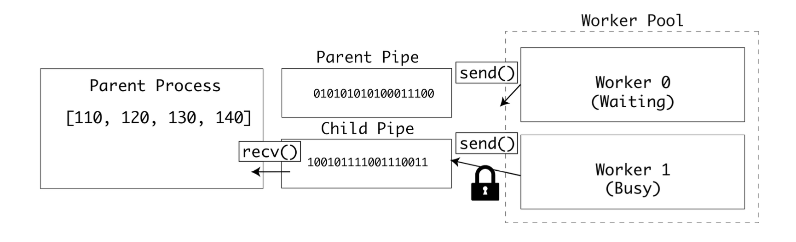

큰 데이터를 전송할수록 충돌 가능성이 높아지기 때문에 이 예제는 큰 데이터를 파이프로 전송하는 상황에 적합하다.

### 프로세스간 공유 상태

지금까지는 부모와 자식 프로세스 간에 데이터를 주고받는 방법에 대해 알아봤지만 자식 프로세스끼리 데이터를 주고받아야 하는 경우도 분명 있다. 이런 경우에 `multiprocessing` 패키지는 두가지 방법을 제공한다.

1. 고성능 공유 메모리 API: 공유 메모리 맵과 공유 C타입을 사용
2. 유연한 서버 프로세스 API: Manager 클래스를 통해 복잡한 타입들을 지원한다.

### 애플리케이션 예제

지금부터 이번 장이 끝날 때까지 TCP 포트 스캐너 예제를 리팩터링해가며 다양한 `동시성 및 병렬성` 기법을 사용해 볼 것이다.

네트워크에서는 호스트는 포트에 연결되며 포트번호는 1부터 65535번 까지 제공된다. 표준적인 서비스에는 표준포트가 제공되는데, 예를들어 HTTP는 80번포트에서 작동하고 HTTPS는 443번에서 실행된다. TCP 포트 스캐너는 네트워크로 패킷을 전송할 수 있는지 확인하는 일반적인 네트워크 테스트 도구이다.

이 코드 예제는 멀티프로세싱 예제에서 사용했던 것과 비슷한 스레드 안전한 큐인 `Queue` 인터페이스를 사용하고, `socket` 패키지를 사용해 원격 포트에 **1초 타임아웃**으로 연결을 시도한다.

`check_port()`는 host가 주어진 port에서 응답하는 지 확인한다. 응답할 경우 check_port()는 포트번호를 results 큐에 추가한다.

스크립트는 실행되면 80번 포트부터 100번 포트까지 `check_port()`를 호출하고, 작업이 완료되면 result 큐를 비운 후 결과를 명령줄에 출력한다. 또한 방식별 차이를 확인할 수 있도록 실행에 걸린 시간을 출력한다.

```python
from queue import Queue import socket
import time
timeout = 1.0

def check_port(host: str, port: int, results: Queue):
	sock = socket.socket(socket.AF_INET, socket.SOCK_STREAM)
	sock.settimeout(timeout)
	result = sock.connect_ex((host, port))
	if result == 0:
	        results.put(port)
	sock.close()


if __name__ == '__main__':
	start = time.time()
	host = "localhost" # Replace with a host you own
	results = Queue()
	for port in range(80, 100):
		check_port(host, port, results)
	while not results.empty():
		print("Port {0} is open".format(results.get()))
	print("Completed scan in {0} seconds".format(time.time() - start))
```

실행해 보면 열려있는 포트와 실행된 시간이 출력된다.

```python
Completed scan in 0.008177042007446289 seconds
```

멀티 프로세싱을 사용하여 Queue 인터페이스를 `multiprocessing.Queue`로 바꾸고 풀 실행기로 포트 스캔을 실행하도록 리팩터링해보자.

```python
import multiprocessing as mp
import socket
import time
timeout = 1.0
def check_port(host: str, port: int, results: mp.Queue):
    sock = socket.socket(socket.AF_INET, socket.SOCK_STREAM)
    sock.settimeout(timeout)
    result = sock.connect_ex((host, port))
    if result == 0:
        results.put(port)
    #time.sleep(1)
    sock.close()


if __name__ == '__main__':
    start = time.time()
    processes = []
    scan_range = range(80, 100)
    host = "localhost"
    mp.set_start_method('spawn')
    pool_manager = mp.Manager()
    with mp.Pool(len(scan_range)) as pool:
        outputs = pool_manager.Queue()
        for port in scan_range:
            processes.append(pool.apply_async(check_port, (host,
port, outputs)))
        for process in processes:
            process.get()
        while not outputs.empty():
            print("Port {0} is open.".format(outputs.get()))
        print("Completed scan in {0} seconds".format(time.time() -
start))
```

기대했던 것처럼 여러 포트를 병렬로 테스트해 속도가 빨라진다.

```python
Completed scan in 19.171173786407470703 seconds
```

## 멀티프로세싱 요약

멀티프로세싱은 확장 가능한 파이썬용 `병렬 실행` API를 제공한다. 프로세스 간에 데이터를 공유할 수도 있고 CPU 집약적인 작업을 병렬작업으로 쪼개서 멀티 코어 또는 멀티 CPU 컴퓨터의 장점을 활용할 수도 있다.

`CPU 집약적인 작업`이 아닌 `I/O 집약적인 작업`의 경우에는 멀티프로세싱이 적합하지 않다.

예를들어 워커 프로세스 4개를 스폰하고 같은 파일을 읽고 쓰는 경우(IO Bound Job), 한 프로세스가 작업하고 있는 동안 나머지 프로세스 3개는 잠금이 해제 되기를 기다려야 한다.

또한 멀티프로세싱은 새로운 파이썬 인터프리터를 시작하는 데 필요한 시간과 처리 오버헤드로 인해 짧은 작업에는 그다지 적합하지 않다.

I/O 작업과 짧은 작업의 시나리오에 대해서는 다음 장에 알아볼 멀티 쓰레딩(`thread 모듈`) 방법이 적합하다.

(GIL: 한 시점에 단 하나의 스레드만이 파이썬 객체에 접근하도록 허용하는 메커니즘)

(한 스레드가 I/O 작업 중에는 GIL이 해제되고 다른 스레드가 CPU시간을 사용하므로 효율적)

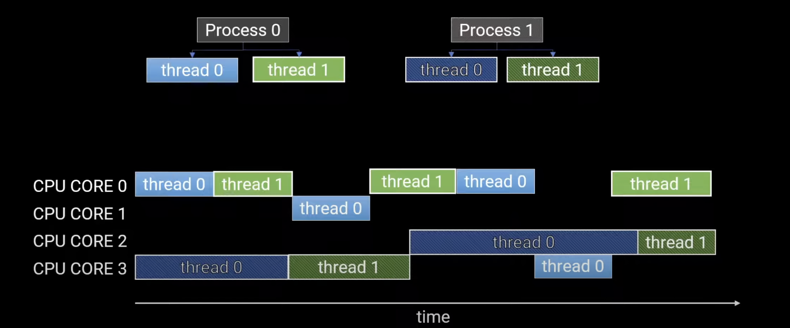
