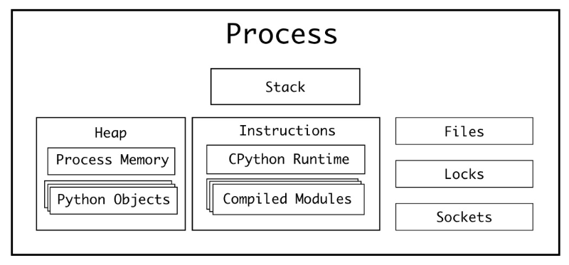
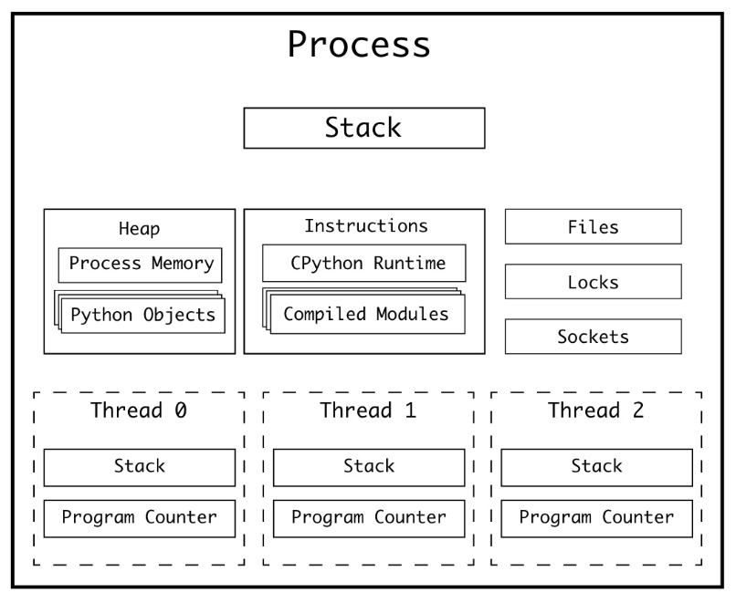
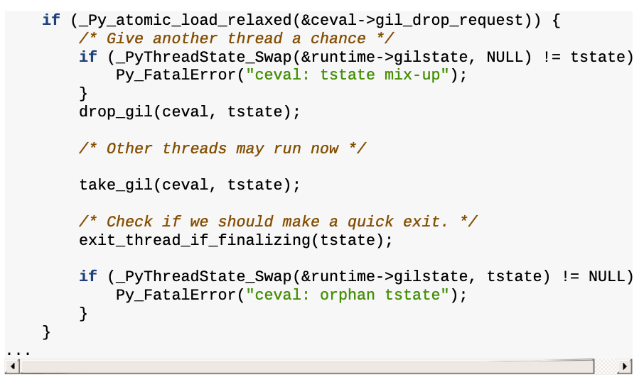
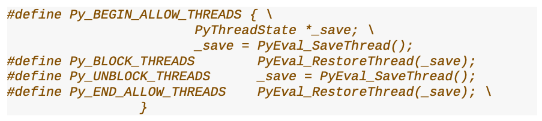
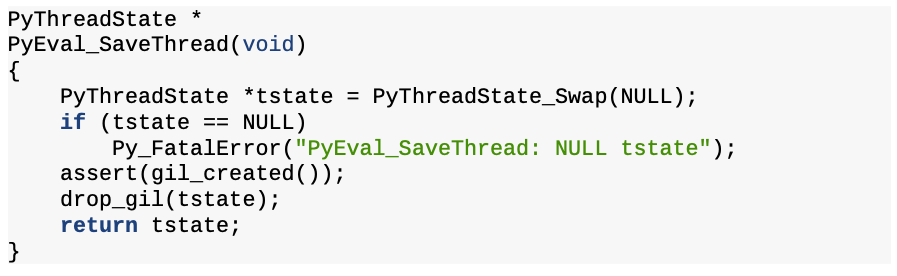
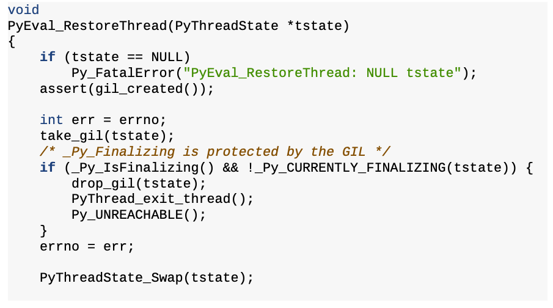
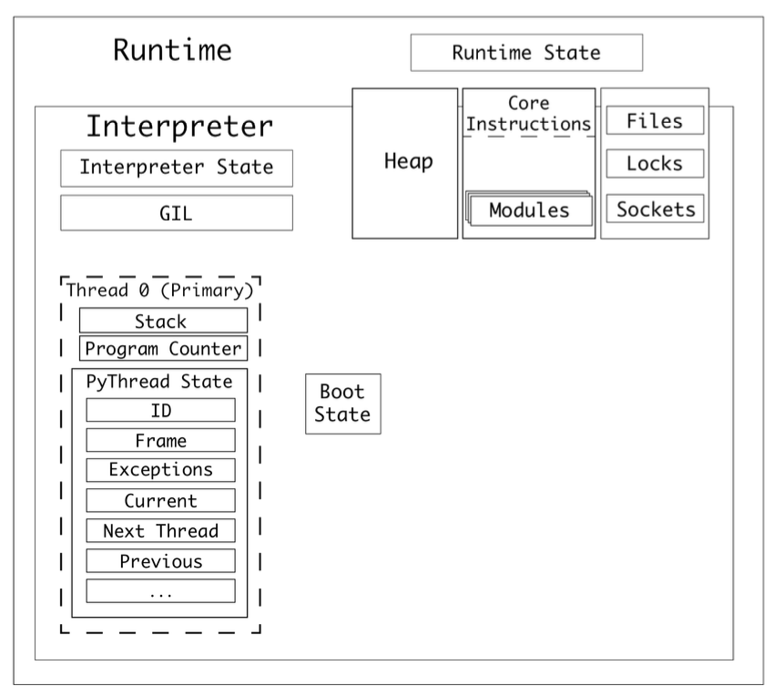
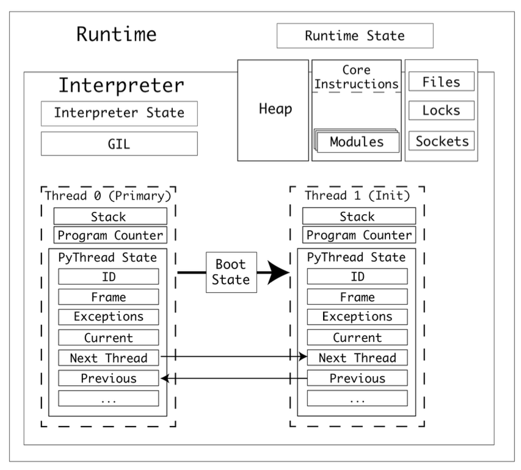
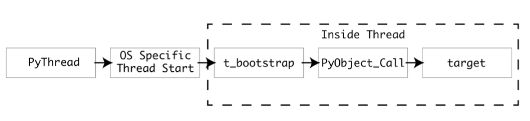

# 스레드

## 1. 파이썬에서의 단일 프로세스와 멀티 스레딩

### 1.1 Process (remind)



프로세스는 “데이터를 이용해서 명령어를 수행”하는 역할을 한다. 따라서, “데이터”와 “명령어”는 중요하다. 또한, 명령을 수행할 때, 외부 I/O (파일 시스템 or 소켓 통신)가 필요할 수도 있다. 추가로, 여러개의 프로세스가 동시에 동작할 수도 있으니 작업의 우선 순위를 위한 장치도 필요할 것이다. 이를 정리하면 다음과 같다.

- 데이터 ⇒ 여러 메모리 공간에 나눠서 저장됨: stack, heap
- 명령어 ⇒ Instructions (메모리 영역 관점에서는 data가 여기에 들어갈 것으로 보임. 정확하게는 모르겠음.)
- 외부 I/O ⇒ Files, Sockets
- 작업의 우선 순위를 위한 장치 ⇒ Locks

추가로 알아야 할 것은, 레지스터다. 레지스터는 정말 빠른 메모리 장치인데, 그 크기가 매우 작다. 대신, 프로세스 수행에 매우 중요한 정보를 가지고 있다

- instruction pointer (or program counter): 어디까지 instruction을 수행했는지에 대한 정보. 정확히는 현재 실행중인 instruction의 메모리 주소를 가리킴.

여기서 우리가 알 수 있는 것은, 프로세스는 1개의 instruction pointer를 갖는다는 것이다. 즉, 프로세스는 하나의 명령만 수행한다는 것이다. CPython 맥락에서 얘기해보면, only one Python bytecode instruction can be executing at a given time 이라는 것이다.

### 1.2 Multi Threading



단일 프로세스의 단점(=program counter가 1개임)을 극복하기 위해, OS는 멀티스레딩을 지원하기 시작했다. 1개의 프로세스 내에 존재하는 여러개의 스레드들은, 각각 Program Counter와 Stack을 갖는다.

- Program Counter (remind): 현재 실행중인 명령어의 주소
- Stack: 명령어를 수행할 때 필요한 메모리 공간

즉, 구조적으로 “여러개의 명령어를 수행”할 수 있게 된 것이다👍🏻

다만, 조심해야 할 점이 있다. 바로, race condition이다. Race condition이란, 여러개의 작업자가 특정 메모리에 동시에 접근하는 상황을 의미하는데, 이렇게 되면 여러가지 예상하지 못한 일이 발생할 수 있다. 사칙연산이 의도대로 되지 않는다거나, 파일에 10개의 라인을 적었는데 8개만 적혔다거나 등등이다. 참고로, 멀티스레딩 환경에서의 race condition을 방지하는 것을 “thread safety를 보장한다” 라고 말한다. 주로 thread safety는 동일한 메모리 주소에 접근하는 것을 제한하는 방법인, Lock을 통해 해결한다.

## 2. GIL (Global Interpreter Lock)

> *The Python interpreter is not fully thread-safe. In order to support multi-threaded Python programs, there’s a global lock, called the global interpreter lock or GIL, that must be held by the current thread before it can safely access Python objects. Without the lock, even the simplest operations could cause problems in a multi-threaded program: for example, when two threads simultaneously increment the reference count of the same object, the reference count could end up being incremented only once instead of twice.
(by [The Python/C API Reference](https://docs.python.org/3.9/c-api/index.html))*
> 

CPython은 C API기반으로 만들어지긴 했지만(=C API를 이용해 멀티 스레딩을 구성함), 결국 파이썬 스레드는 evaluation loop(평가 루프) 위에서 파이썬 바이트 코드를 실행한다. 그런데, 이 evaluation loop는 not thread-safe하다.

- 가비지 컬렉터
- 인터프리터 상태를 구성하는 부분은 전역적이고 공유 상태임 (참고: 1개의 인터프리터가 여러개의 스레드를 갖는 구조임)
- 따라서, not thread-safe

이를 해결하기 위해 CPython 진영에서 나온 것이 GIL (Global Interpreter Lock)이다. 이 덕분에(?) global thread safety를 달성할 수 있었지만, 대신 많은 것을 포기하게 되었다. 특히, 속도를 많이 희생하게 되었다😥 특정 작업이 오래 걸리면, 다른 작업은 이전 작업이 끝날 때까지 대기해야 하기 때문이다.

특정 명령어가 수행되는 동안 다른 명령어가 아예 수행되지 않는 것을 방지하기 위해, evaluation loop state(평가 루프 상태)는 `gil_drop_request` 플래그를 저장한다. 특정 프레임의 바이트코드 연산이 완료되면 GIL이 잠깐 해제된다. 그러면 그 사이에, 또 다른 프레임에서 GIL을 획득해서 바이트코드 연산을 수행하고 GIL을 반납하는 식이다. 이런 방식으로 여러개의 명령어를 동시에 수행할 수 있다. 여기서 동시에는 병렬성(parallelism)이 아닌 동시성(concurrency)을 의미한다! 코드로 본다면 다음과 같다.



CPU-bound 작업에서의 GIL의 한계점은 명확하지만, I/O-bound 작업에서는 매우 안전하고 동시적으로 작업할 수 있다는 장점이 있다.

### 2.1 macros for I/O

GIL을 통한 성능 저하를 방지하기 위해, evaluation loop 레벨이 아닌 코드 레벨에서의 GIL 관리도 있다. 이는 `Py_BEGIN_ALLOW_THREADS`와 `Py_END_ALLOW_THREADS` macros로 구현된다. 대표적인 예시로, **/Modules/socketmodule.c, line 3245**를 참고하자.


소켓 연결을 하기 전에 `Py_BEGIN_ALLOW_THREADS` 가 사용되었고, 소켓 연결 후에 `Py_END_ALLOW_THREADS` 가 사용된 것을 알 수 있다. 두 매크로는 **Include/ceval.h**에 정의되어있다.



`Py_BEGIN_ALLOW_THREADS` 호출하면, `PyEval_SaveThread()`를 호출한다. 해당 함수는 **/Python/ceval.c, line 444**에 구현되어있다.



어디서 익숙한 코드가 보인다. `drop_gil` 코드는 evaluation loop에서 GIL을 관리할 때 사용된 함수이다. 즉, GIL을 잠시 해제한다는 것을 알 수 있다! 그럼 이제 `Py_END_ALLOW_THREADS` 에서 호출하는 `PyEval_RestoreThread()`를 살펴보자. **/Python/ceval.c, line 458**에 있다.



여기서도 익숙한 코드를 볼 수 있다. `take_gil`이다. 해당 함수는 GIL을 획득할 때 사용했던 함수이다. 

지금까지 살펴본 `Py_BEGIN_ALLOW_THREADS`와 `Py_END_ALLOW_THREADS` macros는 소켓 구현체 뿐만 아니라, 기본 라이브러리 곳곳에서 발견할 수 있다. 거의 300번 이상 사용된다고 한다. CPython에서 I/O-bound 작업이 GIL에 영향을 받지 않는 이유를 지금까지의 설명으로 정리할 수 있겠다! 

- Making HTTP requests
- Interacting with local hardware
- Encrypting data
- Reading and writing files

## 3. 프로세스, 런타임, 인터프리터, 스레드 상호 작용



1. CPython 프로그램을 실행하면, 프로세스가 생성된다. 프로세스는 CPython 런타임을 하나 가지고 있다.
2. CPython은 런타임이 하나 있고, 이 런타임은 런타임 상태(`Runtime State`)를 가지고 있다.
3. 런타임에는 1개 이상의 인터프리터가 있다.
4. 인터프리터는 인터프리터 상태(`Interpreter State`)를 가지고 있다.
5. 인터프리터는 코드 객체(code object)를 일련의 프레임 객체(a series of frame objects)로 변환한다.
6. 인터프리터는 스레드를 최소 하나 가진다. 스레드는 스레드 상태(`Thread State`)를 가진다.
7. 프레임 객체는 프레임 스택(스택 종류 중 하나)에서 실행된다.
8. CPython은 값 스택(스택 종류 중 하나)에서 변수를 참조한다.
9. 인터프리터 상태는 스레드들을 연결 리스트로 가지고 있다.
10. 스레드 상태는 다양한 properties를 갖는다. 목록은 위 그림을 참고하자.
11. 멀티프로세싱의 preparation data 처럼, 스레드도 boot state가 필요하다. 하지만, 프로세스와 메모리 공간을 공유하기 때문에, 데이터를 직렬화해서 파일 스트림으로 주고 받는 과정은 필요 없음.
12. (참고) 위 그림에서는 GIL이 인터프리터 레벨에 있는 것처럼 보이는데, 파이썬 3.9 버전에서는 런타임 레벨에 있는 것으로 보임. 왜냐면, 서브인터프리터 프로젝트의 목적이 각 인터프리터는 독립적인 GIL을 사용하는 것인데, 아직 구현이 완전하지 않다고 했기 때문임. 따라서, GIL이 “인터프리터에 속해있다” 혹은 “런타임에 속해있다”는 어떤 버전을 쓰냐에 따라 달라지는 말로 보임.

## 4. 새로운 스레드가 생기는 과정



1. bootstate를 생성한 후 args와 kwargs 인자와 함께 target에 연결된다. (target은 실행할 함수)
    - (참고) target is the callable object
2. bootstate를 인터프리터 상태에 연결한다.
3. 새 PyThreadState를 생성하고, 현재 인터프리터에 연결한다.
    - (참고) 인터프리터 상태는 스레드들을 연결리스트로 가지고 있다
4. PyEval_InitThreads()를 호출해서 GIL이 활성화되지 않았을 경우 GIL을 활성화한다.
5. 운영 체제에 맞는 PyThread_start_new_thread 구현을 사용해서 새 스레드를 시작한다. 아래 그림은 이 과정을 보다 자세하게 보여준다.



> threading.Thread를 사용해 새로운 스레드를 생성한다고 생각해보자. threading. Thread는 PyThread 타입을 추상화하는 고수준 모듈이고, PyThread 인스턴스는 C 확장 모듈 _thread가 관리한다. _thread 모듈은 새 스레드를 실행하기 위한 진입점으로, `thread_PyThread_start_new_thread()`를 제공한다. start_new_thread()는 Thread타입 인스턴스의 메서드다.
> 
1. threading.Thread.start_new_thread()
2. PyThread
3. _thread.thread_PyThread_start_new_thread()
4. 운영체제에 맞는 PyThread_start_new_thread 구현체 사용
    1. POSIX 스레드 (리눅스, macOS)
    2. NT 스레드 (윈도우)
5. PyThread_start_new_thread는 운영 체제 스레드를 생성하고, 어트리뷰트들을 설정한 후, 새 스레드에서 콜백 t_bootstrap()을 실행함.
6. t_bootstrap()는 저수준 스레드와 파이썬 런타임 간의 인터페이스임. 부트스트랩 함수가 스레드를 생성하고, PyObject_Call()을 사용해 target을 호출함.

## 5. Recap: Multi Threading

1. 각 스레드는 각자의 Program Counter와 Stack을 갖기 때문에, 동시에 다른 작업을 처리할 수 있다.
2. thread safety를 위해서 CPython 진영에서는 GIL을 사용한다.
3. GIL로 인해 CPU-bound 작업에서는 멀티스레딩의 이점을 얻지 못하지만, I/O-bound 작업에서는 멀티스레딩을 적극적으로 활용할 수 있다.
4. 이를 위해서 `Py_BEGIN_ALLOW_THREADS`와 `Py_END_ALLOW_THREADS` macros가 실제 구현에 사용된다. 내장 패키지 곳곳에서 해당 구현을 확인할 수 있다.
5. 스레드는 프로세스와 메모리를 공유하기 때문에, 프로세스를 새로 생성하는 것보다는 오버헤드가 적다.

## 6. Port Scanner: Multi Threading

책에서는 적은 범위의 포트만 조회하고 있음. 성능 차이를 확실하게 보기 위해 조회 범위를 넓혔음.

**싱글 프로세스 + 싱글 스레드**

```python
from queue import Queue
import socket
import time

timeout = 1.0

def check_port(host: str, port: int, results: Queue):
    sock = socket.socket(socket.AF_INET, socket.SOCK_STREAM)
    sock.settimeout(timeout)
    result = sock.connect_ex((host, port))
    if result == 0:
        results.put(port)
    sock.close()

def main():
    start = time.time()
    host = "localhost" # Replace with a host you own 
    results = Queue()
    for port in range(30000, 65536):
        check_port(host, port, results) 
    while not results.empty():
        print("Port {0} is open".format(results.get())) 
    print("Completed scan in {0} seconds".format(time.time() - start))

if __name__ == '__main__':
    main()
```

- 3.7초 ~ 3.9초 사이

**멀티스레딩**

```python
from threading import Thread
from queue import Queue
import socket
import time

timeout = 1.0

def check_port(host: str, port: int, results: Queue):
    sock = socket.socket(socket.AF_INET, socket.SOCK_STREAM)
    sock.settimeout(timeout)
    result = sock.connect_ex((host, port))
    if result == 0:
        results.put(port)
    sock.close()

def main():
    start = time.time()
    host = "localhost" # Replace with a host you own
    threads = []
    results = Queue()
    for port in range(30000, 65536):
        t = Thread(target=check_port, args=(host, port, results))
        t.start()
        threads.append(t)
    for t in threads:
        t.join()
    while not results.empty():
        print("Port {0} is open".format(results.get()))
    print("Completed scan in {0} seconds".format(time.time() - start))

if __name__ == '__main__':
     main()
```

- 6.5초 ~ 6.6초 사이
- 훨씬 오래 걸림. I/O 작업인데도 멀티스레딩이 느린 것은 문제가 있음. 아마, 스레드 개수에 제한이 없어서 그런 것으로 추측됨.

**멀티스레딩 + 스레드 개수 제한**

```python
import socket
import time
from concurrent.futures import ThreadPoolExecutor, as_completed
from queue import Queue

timeout = 1.0

def check_port(host: str, port: int) -> int:
    with socket.socket(socket.AF_INET, socket.SOCK_STREAM) as sock:
        sock.settimeout(timeout)
        result = sock.connect_ex((host, port))
        if result == 0:
            return port
    return None

def main():
    start = time.time()
    host = "localhost"  # Replace with a host you own
    open_ports = []
    
    with ThreadPoolExecutor(max_workers=50) as executor:
        futures = [executor.submit(check_port, host, port) for port in range(30000, 65536)]
        
        for future in as_completed(futures):
            port = future.result()
            if port is not None:
                open_ports.append(port)
    
    for port in open_ports:
        print(f"Port {port} is open")
    print(f"Completed scan in {time.time() - start:.2f} seconds")

if __name__ == '__main__':
    main()

```

- 3초 ~ 3.1초 사이
- 싱글 스레드보다 빨라짐. 참고로, 스레드 개수를 100개로 늘리면 3.4초 ~ 3.5초 정도 소요됨.
- 멀티스레딩이 멀티프로세싱에 비해 오버헤드가 적다는 것이지, 오버헤드가 없다는 뜻은 아님! 따라서, 스레드 개수의 적절한 설정은 중요함.
