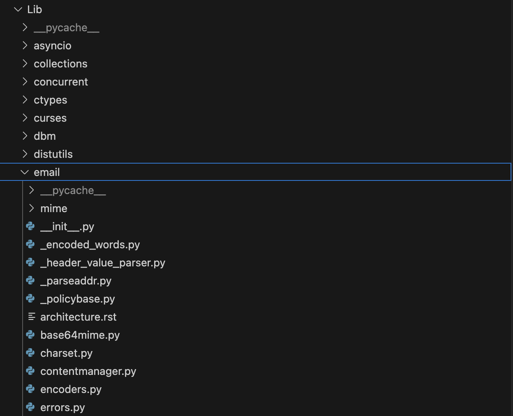

# 12. 표준 라이브러리

CPython 표준 라이브러리 모듈은 두 가지 종류로 나뉜다.

1. 유틸리티를 제공하는 순수한 파이썬 모듈
2. C로 작성됐고 파이썬 래퍼를 제공하는 모듈

## 12.1 파이썬 모듈

순수한 파이썬 모듈들은 `Lib` 디렉토리에 위치한다.

아래의 email 모듈과 같은 큰 모듈 중 일부는 하위 모듈이 있는 경우도 있다.



파이썬 배포판을 설치하면 표준 라이브러리 모듈은 배포판 폴더로 복사된다. 해당 폴더는 파이썬을 시작할 때 항상 경로에 포함되어 모듈을 임포트할 때 모듈 위치를 신경 쓰지 않아도 된다.

→ `sys.path`에 포함된다.

아래는 파이썬 모듈 중 하나인 `colorsys`의 함수이다.

```python
def rgb_to_hls(r, g, b):
    maxc = max(r, g, b)
    minc = min(r, g, b)
    # XXX Can optimize (maxc+minc) and (maxc-minc)
    l = (minc+maxc)/2.0
    if minc == maxc:
        return 0.0, l, 0.0
    if l <= 0.5:
        s = (maxc-minc) / (maxc+minc)
    else:
        s = (maxc-minc) / (2.0-maxc-minc)
    rc = (maxc-r) / (maxc-minc)
    gc = (maxc-g) / (maxc-minc)
    bc = (maxc-b) / (maxc-minc)
    if r == maxc:
        h = bc-gc
    elif g == maxc:
        h = 2.0+rc-bc
    else:
        h = 4.0+gc-rc
    h = (h/6.0) % 1.0
    return h, l, s
```

위 함수를 사용하는 방법은 아래와 같다.

```python
import colorsys

colorsys.rgb_to_hls(255, 0, 0)
```

모듈의 위치를 신경 쓰지 않고 바로 임포트할 수 있다.

모든 파이썬 모듈은 위 함수와 같이 단순한 파이썬 코드로 이루어져 있으며 이해하기 어렵지 않다. 따라서 표준 라이브러리 코드에서 버그나 개선 사항을 찾아 파이썬 배포판에 기여할 수도 있다.

## 12.2 파이썬과 C가 혼용된 모듈

순수한 파이썬 모듈을 제외한 나머지 모듈은 모두 C로 작성됐거나 C와 파이썬이 혼용되어 있다.

C로 작성된 부분은 `Modules` 디렉토리에 위치하며 파이썬으로 작성된 부분은 `Lib` 디렉토리에 위치한다.

아래 사항은 예외이다.

1. `sys` 모듈은 `Python/sysmodule.c`에 위치한다.
    - CPython의 내부와 강하게 연관되어 있기 때문에 `Python` 디렉토리에 존재한다.
2. `__builtins__` 모듈은 `Python/bltinmodule.c`에 위치한다.
    - 인터프리터를 인스턴스화할 때 내장 함수들을 __builtins__로부터 임포트하므로 `Python` 디렉토리에 존재한다.
    - `print()`, `chr()`, `format()`과 같은 모든 내장 함수를 해당 파일에서 찾을 수 있다.

C로 작성된 일부 모듈의 내용은 운영 체제 기능을 외부에 노출한다. 따라서 운영 체제에 따라 모듈이 다르게 동작하는 특수한 케이스가 존재한다.

예를 들어 `time` 모듈은 윈도우가 시간을 유지하고 저장하는 방법이 리눅스, macOS와 전혀 다르기 때문에 운영 체제별로 시간 함수의 정확도가 다르다.

스레딩 모듈, 파일 시스템 모듈, 네트워킹 모듈도 동일한 API를 운영 체제별로 여러 번 구현한다.

운영 체제별로 동작이 다르기 때문에 CPython 소스 코드는 최대한 같은 방식으로 동작을 구현한 다음 일관성 있고 추상화된 API만 제공한다.

이러한 구현 방식을 `time` 모듈에서도 확인할 수 있다.

아래는 `time` 모듈의 함수로 프로세스의 CPU 사용 시간을 나노초 단위로 반환하는 함수이다.

```c
static PyObject *
time_process_time_ns(PyObject *self, PyObject *unused)
{
    _PyTime_t t;
    if (_PyTime_GetProcessTimeWithInfo(&t, NULL) < 0) {
        return NULL;
    }
    return _PyTime_AsNanosecondsObject(t);
}
```

아래 함수는 `time_process_time_ns()`에서 호출하는 함수로 운영 체제에 따라 다른 방식으로 시스템 프로세스 시간을 가져오는 기능을 수행한다.

```c
static int
_PyTime_GetProcessTimeWithInfo(_PyTime_t *tp, _Py_clock_info_t *info)
{
#if defined(MS_WINDOWS)
    HANDLE process;
    FILETIME creation_time, exit_time, kernel_time, user_time;

...

    t = _PyTime_FromNanoseconds((ktime + utime) * 100);
    *tp = t;
    return 0;
#else

    /* clock_gettime */
#if defined(HAVE_CLOCK_GETTIME) \
    && (defined(CLOCK_PROCESS_CPUTIME_ID) || defined(CLOCK_PROF))
    struct timespec ts;

...

    /* clock */
    /* Currently, Python 3 requires clock() to build: see issue #22624 */
    return _PyTime_GetClockWithInfo(tp, info);
#endif
}
```
