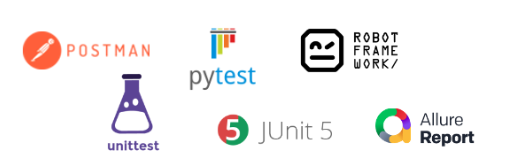

# 13. 테스트 스위트

CPython은 코어 인터프리터, 표준 라이브러리, 툴링을 비롯해
리눅스, macOS용 배포까지 포함하는 강력한 테스트 스위트를 가지고 있다.

테스트 스위트는 `Lib/tests`에 위치해 있고 대부분 파이썬으로 작성되어있다.

전체 테스트 스위트가 파이썬 패키지이기 때문에
컴파일한 파이썬 인터프리터로 테스트를 실행해 볼 수 있다.

---

## 용어

테스트를 처음 접하는 경우 아래의 용어를 알고 있다면 이해하는데 도움이 될 것 같다.

### 테스트 하네스

테스트 수행 도구를 의미한다.
Postman, unittest, Pytest, JUnit5, Robot Framework 등이 여기에 해당한다.



### 테스트 스위트, 테스트 케이스

테스트 케이스의 모음을 테스트 스위트라고 부른다.

### 확인 테스트, 회귀 테스트

**확인 테스트**는 발생한 이슈에 대한 수정 검증 테스트를 의미한다.
만약 확인 테스트가 이후 릴리즈 할 버전에도 영향을 미칠 것 같다고 판단된다면
수행한 확인 테스트 케이스를 회귀 테스트 스위트에 포함시킨다.

**회귀 테스트**는 테스트 버전에 대해
릴리즈 버전에서 수행한 테스트 케이스들을 다시 수행하는 것을 의미한다.

## 일반적인 테스트 코드 구조

일반적으로는 테스트 코드는 다음과 같이 구성되어 있다. (프로젝트 별로 관리 방식이 상이할 수 있다)

pytest를 사용할 경우의 디렉토리 구조이다

```
Project
	|- src
		|- __init__.py 
		|- main.py
		|- data_loader
			|- ...
		|- models 
			|- ...
	|- tests
		|- __init__.py 
		|- test_{suites1}
			|- ...
		|- test_{suites2}
			|- __init__.py
			|- conftest.py
			|- test_{suite1}.py
			|- test_{suite2}.py
```

### Mock

Mock은 '가짜 데이터'를 의미한다.
예를 들어 테스트 코드를 작성할 때, 실제 모듈과 유사하게 동작하는 가짜 데이터를 만들어 사용할 수 있다.

mock를 사용하면 함수의 실제 실행 없이, 미리 정해진 값을 반환하도록 할 수 있다.

성능 저하, 비용 등 불필요한 리소스 발생이 예상될 때, 일반적으로 mock 사용을 권장한다.

```python
# src/example.py

def func():
	return "fail"
```

위와 같은 함수가 있다고 해보자.
원래라면 “fail”만 리턴하는 함수이다.

그리고 테스트를 위한 `test_example.py`를 만들어보자.

```python
# tests/test_example.py

import unittest
from unittest import mock
from src import example

class TestExample(unittest.TestCase):

    @mock.patch("src.example.func", return_value="success")
    def test_func(self, mock_func):
        actual = example.func()
        expected = "success"

        self.assertEqual(actual, expected)

if __name__ == "__main__":
    unittest.main()
```

mock를 사용하기 위해서는 test 함수 위에 다음과 같은 데코레이터를 추가해야 한다.

```python
@mock.patch("src.example.func", return_value="success")
```

`patch`메소드의 첫 번째 인자는 target 함수의 경로이다.
`return_value` 인자에는 target 함수의 return 값을 지정할 수 있다.

`return_value`를 통해 함수의 return 값을 강제할 수 있다.

`func()` 는 "fail"을 return 하지만,
`return_value` 파라미터를 통해 "success"로 강제할 수 있다.

### Hook

각 테스트 케이스마다 반복되는 작업이 있을 경우 Hook을 수행할 수 있다.

`unittest`에서는 테스트 케이스의 설정 및 정리를 위해
`setUp`, `tearDown`, `setUpClass`, `tearDownClass` 메소드를 사용한다.

- `setUp`: 각 테스트 케이스가 호출되기 전 먼저 호출되는 메소드
- `setUpClass`: 테스트 스위트가 실행된 직후 가장 먼저 호출되는 메소드
- `tearDown`: 각 테스트 케이스의 종료 후 호출되는 메소드
- `tearDownClass`: 테스트 스위트의 종료 후 호출되는 메소드

```python
# tests/test_example.py

import unittest
from unittest import mock
from src import example

class TestExample(unittest.TestCase):
    def setUp(self):
        self.mock_func = mock.patch("src.example.func", return_value="success").start()

    def tearDown(self):
        mock.patch.stopall()

    def test_func(self):
        actual = example.func()
        expected = "success"
        self.assertEqual(actual, expected)

if __name__ == "__main__":
    unittest.main()
```

---

## **리눅스와 macOS에서 테스트 스위트 실행하기**

리눅스와 macOS에서 `make`로 `test` 타겟을 실행하면 컴파일 후 테스트가 실행된다.

```python
$ make test
== CPython 3.9
== macOS-14.4.1-arm64-arm-64bit little-endian
== cwd: /Users/wooy0ng/Desktop/cpython/build/test_python_3006æ
== CPU count: 8
== encodings: locale=UTF-8, FS=utf-8
0:00:00 load avg: 5.40 [&nbsp; 1/425] test_wave passed
0:00:00 load avg: 5.40 [&nbsp; 2/425] test_richcmp passed
0:00:00 load avg: 7.93 [&nbsp; 3/425] test_future5 passed
```

또는 컴파일된 바이너리인 `python`이나 `python.exe`로 `test` 패키지를 실행할 수도 있다.

```python
$ ./python -m test
== CPython 3.9
== macOS-14.4.1-arm64-arm-64bit little-endian
== cwd: /Users/wooy0ng/Desktop/cpython/build/test_python_3006æ
== CPU count: 8
== encodings: locale=UTF-8, FS=utf-8
0:00:00 load avg: 5.20 [&nbsp; 1/425] test_wave passed
0:00:00 load avg: 5.20 [&nbsp; 2/425] test_richcmp passed
0:00:00 load avg: 7.68 [&nbsp; 3/425] test_future5 passed
```

다음은 cpython에서 테스트를 위한 `make` 타겟 목록이다.

| 타깃 | 용도 |
| --- | --- |
| test | 기본적인 회귀 테스트를 실행한다. |
| quicktest | 오래 걸리는 테스트를 제외하고 빠른 회귀 테스트만 실행한다. |
| testall | .pyc 파일이 없는 상태로 한 번, 있는 상태로 한 번 전체 테스트 스위트를 실행한다. |
| testuniversal | macOS 유니버셜 빌드에서 여러 아키텍처에 대한 테스트 스위트를 실행한다. |
| coverage | 컴파일 후 gcov로 테스트를 실행한다. |
| coverage-lcov | HTML 커버리지 보고를 생성한다. |

---

## 테스트 플래그

GUI가 필요한 IDLE에 대한 테스트처럼
일부 테스트는 특정한 플래그가 없으면 자동으로 건너뛴다.

- `-list-tests` 플래그로 구성에서 테스트 스위트 목록을 볼 수 있다.

```python
$ ./python -m test --list-tests

test_grammer
test_opcodes
test_dict
test_builtin
test_exceptions
...
```

---

## 특정 테스트만 실행하기

테스트를 실행할 때 첫 번째 인자에 실행할 테스트 스위트를 명시해서 특정 테스트만 실행할 수 있다.

아래는 리눅스와 macOS에서 실행할 테스트 스위트를 명시하는 방법이다.

```python
$ ./python -m test test_webbrowser
Raised RLIMIT_NOFILE: 256 -> 1024

0:00:00 load avg: 1.70 Run tests sequentially
0:00:00 load avg: 1.70 [1/1] test_webbrowser

== Tests result: SUCCESS ==
1 test OK.

Total duration: 37 ms
Tests result: SUCCESS
```

CPython을 변경하려면 테스트 스위트를 사용하는 방법과
직접 컴파일한 바이너리 상태를 확인하는 방법을 이해하는 것이 매우 중요하다.

소스 코드를 변경하기 전에 전체 테스트 세트를 실행하고 모두 통과되는지 확인해야 한다.

---

## 테스트 모듈

C 확장과 파이썬 모듈은 `unittest` 모듈로 임포트하고 테스트한다.
테스트는 모듈이나 패키지 단위로 구성된다.

예를 들어 파이썬 유니코드 문자열 타입의 테스트는 `Lib/test/test_unicode.py`에서,
`asyncio` 패키지의 테스트 패키지는 `Lib/test/test_asyncio`에서 찾을 수 있다.

아래는 UnicodeTest 클래스 중 일부이다.

```python

class UnicodeTest(string_tests.CommonTest,
			string_tests.MixinStrUnicodeUserStringTest,
			string_tets.MixinStrUnicodeTest,
			unittest.TestCase
):
...
	def test_casefold(self):
		self.assertEqual('hello'.casefold(), 'hello')
		self.assertEqual('hELlo'.casefold(), 'hello')
		self.assertEqual('ß'.casefold(), 'ss')
		self.assertEqual('fi'.casefold(), 'fi')
```

이전 장에서 유니코드 문자열에 대해 구현한 '거의 같음' 연산자에 대한 테스트를
UnicodeTest 클래스의 새 메소드로 추가해보자.

```python
def test_almost_equals(self):
	self.assertTrue('hello' ~= 'hello')
	self.assertTrue('heLlo' ~= 'hello)
	self.assertFalse('hELlo!' ~= 'hello')
```

새로 추가한 테스트를 아래의 커멘드로 실행해보자

- Windows
    
    ```python
    > rc.bat -q -d -x64 test_unicode
    ```
    

- MacOS, 리눅스
    
    ```python
    $ ./python -m test test_unicode -v
    ```
    

---

## 테스트 유틸리티

`test.support.script_helper` 모듈은
파이썬 런타임 테스트를 사용할 수 있는 helper 함수를 제공한다.

- `assert_python_ok(*args, **env_vars)`
    
    > 지정된 인수와 함께 파이썬 프로세스를 실행하고 반환 코드와
    stdout, stderr를 담은 튜플을 반환한다.
    > 
- `assert_python_failure(*args, **env_vars)`
    
    > assert_python_ok()와 비슷하지만 실패를 가정하는 경우에 사용한다.
    > 
- `make_script(script_dir, script_basename, source)`
    
    > script_basename과 source를 사용해 script_dir에 스크립트를 생성하고
    스크립트에 대한 경로를 반환한다.
    > 
    

모듈이 빌드되지 않았을 경우 테스트도 건너뛰게 하고 싶다면
유틸리티 함수 `test.support.import_module()`을 사용할 수 있다.

이 유틸리티는 테스트할 모듈이 빌드되지 않았다면 `SkipTest`를 발생시켜
이 테스트 패키지를 건너뛰라는 신호를 Test Runner에 보낸다.

`import_module()`을 사용하는 방법은 아래와 같다.

```python
import test.support

_multiprocessing = test.support.import_module('_multiprocessing')

# test 작성
...
```

---
