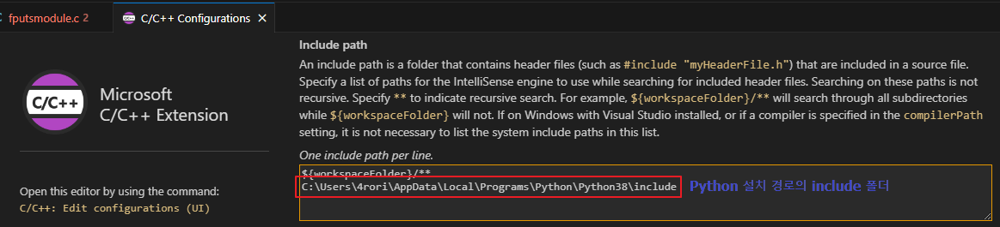

# Python C 확장 개발 가이드

## 참고 페이지
[Real Python Building a Python C Extension Module](https://realpython.com/build-python-c-extension-module/)   
[MSDN Python용 C++ 확장 만들기](https://learn.microsoft.com/ko-kr/visualstudio/python/working-with-c-cpp-python-in-visual-studio?view=vs-2022)


## 샘플 코드
저장소 book/c_extension_sample 폴더


## Python C 확장 따라 만들기
원하는 경로, 원하는 IDE에서 작업을 시작할 수 있습니다  
VSCode 기준으로 작업을 진행합니다   
C/C++ 확장이 설치되어 있어야 편합니다

### VSCode 세팅하기
   
Ctrl + Shift + P 를 눌러 C/C++ Configurations 창을 열어줍니다

   
Include path 에 Python이 설치된 폴더를 보면 include 폴더가 있습니다   
해당 경로를 추가해줍니다

### c 확장 모듈 기능 작성하기
이제 간단하게 C API 인 fputs를 python에서 쓸 수 있는 모듈로 개발합니다
```c
#include <Python.h>

static PyObject* method_fputs(PyObject* self, PyObject* args) {
    char *str, *filename = NULL;
    int bytes_copied = -1;

    if(!PyArg_ParseTuple(args, "ss", &str, &filename)) {
        return NULL;
    }

    FILE *fp = fopen(filename, "w");
    bytes_copied = fputs(str, fp);
    fclose(fp);

    return PyLong_FromLong(bytes_copied);
}
```
PyObject* 를 반환하는 fputs static 함수를 작성하였습니다   
PyObject 타입은 Python 의 객체 타입으로 **11장 객체와 타입**에서도 설명을 하고 있습니다   

```c
...
    char *str, *filename = NULL;
    int bytes_copied = -1;
    if(!PyArg_ParseTuple(args, "ss", &str, &filename)) {
        return NULL;
    }
...
```
PyArg_ParseTuple 함수는 Python 에서 받은 인수 args를 로컬 변수로 대입합니다  
2번째 인자 "ss"는 어떤 타입으로 인수를 파싱할지 설정합니다 (예제에서는 문자열, 문자열로 파싱)   
[[c-api arg 관련 공식 문서](https://docs.python.org/3/c-api/arg.html)]   
3번째 인자부터는 가변길이 인자로 인수를 대입받을 변수들의 주소값을 차례대로 넘겨줍니다  

```c
    FILE *fp = fopen(filename, "w");
    bytes_copied = fputs(str, fp);
    fclose(fp);

    return PyLong_FromLong(bytes_copied);
```
받은 인수값으로 파일을 열어 fputs를 수행합니다   
그리고 반환값으로 PyLong_FromLong 함수를 통하여 fputs로 쓴 파일 크기를 PyObject로 반환합니다   
(PyLong_FromLong에 대한 부분도 11장 객체와 타입 참조)   

### c 확장 모듈 초기화 함수 작성하기
위 코드에 이어서 확장 모듈 초기화 부분을 작성합니다
```c
static PyMethodDef FPutsMethods[] = {
    {"fputs", method_fputs, METH_VARARGS, "Python interface for fputs C library function"},
    {NULL, NULL, 0, NULL}
};

static struct PyModuleDef fputsmodule = {
    PyModuleDef_HEAD_INIT,
    "fputs",
    "Python interface for the fputs C library function",
    -1,
    FPutsMethods
};
```


