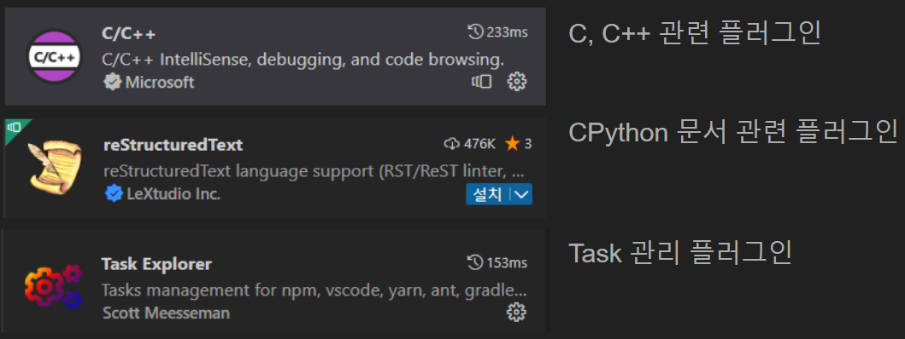

# 2. 개발 환경 세팅

CPython-Guide는 CPython 파헤치기 책과 동일한 Python 3.9 버전을 기반으로 진행됩니다.

## Visual Studio Code 개발 환경 세팅

### 플러그인 설치
아래와 같은 플러그인들을 설치해줍니다.


### .vscode/task.json 작성
프로젝트 실행 명령에 대한 json 파일 `.vscode/task.json`을 아래와 같이 생성해줍니다.

```json
{
    "version": "2.0.0",
    "tasks": [
        {
            "label": "build",
            "type": "shell",
            "group": {
                "kind": "build",
                "isDefault": true
            },
            "windows": {
                "command": "PCBuild/build.bat",
                "args": ["-p", "x64", "-c", "Debug"]
            },
            "linux": {
                "command": "make -j2 -s"
            },
            "osx": {
                "command": "make -j2 -s"
            }
        }
    ]
}
```

위와 같이 파일 작성을 완료하면 TASK EXPLORER의 vscode 하위에 작성한 build task가 추가된 것을 볼 수 있습니다.
  


### .vscode/launch.json 작성
디버거를 위한 json 파일 `.vscode/launch.json`을 아래와 같이 생성해줍니다.

- macOS
    ```json
    {
        "version": "0.2.0",
        "configurations": [
            {
                "name": "Debug C Code",
                "type": "cppdbg",
                "request": "launch",
                "program": "${workspaceFolder}/python.exe",
                "args": [],
                "stopAtEntry": false,
                "cwd": "${workspaceFolder}",
                "environment": [],
                "externalConsole": true,
                "MIMode": "lldb"
            }
        ]
    }
    ```
- Windows
    ```json
    {
        "version": "0.2.0",
        "configurations": [
            {
                "name": "msvc cl.exe debug cpython",
                "type": "cppvsdbg",
                "request": "launch",
                "program": "PCBuild/amd64/python_d.exe",
                "args": [],
                "stopAtEntry": false,
                "cwd": "${workspaceFolder}",
                "environment": [],
                "externalConsole": true,
                "preLaunchTask": "build"
            }
        ]
    }
    ```

이제 F5를 누르면 CPython 빌드 진행 및 디버깅을 할 수 있습니다.  
CPython의 진입점이 되는 Programs/python.c의 9번 라인에 디버그 브레이크를 걸고 실행해보면,
아래와 같이 디버깅이 잡힌 것을 확인할 수 있습니다.
  
