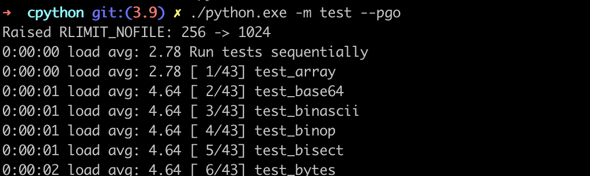

# 3. 컴파일하기

> 지난 챕터까지는 CPython 개발 환경을 구성했다면,
<br>이번 챕터에서는 CPython 소스 코드를 실제로 작동시키는 interpreter로 컴파일하고자 합니다 🚀

<aside>
💡 컴파일(compile)이란?

- 프로그래밍 언어로 작성된 소스 코드를 컴퓨터가 직접 이해하고 실행할 수 있는 기계어 코드로 변환하는 과정입니다. 
<br>(**소스 코드 → 실행 가능한 프로그램**)
- 컴파일러는 번역기처럼 한 언어(출발어: source language)를 다른 언어(도착어: target language)로 변환하는 것이 목표입니다.
</aside>

### macOS

```bash
# C 컴파일러 툴킷(Xcode Command Line Tools) 설치
xcode-select --install  ## make, GNU Compiler Collection(gcc) 등 설치

# 외부 라이브러리 설치
brew install openssl xz zlib gdbm sqlite

# Makefile 생성 (configure 스크립트 실행)
CPPFLAGS="-I$(brew --prefix zlib)/include" \
LDFLAGS="-L$(brew --prefix zlib)/lib" \
./configure --with-openssl=$(brew --prefix openssl) --with-pydebug

## 애플칩(M1, M2, ...)은 아래와 같이 xz 경로도 추가해주기
CPPFLAGS="-I$(brew --prefix zlib)/include -I$(brew --prefix xz)/include" \
LDFLAGS="-L$(brew --prefix zlib)/lib -L$(brew --prefix xz)/lib" \
./configure --with-openssl=$(brew --prefix openssl) --with-pydebug

# CPython 바이러니 빌드
make -j2 -s   # -j2: 동시 작업 2개 / -s: 실행된 명령어 출력 X

# 바이너리 파일 실행
./python.exe
```

<details>
<summary>make란?</summary>

- 소프트웨어 빌드 자동화 도구로, C/C++ 프로젝트 빌드 자동화에서 사용합니다.
- Makefile을 기반으로 실행되며, `make [옵션] [target]` 을 통해 해당하는 명령어(command)가 실행됩니다.
    ```makefile
    # Makefile 형식
    목표(target): 의존성(dependencies)
        명령어(commands)
        
    # 예시 (make docclean / make pythoninfo)
    docclean:
        -rm -rf Doc/build
        -rm -rf Doc/tools/sphinx Doc/tools/pygments Doc/tools/docutils

    pythoninfo: build_all
            $(RUNSHARED) ./$(BUILDPYTHON) -m test.pythoninfo
    ```

- make 옵션
    - `-d`(`--debug`): 디버깅 정보 출력
    - `-e` (`—environment-overrides`): Makefile보다 우선할 환경 변수 지정
    - `-i`(`—-ignore-errors`): 에러 무시하기
    - `-j [N]`(`—-jobs`): N개 작업 동시 실행
    - `-k`(`—-keep-going`): 특정 타깃 실패하더라도 계속 진행
    - `-l [N]` (`--load-average`, `--max-load`): 평균 부하가 N 미만일 때 동시 작업 시작
    - `-n`(`-dry-run`): 명령 실행하지 않고 출력하기
    - `-s`(`--silent`): 실행 명령어 출력 X
    - `-S`(`--stop`): 타깃 실패하면 중지하기

- make를 사용하는 이유
    - C/C++ 같은 컴파일 언어 사용 시, 
    애플리케이션을 소스에서 컴파일 할 때 시스템의 외부 라이브러리 링크해야 하는데, 
    코드를 올바르게 로드하고 링크 및 컴파일하기 위해 많은 명령어를 실행해야 할 수도 있습니다.
    - CPython에서처럼 `./configure` 실행 시 autoconf를 통해 필요한 라이브러리 위치 찾아서 Makefile에 붙여 넣어주고,
    make 실행을 통해 위와 같은 문제를 쉽게 실행할 수 있도록 해결해줍니다.

- CPython make 타깃
    - 빌드 타깃
        - all(기본): 컴파일러, 라이브러리, 모듈 빌드
        - clinic: 모든 소스 파일에 대해 인자 클리닉 실행
        - profile-opt: 프로파일 기반 최적화를 통해 파이썬 바이너리 빌드
        - regen-all: 생성된 파일을 전부 다시 생성
        - sharedmods: 공유 모듈 빌드
    - 테스트 타깃
        - coverage: 컴파일 후 gcov로 테스트 실행
        - coverage-lcov: html 커버리지 보고 생성
        - quicktest: 빠른 회귀 테스트만 실행 (오래 걸리는 테스트 제외)
        - test: 기본적인 회귀 테스트 실행
        - testall: .pyc 파일 없는/있는 상태로 한 번씩 전체 테스트 스위트 실행
        - testuniversal: macOS 유니버셜 빌드에서 여러 아키텍처에 대한 테스트 스위트 실행
    - 정리 타깃
        - check-clean-src: 빌드 시 소스 검사
        - clean: .pyc 파일과 컴파일된 라이브러리, 프로파일 삭제
        - cleantest: 직전에 실패한 테스트의 test_python_* 경로 삭제
        - clobber: 라이브러리, 태그, 구성, 빌드 삭제
        - distclean: Makefile을 비롯한 소스에서 생성된 모든 파일 삭제
        - docclean: Doc/ 경로에 생성된 문서 삭제
        - profile-removal: 모든 최적화 프로파일 삭제
        - pycremoval: .pyc 파일 삭제
    - 설치 타깃
        - altbininstall: 버전 명시한 python 인터프리터 설치 (ex: python3.9)
        - altinstall: 공유 라이브러리, 바이너리, 문서를 버전 접미사와 함께 설치
        - altmaninstall: 버전 붙은 매뉴얼 설치
        - bininstall: python, idle, 2to3 등 모든 바이너리 설치
        - commoninstall: 공유 라이브러리 및 모듈 설치
        - libinstall: 공유 라이브러리 설치
        - maninstall: 문서 설치
        - install: 공유 라이브러리, 바이너리, 문서 설치
        (commoninstall + bininstall + maninstall 실행)
        - sharedinstall: 동적으로 모듈 로드
    - 기타 타깃
        - autoconf: configure / pyconfig.h.in 다시 생성
        - python-config: python-config 스크립트 생성
        - recheck: 이전과 같은 옵션으로 configure 다시 실행
        - smelly: 내보내진 심벌이 Py 또는 _Py로 시작하는지 확인
        - tags: vi용 태그 파일 생성
        - TAGS: 이맥스용 태그 파일 생성
</details>

### Windows

여기에서는 “명령 프롬프트 사용하기” 방식만 다룰 예정이며, 
<br>”Visual Studio에서 PCbuild/pcbuild.sln 열어서 빌드하기” 방식도 있습니다.
<br>(CPython 파헤치기 도서 32페이지 참고)

```powershell
# 의존성 설치 (외부 도구, 라이브러리, C 헤더 등 설치)
PCbuild/get_externals.bat

# PCbuild/amd64/python_d.exe 바이너리 파일 생성
build.bat -p x64 -c Debug    # 디버그 버전
# 디버그 버전 바이너리 파일 실행
amd64\python_d.exe

# PCbuild/amd64/python.exe 바이너리 파일 생성
build.bat -p x64 -c Release  # 릴리즈 버전 (프로파일 기반 최적화 구성 사용됨)
# 릴리즈 버전 바이너리 파일 실행
amd64\python.exe
```

### 프로파일 기반 최적화

- 프로파일 기반 최적화(PGO: Profile-Guided Optimization)는 컴파일러에서 제공하는 기능으로,
최초 컴파일 후 → 일련의 테스트 실행 → 애플리케이션을 프로파일링하는 최적화 방식입니다.
- `python -m test --pgo`로 실행합니다. (Lib/test/libregrtest/pgo.py 회귀 테스트 실행)
    
- 출력 내용
    ```python
    Raised RLIMIT_NOFILE: 256 -> 1024
    0:00:00 load avg: 2.78 Run tests sequentially
    0:00:00 load avg: 2.78 [ 1/43] test_array
    0:00:01 load avg: 4.64 [ 2/43] test_base64
    0:00:01 load avg: 4.64 [ 3/43] test_binascii
    0:00:01 load avg: 4.64 [ 4/43] test_binop
    0:00:01 load avg: 4.64 [ 5/43] test_bisect
    0:00:02 load avg: 4.64 [ 6/43] test_bytes
    0:00:05 load avg: 4.42 [ 7/43] test_bz2
    0:00:06 load avg: 4.42 [ 8/43] test_cmath
    0:00:06 load avg: 4.42 [ 9/43] test_codecs
    0:00:09 load avg: 4.42 [10/43] test_collections
    /Users/user/Documents/cpython/Lib/test/test_collections.py:1509: DeprecationWarning: Please use assertEqual instead.
        self.assertEquals(len(s), len(items) - 1)
    0:00:10 load avg: 4.63 [11/43] test_complex
    0:00:11 load avg: 4.63 [12/43] test_dataclasses
    0:00:11 load avg: 4.63 [13/43] test_datetime
    0:00:18 load avg: 4.66 [14/43] test_decimal
    ------------------------------------------------ NOTICE ------------------------------------------------
    test_decimal may generate "malloc can't allocate region"
    warnings on macOS systems. This behavior is known. Do not
    report a bug unless tests are also failing. See bpo-40928.
    --------------------------------------------------------------------------------------------------------
    0:00:26 load avg: 5.08 [15/43] test_difflib
    0:00:28 load avg: 5.08 [16/43] test_embed
    0:00:36 load avg: 5.62 [17/43] test_float
    0:00:36 load avg: 5.62 [18/43] test_fstring
    0:00:37 load avg: 5.62 [19/43] test_functools
    0:00:37 load avg: 5.62 [20/43] test_generators
    0:00:38 load avg: 5.62 [21/43] test_hashlib
    0:00:39 load avg: 5.62 [22/43] test_heapq
    0:00:40 load avg: 5.33 [23/43] test_int
    0:00:41 load avg: 5.33 [24/43] test_itertools
    0:00:49 load avg: 5.30 [25/43] test_json
    0:00:54 load avg: 5.04 [26/43] test_long
    0:01:00 load avg: 4.64 [27/43] test_lzma
    0:01:00 load avg: 4.64 [28/43] test_math -- test_lzma skipped
    0:01:05 load avg: 4.75 [29/43] test_memoryview
    0:01:06 load avg: 4.75 [30/43] test_operator
    0:01:06 load avg: 4.75 [31/43] test_ordered_dict
    0:01:07 load avg: 4.75 [32/43] test_pickle
    0:01:18 load avg: 5.11 [33/43] test_pprint
    0:01:19 load avg: 5.11 [34/43] test_re
    0:01:21 load avg: 5.10 [35/43] test_set
    0:01:30 load avg: 4.63 [36/43] test_sqlite
    0:01:31 load avg: 4.63 [37/43] test_statistics
    0:01:34 load avg: 4.63 [38/43] test_struct
    0:01:35 load avg: 4.58 [39/43] test_tabnanny
    0:01:36 load avg: 4.58 [40/43] test_time
    0:01:38 load avg: 4.58 [41/43] test_unicode
    0:01:40 load avg: 4.37 [42/43] test_xml_etree
    0:01:41 load avg: 4.37 [43/43] test_xml_etree_c
    
    Total duration: 1 min 43 sec
    Tests result: SUCCESS
    ```
- 최적화 된 파이썬 배포
    - macOS: `./configure --enable-optimization`
    - Windows: `build.bat --pgo`
- 최적화에 포함되는 기능
    - **함수 inline 처리**
    : 다른 함수에서 자주 호출될 경우, 스택 크기 줄이기 위해 inline으로 변경되거나 호출자 함수에 복사됩니다.
    - **가상 호출 추론**
    : 특정 함수에 대한 가상 함수 호출이 빈번하게 일어나면, 조건부로 실행되는 직접 호출을 대상 함수에 추가합니다.
    - **레지스터 할당 최적화**
    : 프로파일 데이터를 기반으로 최적화를 하면 레지스터 할당이 향상됩니다.
    - **기본 블록 최적화**
    : 지정된 프레임 내 일시적으로 자주 실행되는 기본 블록을 동일한 페이지 집합에 배치
    → 사용되는 페이지 수 최소화 → 메모리 오버헤드도 최소화 시킵니다.
    - **핫스팟 최적화**
    : 가장 많이 실행되는 함수의 실행 시간을 최적화시킵니다.
    - **함수 레이아웃 최적화**
    : 호출 그래프에 따라 동일한 실행 경로를 따르는 함수를 컴파일된 애플리케이션의 동일한 섹션에 배치합니다.
    - **조건부 분기 최적화**
    : 같은 분기에서 가장 자주 사용되는 분기를 찾아 바로 실행될 수 있도록 해당 분기를 먼저 배치합니다.
    - **미사용 코드 분리**
    : 호출되지 않은 코드를 애플리케이션의 별도 섹션으로 옮깁니다.
