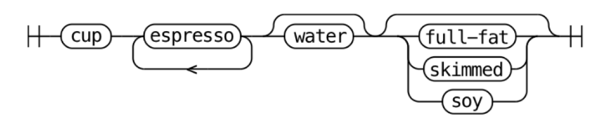
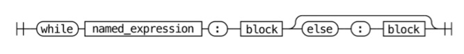
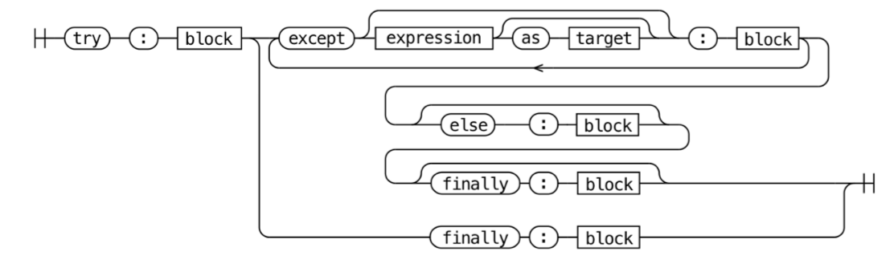

# 4. 언어와 문법

- 파이썬 애플리케이션은 보통 소스 코드 형태로 배포됩니다.
- 소스 코드를 바이트코드라는 중간 언어로 컴파일하고 → `.pyc` 파일에 저장 + 실행 위해 캐싱을 진행합니다.
- 파이썬 인터프리터가 해당 바이트코드(`.pyc`)를 한 줄씩 읽고 실행합니다.
    - CPython 런타임이 첫 번째 실행될 때 코드를 컴파일하지만, 일반 사용자에게 노출되지는 않습니다.
    - 코드 변경 없이 같은 파이썬 애플리케이션 다시 실행하면 → 컴파일된 바이트코드를 불러와서 더 빠르게 실행합니다.

<details>
<summary>💡 이식성(portability)을 기준으로 컴파일러를 선택한다면..</summary>

> - 저수준 기계어
>     - 시스템에서 바로 실행할 수 있는 기계어로 컴파일
>     - 바이러니 실행 파일로 컴파일 → 컴파일한 플랫폼과 동일한 플랫폼에서 사용 가능
>     - ex) C, Go, C++, Pascal
> - 중간 언어
>     - 가상 머신에서 실행하기 위한 언어로 컴파일
>     - 여러 시스템 아키텍처에서 사용 가능한 중간 언어로 컴파일
>     - ex) 닷넷 CLR, JAVA, **Python**

</details>


## 4.1 CPython이 파이썬이 아니라 C로 작성된 이유

<details>
<summary>결론 먼저 보기</summary>

> - CPython은 파이썬에서 이용하는 많은 라이브러리가 C로 되어있기 때문에 C로 만들어진 컴파일러를 사용합니다.
> - 안정적인 언어로 다양한 표준 라이브러리 모듈을 이용하기 위해서 C 컴파일러를 사용하고 있습니다.

</details>

<br>

- 새로운 프로그래밍 언어를 만들려면 한 언어(source language)를 다른 만들고자 하는 언어(target language)로 바꿔줄 컴파일러가 필요합니다.
- 새로운 언어 개발 시 어떤 프로그램이든 실행할 수 있어야 하기 때문에 보통 **더 오래되고 안정적인 언어**로 컴파일러를 작성합니다.

> 💡 <b>컴파일러 유형</b>
> - 셀프 호스팅 컴파일러
>     - 자기 자신으로 작성한 컴파일러 (부트스트래핑 단계를 통해 만들어짐)
>     - ex) Go(C로 작성된 첫번째 Go 컴파일러가 Go를 컴파일할 수 있게 되자 → 컴파일러를 Go로 재작성), PyPy(파이썬으로 작성된 파이썬 컴파일러)
> - 소스 대 소스(source-to-source) 컴파일러
>     - 이미 갖고 있는 다른 언어로 작성한 컴파일러
>     - ex) CPython (C → Python)

- 여러 표준 라이브러리 모듈(ssl, sockets 등)도 저수준 운영체제 API에 접근하기 위해서 C로 작성되어 있고,
<br>네트워크 소켓 만들기, 파일 시스템 조작, 디스플레이와 상호작용하는 윈도우/리눅스 커널 API도 모두 C로 작성되어 있기 때문에 **파이썬 또한 확장성을 고려하여 C로 작성되었다**고 볼 수 있습니다.


## 4.2 파이썬 언어 사양
- 컴파일러가 언어를 실행하기 위해서는 문법 구조에 대한 엄격한 규칙인 **언어 사양**이 필요합니다.
- 언어 사양은 모든 파이썬 인터프리터 구현이 사용하는 레퍼런스 사양으로,
    - 사람이 읽을 수 있는 형식 + 기계가 읽을 수 있는 형식으로 제공합니다.
    - 문법 형식 + 각 문법 요소가 실행되는 방식을 자세히 설명하고 있습니다.

### 언어 레퍼런스
사람이 읽을 수 있는 형식으로, Doc/reference에 언어의 구조, 키워드를 정의해두고 있습니다.
```bash
Doc/reference
├── index.rst               # 언어 레퍼런스 목차
├── introduction.rst        # 레퍼런스 문서 개요
├── compound_stmts.rst      # 복합문 (if, while, for, 함수 정의 등)
├── datamodel.rst           # 객체, 값, 타입
├── executionmodel.rst      # 프로그램 구조
├── expressions.rst         # 표현식 구성 요소
├── grammar.rst             # 문법 규격(Grammar/Grammar 참조)
├── import.rst              # import 시스템
├── lexical_analysis.rst    # 어휘 구조 (줄, 들여쓰기, 토큰, 키워드 등)
├── simple_stmts.rst        # 단순문 (assert, import, return, yield 등)
└── toplevel_components.rst # 스크립트 및 모듈 실행 방법 설명
```
<details>
<summary>ex1) if (compound_stmts.rst)</summary>
    
```markdown
.. _if:
.. _elif:
.. _else:

The :keyword:`!if` statement
============================

.. index::
    ! statement: if
    keyword: elif
    keyword: else
    single: : (colon); compound statement

The :keyword:`if` statement is used for conditional execution:

.. productionlist:: python-grammar
    if_stmt: "if" `assignment_expression` ":" `suite`
            : ("elif" `assignment_expression` ":" `suite`)*
            : ["else" ":" `suite`]

It selects exactly one of the suites by evaluating the expressions one by one
until one is found to be true (see section :ref:`booleans` for the definition of
true and false); then that suite is executed (and no other part of the
:keyword:`if` statement is executed or evaluated).  If all expressions are
false, the suite of the :keyword:`else` clause, if present, is executed.
```

</details>

<details>
<summary>ex2) Class instance (datamodel.rst)</summary>

```markdown
Class instances
    .. index::
        object: class instance
        object: instance
        pair: class; instance
        pair: class instance; attribute

    A class instance is created by calling a class object (see above).  A class
    instance has a namespace implemented as a dictionary which is the first place
    in which attribute references are searched.  When an attribute is not found
    there, and the instance's class has an attribute by that name, the search
    continues with the class attributes.  If a class attribute is found that is a
    user-defined function object, it is transformed into an instance method
    object whose :attr:`__self__` attribute is the instance.  Static method and
    class method objects are also transformed; see above under "Classes".  See
    section :ref:`descriptors` for another way in which attributes of a class
    retrieved via its instances may differ from the objects actually stored in
    the class's :attr:`~object.__dict__`.  If no class attribute is found, and the
    object's class has a :meth:`~object.__getattr__` method, that is called to satisfy
    the lookup.

    .. index:: triple: class instance; attribute; assignment

    Attribute assignments and deletions update the instance's dictionary, never a
    class's dictionary.  If the class has a :meth:`~object.__setattr__` or
    :meth:`~object.__delattr__` method, this is called instead of updating the instance
    dictionary directly.

    .. index::
        object: numeric
        object: sequence
        object: mapping

    Class instances can pretend to be numbers, sequences, or mappings if they have
    methods with certain special names.  See section :ref:`specialnames`.

    .. index::
        single: __dict__ (instance attribute)
        single: __class__ (instance attribute)

    Special attributes: :attr:`~object.__dict__` is the attribute dictionary;
    :attr:`~instance.__class__` is the instance's class.
```

</details>


### 문법
기계가 읽을 수 있는 형식으로, Grammar/python.gram에 PEG 표현식을 통해 정의하고 있습니다.

- 파서 표현식 문법(parsing expression grammar, PEG) 사양
    - `*`: 반복
    - `+`: 최소 1번 반복
    - `[]`: 선택적인 부분
    - `|`: 대안
    - `()`: 그룹
- 철도 다이어그램
    <br>  


<details>
<summary>ex0) 커피 레시피</summary>

- 예시
    - 컵 필요: `'cup'`
    - 최소 에스프레소 한 샷 이상: `('espresso')+`
    - 물 사용 (옵션): `['water']`
    - 우유 사용 (옵션): `[milk]`
    - 우유 사용했다면, 탈지우유나 두유 등 여러 종류의 우유 선택 가능: `milk: 'full-fat' | 'skimmed' | 'soy'`
- 정의
    
    ```makefile
    coffee: 'cup' ('espresso')+ ['water'] [milk]
    milk: 'full-fat' | 'skimmed' | 'soy'
    ```
- 철도 다이어그램
    

</details>

<details>
<summary>ex1) while문</summary>

- 예시
    1. 표현식 & `:` 단말 기호 & 코드 블록으로 구성
        
        ```python
        while finished:
                do_things()
        ```
        
    2. named_expression 대입 표현식 사용 (값 할당하는 동시에 그 값을 평가하는 표현식)
        
        ```python
        while letters := read(document, 10):
                print(letters)
        ```
        
    3. while문 다음에 else 블록 사용
        
        ```python
        while item := next(iterable):
                print(item)
        else:
                print("Iterable is empty")
        ```
        
- 정의 (while_stmt 문법 파일)
    
    ```python
    # Grammar/python.gram#L165
    
    while_stmt[stmt_ty]:
            | 'while' a=named_expression ':' b=block c=[else_block] ...
    ```
    
- 철도 다이어그램

    

</details>

<details>
<summary>ex2) try문</summary>

- 정의
    
    ```python
    # Grammar/python.gram#L189
    
    try_stmt[stmt_ty]:
        | 'try' ':' b=block f=finally_block { _Py_Try(b, NULL, NULL, f, EXTRA) }
        | 'try' ':' b=block ex=except_block+ el=[else_block] f=[finally_block] { _Py_Try(b, ex, el, f, EXTRA) }
    
    finally_block[asdl_seq*]: 'finally' ':' a=block { a }
    
    except_block[excepthandler_ty]:
        | 'except' e=expression t=['as' z=NAME { z }] ':' b=block {
            _Py_ExceptHandler(e, (t) ? ((expr_ty) t)->v.Name.id : NULL, b, EXTRA) }
        | 'except' ':' b=block { _Py_ExceptHandler(NULL, NULL, b, EXTRA) }
    
    else_block[asdl_seq*]: 'else' ':' b=block { b }
    ```
    
- 철도 다이어그램
    
    

</details>


##### 문법 다시 생성해보기

Grammar/python.gram 에서 간단문 정의(small_stmt)에서 pass 문이 정의된 것을 볼 수 있습니다.
    
```python
small_stmt[stmt_ty] (memo):
    | assignment
    | e=star_expressions { _Py_Expr(e, EXTRA) }
    | &'return' return_stmt
    | &('import' | 'from') import_stmt
    | &'raise' raise_stmt
    **| 'pass' { _Py_Pass(EXTRA) }**
    | &'del' del_stmt
    | &'yield' yield_stmt
    | &'assert' assert_stmt
    | 'break' { _Py_Break(EXTRA) }
    | 'continue' { _Py_Continue(EXTRA) }
    | &'global' global_stmt
    | &'nonlocal' nonlocal_stmt
```

pass 정의 `'pass' { _Py_Pass(EXTRA) }`를
<br>`('pass'|'proceed') { _Py_Pass(EXTRA) }`로 바꾸고 아래와 같이 컴파일 하면,
```
# macOS
make regen-pegen
make -j2 -s

# Windows
build.bat --regen
build.bat -t CleanAll
build.bat -t Build
```

proceed라는 함수가 pass랑 동일한 action을 하게 됩니다.
```
def test1():
    pass

def test2():
    proceed
```

위에서 test1()이랑 test2()의 action은 동일하게 됩니다.
<br>이처럼, python.gram 파일 수정을 통해서 파이썬 문법을 변경할 수 있습니다.

<aside>

💡 **파서 생성기**
- 파이썬 컴파일러는 문법 파일을 직접 사용하지 않고, 파서 생성기가 문법 파일에서 생성한 파서를 사용합니다.
- 문법 파일을 수정하면 → 파서 재생성 후 → CPython을 다시 컴파일해야 합니다.
- Python 3.9부터는 파서 테이블 생성기(pgen 모듈) 대신 문맥 의존 문법 파서(pegen)를 사용합니다.

</aside>

### 토큰
Grammar/Tokens 파일은 파스 트리의 Leaf node에서 사용되는 고유 토큰들을 정의합니다.
코드 tokenization은 추후 컴파일링 할 때 이용되며,
각 토큰별로 이름, 자동으로 생성된 고유 ID를 지니고 있습니다.
```python
LPAR                    '('
RPAR                    ')'
LSQB                    '['
RSQB                    ']'
COLON                   ':'
COMMA                   ','
```

tokenizer를 통해서 토큰으로 파싱이 되며, 아래 예시를 통해 tokenize 되는 결과를 확인할 수 있습니다.

- 예시 스크립트 파일 (test_tokens.py)
    ```python
    def my_function():
            pass
    ```
- `./python.exe -m tokenize -e test_tokens.py` (토큰 목록 출력)
    ```python
    0,0-0,0:            ENCODING       'utf-8'
    1,0-1,3:            NAME           'def'
    1,4-1,15:           NAME           'my_function'
    1,15-1,16:          LPAR           '('
    1,16-1,17:          RPAR           ')'
    1,17-1,18:          COLON          ':'
    1,18-1,19:          NEWLINE        '\n'
    2,0-2,4:            INDENT         '    '
    2,4-2,8:            NAME           'pass'
    2,8-2,9:            NEWLINE        '\n'
    3,0-3,0:            DEDENT         ''
    3,0-3,0:            ENDMARKER      ''
    ```

<details>  
<summary>`./python.exe -d test_tokens.py` (디버그 빌드)</summary>
    
```python
    > file[0-0]: statements? $
    > statements[0-0]: statement+
    > _loop1_11[0-0]: statement
    > statement[0-0]: compound_stmt
        > compound_stmt[0-0]: &('def' | '@' | ASYNC) function_def
        > _tmp_15[0-0]: 'def'
        + _tmp_15[0-1]: 'def' succeeded!
        > function_def[0-0]: decorators function_def_raw
        > decorators[0-0]: (('@' named_expression NEWLINE))+
        > _loop1_68[0-0]: ('@' named_expression NEWLINE)
            > _tmp_140[0-0]: '@' named_expression NEWLINE
            - _tmp_140[0-0]: '@' named_expression NEWLINE failed!
        - _loop1_68[0-0]: ('@' named_expression NEWLINE) failed!
        - decorators[0-0]: (('@' named_expression NEWLINE))+ failed!
        - function_def[0-0]: decorators function_def_raw failed!
        > function_def[0-0]: function_def_raw
        > function_def_raw[0-0]: 'def' NAME '(' params? ')' ['->' expression] ':' func_type_comment? block
        > params[3-3]: parameters
            > parameters[3-3]: slash_no_default param_no_default* param_with_default* star_etc?
            > slash_no_default[3-3]: param_no_default+ '/' ','
            > _loop1_60[3-3]: param_no_default
            > param_no_default[3-3]: param ',' TYPE_COMMENT?
                > param[3-3]: NAME annotation?
                - param[3-3]: NAME annotation? failed!
            - param_no_default[3-3]: param ',' TYPE_COMMENT? failed!
            > param_no_default[3-3]: param TYPE_COMMENT? &')'
                > param[3-3]: NAME annotation?
                - param[3-3]: NAME annotation? failed!
            - param_no_default[3-3]: param TYPE_COMMENT? &')' failed!
            - _loop1_60[3-3]: param_no_default failed!
            - slash_no_default[3-3]: param_no_default+ '/' ',' failed!
            > slash_no_default[3-3]: param_no_default+ '/' &')'
            > _loop1_61[3-3]: param_no_default
            > param_no_default[3-3]: param ',' TYPE_COMMENT?
                > param[3-3]: NAME annotation?
                - param[3-3]: NAME annotation? failed!
            - param_no_default[3-3]: param ',' TYPE_COMMENT? failed!
            > param_no_default[3-3]: param TYPE_COMMENT? &')'
                > param[3-3]: NAME annotation?
                - param[3-3]: NAME annotation? failed!
            - param_no_default[3-3]: param TYPE_COMMENT? &')' failed!
            - _loop1_61[3-3]: param_no_default failed!
            - slash_no_default[3-3]: param_no_default+ '/' &')' failed!
            - parameters[3-3]: slash_no_default param_no_default* param_with_default* star_etc? failed!
            > parameters[3-3]: slash_with_default param_with_default* star_etc?
            > slash_with_default[3-3]: param_no_default* param_with_default+ '/' ','
            > _loop0_62[3-3]: param_no_default
            > param_no_default[3-3]: param ',' TYPE_COMMENT?
                > param[3-3]: NAME annotation?
                - param[3-3]: NAME annotation? failed!
            - param_no_default[3-3]: param ',' TYPE_COMMENT? failed!
            > param_no_default[3-3]: param TYPE_COMMENT? &')'
                > param[3-3]: NAME annotation?
                - param[3-3]: NAME annotation? failed!
            - param_no_default[3-3]: param TYPE_COMMENT? &')' failed!
            - _loop0_62[3-3]: param_no_default failed!
            > _loop1_63[3-3]: param_with_default
            > param_with_default[3-3]: param default ',' TYPE_COMMENT?
                > param[3-3]: NAME annotation?
                - param[3-3]: NAME annotation? failed!
            - param_with_default[3-3]: param default ',' TYPE_COMMENT? failed!
            > param_with_default[3-3]: param default TYPE_COMMENT? &')'
                > param[3-3]: NAME annotation?
                - param[3-3]: NAME annotation? failed!
            - param_with_default[3-3]: param default TYPE_COMMENT? &')' failed!
            - _loop1_63[3-3]: param_with_default failed!
            - slash_with_default[3-3]: param_no_default* param_with_default+ '/' ',' failed!
            > slash_with_default[3-3]: param_no_default* param_with_default+ '/' &')'
            > _loop0_64[3-3]: param_no_default
            > param_no_default[3-3]: param ',' TYPE_COMMENT?
                > param[3-3]: NAME annotation?
                - param[3-3]: NAME annotation? failed!
            - param_no_default[3-3]: param ',' TYPE_COMMENT? failed!
            > param_no_default[3-3]: param TYPE_COMMENT? &')'
                > param[3-3]: NAME annotation?
                - param[3-3]: NAME annotation? failed!
            - param_no_default[3-3]: param TYPE_COMMENT? &')' failed!
            - _loop0_64[3-3]: param_no_default failed!
            > _loop1_65[3-3]: param_with_default
            > param_with_default[3-3]: param default ',' TYPE_COMMENT?
                > param[3-3]: NAME annotation?
                - param[3-3]: NAME annotation? failed!
            - param_with_default[3-3]: param default ',' TYPE_COMMENT? failed!
            > param_with_default[3-3]: param default TYPE_COMMENT? &')'
                > param[3-3]: NAME annotation?
                - param[3-3]: NAME annotation? failed!
            - param_with_default[3-3]: param default TYPE_COMMENT? &')' failed!
            - _loop1_65[3-3]: param_with_default failed!
            - slash_with_default[3-3]: param_no_default* param_with_default+ '/' &')' failed!
            - parameters[3-3]: slash_with_default param_with_default* star_etc? failed!
            > parameters[3-3]: param_no_default+ param_with_default* star_etc?
            > _loop1_57[3-3]: param_no_default
            > param_no_default[3-3]: param ',' TYPE_COMMENT?
            > param[3-3]: NAME annotation?
            - param[3-3]: NAME annotation? failed!
            - param_no_default[3-3]: param ',' TYPE_COMMENT? failed!
            > param_no_default[3-3]: param TYPE_COMMENT? &')'
            > param[3-3]: NAME annotation?
            - param[3-3]: NAME annotation? failed!
            - param_no_default[3-3]: param TYPE_COMMENT? &')' failed!
            - _loop1_57[3-3]: param_no_default failed!
            - parameters[3-3]: param_no_default+ param_with_default* star_etc? failed!
            > parameters[3-3]: param_with_default+ star_etc?
            > _loop1_59[3-3]: param_with_default
            > param_with_default[3-3]: param default ',' TYPE_COMMENT?
            > param[3-3]: NAME annotation?
            - param[3-3]: NAME annotation? failed!
            - param_with_default[3-3]: param default ',' TYPE_COMMENT? failed!
            > param_with_default[3-3]: param default TYPE_COMMENT? &')'
            > param[3-3]: NAME annotation?
            - param[3-3]: NAME annotation? failed!
            - param_with_default[3-3]: param default TYPE_COMMENT? &')' failed!
            - _loop1_59[3-3]: param_with_default failed!
            - parameters[3-3]: param_with_default+ star_etc? failed!
            > parameters[3-3]: star_etc
            > star_etc[3-3]: '*' param_no_default param_maybe_default* kwds?
            - star_etc[3-3]: '*' param_no_default param_maybe_default* kwds? failed!
            > star_etc[3-3]: '*' ',' param_maybe_default+ kwds?
            - star_etc[3-3]: '*' ',' param_maybe_default+ kwds? failed!
            > star_etc[3-3]: kwds
            > kwds[3-3]: '**' param_no_default
            - kwds[3-3]: '**' param_no_default failed!
            - star_etc[3-3]: kwds failed!
            - parameters[3-3]: star_etc failed!
        - params[3-3]: parameters failed!
        > _tmp_51[4-4]: '->' expression
        - _tmp_51[4-4]: '->' expression failed!
        > func_type_comment[5-5]: NEWLINE TYPE_COMMENT &(NEWLINE INDENT)
        - func_type_comment[5-5]: NEWLINE TYPE_COMMENT &(NEWLINE INDENT) failed!
        > func_type_comment[5-5]: TYPE_COMMENT
        - func_type_comment[5-5]: TYPE_COMMENT failed!
        > block[5-5]: NEWLINE INDENT statements DEDENT
            > statements[7-7]: statement+
            > _loop1_11[7-7]: statement
            > statement[7-7]: compound_stmt
            > compound_stmt[7-7]: &('def' | '@' | ASYNC) function_def
                > _tmp_15[7-7]: 'def'
                - _tmp_15[7-7]: 'def' failed!
                > _tmp_15[7-7]: '@'
                - _tmp_15[7-7]: '@' failed!
                > _tmp_15[7-7]: ASYNC
                - _tmp_15[7-7]: ASYNC failed!
            - compound_stmt[7-7]: &('def' | '@' | ASYNC) function_def failed!
            > compound_stmt[7-7]: &'if' if_stmt
            - compound_stmt[7-7]: &'if' if_stmt failed!
            > compound_stmt[7-7]: &('class' | '@') class_def
                > _tmp_16[7-7]: 'class'
                - _tmp_16[7-7]: 'class' failed!
                > _tmp_16[7-7]: '@'
                - _tmp_16[7-7]: '@' failed!
            - compound_stmt[7-7]: &('class' | '@') class_def failed!
            > compound_stmt[7-7]: &('with' | ASYNC) with_stmt
                > _tmp_17[7-7]: 'with'
                - _tmp_17[7-7]: 'with' failed!
                > _tmp_17[7-7]: ASYNC
                - _tmp_17[7-7]: ASYNC failed!
            - compound_stmt[7-7]: &('with' | ASYNC) with_stmt failed!
            > compound_stmt[7-7]: &('for' | ASYNC) for_stmt
                > _tmp_18[7-7]: 'for'
                - _tmp_18[7-7]: 'for' failed!
                > _tmp_18[7-7]: ASYNC
                - _tmp_18[7-7]: ASYNC failed!
            - compound_stmt[7-7]: &('for' | ASYNC) for_stmt failed!
            > compound_stmt[7-7]: &'try' try_stmt
            - compound_stmt[7-7]: &'try' try_stmt failed!
            > compound_stmt[7-7]: &'while' while_stmt
            - compound_stmt[7-7]: &'while' while_stmt failed!
            - statement[7-7]: compound_stmt failed!
            > statement[7-7]: simple_stmt
            > simple_stmt[7-7]: small_stmt !';' NEWLINE
                > small_stmt[7-7]: assignment
                > assignment[7-7]: NAME ':' expression ['=' annotated_rhs]
                - assignment[7-7]: NAME ':' expression ['=' annotated_rhs] failed!
                > assignment[7-7]: ('(' single_target ')' | single_subscript_attribute_target) ':' expression ['=' annotated_rhs]
                > _tmp_20[7-7]: '(' single_target ')'
                - _tmp_20[7-7]: '(' single_target ')' failed!
                > _tmp_20[7-7]: single_subscript_attribute_target
                > single_subscript_attribute_target[7-7]: t_primary '.' NAME !t_lookahead
                    > t_primary[7-7]: t_primary '.' NAME &t_lookahead
                    - t_primary[7-7]: t_primary '.' NAME &t_lookahead failed!
                    > t_primary[7-7]: t_primary '[' slices ']' &t_lookahead
                    - t_primary[7-7]: t_primary '[' slices ']' &t_lookahead failed!
                    > t_primary[7-7]: t_primary genexp &t_lookahead
                    - t_primary[7-7]: t_primary genexp &t_lookahead failed!
                    > t_primary[7-7]: t_primary '(' arguments? ')' &t_lookahead
                    - t_primary[7-7]: t_primary '(' arguments? ')' &t_lookahead failed!
                    > t_primary[7-7]: atom &t_lookahead
                    > atom[7-7]: NAME
                    - atom[7-7]: NAME failed!
                    > atom[7-7]: 'True'
                    - atom[7-7]: 'True' failed!
                    > atom[7-7]: 'False'
                    - atom[7-7]: 'False' failed!
                    > atom[7-7]: 'None'
                    - atom[7-7]: 'None' failed!
                    > atom[7-7]: '__peg_parser__'
                    - atom[7-7]: '__peg_parser__' failed!
                    > atom[7-7]: &STRING strings
                    - atom[7-7]: &STRING strings failed!
                    > atom[7-7]: NUMBER
                    - atom[7-7]: NUMBER failed!
                    > atom[7-7]: &'(' (tuple | group | genexp)
                    - atom[7-7]: &'(' (tuple | group | genexp) failed!
                    > atom[7-7]: &'[' (list | listcomp)
                    - atom[7-7]: &'[' (list | listcomp) failed!
                    > atom[7-7]: &'{' (dict | set | dictcomp | setcomp)
                    - atom[7-7]: &'{' (dict | set | dictcomp | setcomp) failed!
                    > atom[7-7]: '...'
                    - atom[7-7]: '...' failed!
                    - t_primary[7-7]: atom &t_lookahead failed!
                - single_subscript_attribute_target[7-7]: t_primary '.' NAME !t_lookahead failed!
                > single_subscript_attribute_target[7-7]: t_primary '[' slices ']' !t_lookahead
                - single_subscript_attribute_target[7-7]: t_primary '[' slices ']' !t_lookahead failed!
                - _tmp_20[7-7]: single_subscript_attribute_target failed!
                - assignment[7-7]: ('(' single_target ')' | single_subscript_attribute_target) ':' expression ['=' annotated_rhs] failed!
                > assignment[7-7]: ((star_targets '='))+ (yield_expr | star_expressions) !'=' TYPE_COMMENT?
                > _loop1_22[7-7]: (star_targets '=')
                > _tmp_137[7-7]: star_targets '='
                    > star_targets[7-7]: star_target !','
                    > star_target[7-7]: '*' (!'*' star_target)
                    - star_target[7-7]: '*' (!'*' star_target) failed!
                    > star_target[7-7]: target_with_star_atom
                    > target_with_star_atom[7-7]: t_primary '.' NAME !t_lookahead
                    - target_with_star_atom[7-7]: t_primary '.' NAME !t_lookahead failed!
                    > target_with_star_atom[7-7]: t_primary '[' slices ']' !t_lookahead
                    - target_with_star_atom[7-7]: t_primary '[' slices ']' !t_lookahead failed!
                    > target_with_star_atom[7-7]: star_atom
                    > star_atom[7-7]: NAME
                    - star_atom[7-7]: NAME failed!
                    > star_atom[7-7]: '(' target_with_star_atom ')'
                    - star_atom[7-7]: '(' target_with_star_atom ')' failed!
                    > star_atom[7-7]: '(' star_targets_tuple_seq? ')'
                    - star_atom[7-7]: '(' star_targets_tuple_seq? ')' failed!
                    > star_atom[7-7]: '[' star_targets_list_seq? ']'
                    - star_atom[7-7]: '[' star_targets_list_seq? ']' failed!
                    - target_with_star_atom[7-7]: star_atom failed!
                    - star_target[7-7]: target_with_star_atom failed!
                    - star_targets[7-7]: star_target !',' failed!
                    > star_targets[7-7]: star_target ((',' star_target))* ','?
                    - star_targets[7-7]: star_target ((',' star_target))* ','? failed!
                - _tmp_137[7-7]: star_targets '=' failed!
                - _loop1_22[7-7]: (star_targets '=') failed!
                - assignment[7-7]: ((star_targets '='))+ (yield_expr | star_expressions) !'=' TYPE_COMMENT? failed!
                > assignment[7-7]: single_target augassign ~ (yield_expr | star_expressions)
                > single_target[7-7]: single_subscript_attribute_target
                > single_subscript_attribute_target[7-7]: t_primary '.' NAME !t_lookahead
                - single_subscript_attribute_target[7-7]: t_primary '.' NAME !t_lookahead failed!
                > single_subscript_attribute_target[7-7]: t_primary '[' slices ']' !t_lookahead
                - single_subscript_attribute_target[7-7]: t_primary '[' slices ']' !t_lookahead failed!
                - single_target[7-7]: single_subscript_attribute_target failed!
                > single_target[7-7]: NAME
                - single_target[7-7]: NAME failed!
                > single_target[7-7]: '(' single_target ')'
                - single_target[7-7]: '(' single_target ')' failed!
                - assignment[7-7]: single_target augassign ~ (yield_expr | star_expressions) failed!
                - small_stmt[7-7]: assignment failed!
                > small_stmt[7-7]: star_expressions
                > star_expressions[7-7]: star_expression ((',' star_expression))+ ','?
                > star_expression[7-7]: '*' bitwise_or
                - star_expression[7-7]: '*' bitwise_or failed!
                > star_expression[7-7]: expression
                > expression[7-7]: disjunction 'if' disjunction 'else' expression
                    > disjunction[7-7]: conjunction (('or' conjunction))+
                    > conjunction[7-7]: inversion (('and' inversion))+
                    > inversion[7-7]: 'not' inversion
                    - inversion[7-7]: 'not' inversion failed!
                    > inversion[7-7]: comparison
                    > comparison[7-7]: bitwise_or compare_op_bitwise_or_pair+
                        > bitwise_or[7-7]: bitwise_or '|' bitwise_xor
                        - bitwise_or[7-7]: bitwise_or '|' bitwise_xor failed!
                        > bitwise_or[7-7]: bitwise_xor
                        > bitwise_xor[7-7]: bitwise_xor '^' bitwise_and
                        - bitwise_xor[7-7]: bitwise_xor '^' bitwise_and failed!
                        > bitwise_xor[7-7]: bitwise_and
                            > bitwise_and[7-7]: bitwise_and '&' shift_expr
                            - bitwise_and[7-7]: bitwise_and '&' shift_expr failed!
                            > bitwise_and[7-7]: shift_expr
                            > shift_expr[7-7]: shift_expr '<<' sum
                            - shift_expr[7-7]: shift_expr '<<' sum failed!
                            > shift_expr[7-7]: shift_expr '>>' sum
                            - shift_expr[7-7]: shift_expr '>>' sum failed!
                            > shift_expr[7-7]: sum
                                > sum[7-7]: sum '+' term
                                - sum[7-7]: sum '+' term failed!
                                > sum[7-7]: sum '-' term
                                - sum[7-7]: sum '-' term failed!
                                > sum[7-7]: term
                                > term[7-7]: term '*' factor
                                - term[7-7]: term '*' factor failed!
                                > term[7-7]: term '/' factor
                                - term[7-7]: term '/' factor failed!
                                > term[7-7]: term '//' factor
                                - term[7-7]: term '//' factor failed!
                                > term[7-7]: term '%' factor
                                - term[7-7]: term '%' factor failed!
                                > term[7-7]: term '@' factor
                                - term[7-7]: term '@' factor failed!
                                > term[7-7]: factor
                                    > factor[7-7]: '+' factor
                                    - factor[7-7]: '+' factor failed!
                                    > factor[7-7]: '-' factor
                                    - factor[7-7]: '-' factor failed!
                                    > factor[7-7]: '~' factor
                                    - factor[7-7]: '~' factor failed!
                                    > factor[7-7]: power
                                    > power[7-7]: await_primary '**' factor
                                    > await_primary[7-7]: AWAIT primary
                                    - await_primary[7-7]: AWAIT primary failed!
                                    > await_primary[7-7]: primary
                                        > primary[7-7]: primary '.' NAME
                                        - primary[7-7]: primary '.' NAME failed!
                                        > primary[7-7]: primary genexp
                                        - primary[7-7]: primary genexp failed!
                                        > primary[7-7]: primary '(' arguments? ')'
                                        - primary[7-7]: primary '(' arguments? ')' failed!
                                        > primary[7-7]: primary '[' slices ']'
                                        - primary[7-7]: primary '[' slices ']' failed!
                                        > primary[7-7]: atom
                                        > atom[7-7]: NAME
                                        - atom[7-7]: NAME failed!
                                        > atom[7-7]: 'True'
                                        - atom[7-7]: 'True' failed!
                                        > atom[7-7]: 'False'
                                        - atom[7-7]: 'False' failed!
                                        > atom[7-7]: 'None'
                                        - atom[7-7]: 'None' failed!
                                        > atom[7-7]: '__peg_parser__'
                                        - atom[7-7]: '__peg_parser__' failed!
                                        > atom[7-7]: &STRING strings
                                        - atom[7-7]: &STRING strings failed!
                                        > atom[7-7]: NUMBER
                                        - atom[7-7]: NUMBER failed!
                                        > atom[7-7]: &'(' (tuple | group | genexp)
                                        - atom[7-7]: &'(' (tuple | group | genexp) failed!
                                        > atom[7-7]: &'[' (list | listcomp)
                                        - atom[7-7]: &'[' (list | listcomp) failed!
                                        > atom[7-7]: &'{' (dict | set | dictcomp | setcomp)
                                        - atom[7-7]: &'{' (dict | set | dictcomp | setcomp) failed!
                                        > atom[7-7]: '...'
                                        - atom[7-7]: '...' failed!
                                        - primary[7-7]: atom failed!
                                    - await_primary[7-7]: primary failed!
                                    - power[7-7]: await_primary '**' factor failed!
                                    > power[7-7]: await_primary
                                    - power[7-7]: await_primary failed!
                                    - factor[7-7]: power failed!
                                - term[7-7]: factor failed!
                                - sum[7-7]: term failed!
                            - shift_expr[7-7]: sum failed!
                            - bitwise_and[7-7]: shift_expr failed!
                        - bitwise_xor[7-7]: bitwise_and failed!
                        - bitwise_or[7-7]: bitwise_xor failed!
                    - comparison[7-7]: bitwise_or compare_op_bitwise_or_pair+ failed!
                    > comparison[7-7]: bitwise_or
                    - comparison[7-7]: bitwise_or failed!
                    - inversion[7-7]: comparison failed!
                    - conjunction[7-7]: inversion (('and' inversion))+ failed!
                    > conjunction[7-7]: inversion
                    - conjunction[7-7]: inversion failed!
                    - disjunction[7-7]: conjunction (('or' conjunction))+ failed!
                    > disjunction[7-7]: conjunction
                    - disjunction[7-7]: conjunction failed!
                - expression[7-7]: disjunction 'if' disjunction 'else' expression failed!
                > expression[7-7]: disjunction
                - expression[7-7]: disjunction failed!
                > expression[7-7]: lambdef
                    > lambdef[7-7]: 'lambda' lambda_params? ':' expression
                    - lambdef[7-7]: 'lambda' lambda_params? ':' expression failed!
                - expression[7-7]: lambdef failed!
                - star_expression[7-7]: expression failed!
                - star_expressions[7-7]: star_expression ((',' star_expression))+ ','? failed!
                > star_expressions[7-7]: star_expression ','
                - star_expressions[7-7]: star_expression ',' failed!
                > star_expressions[7-7]: star_expression
                - star_expressions[7-7]: star_expression failed!
                - small_stmt[7-7]: star_expressions failed!
                > small_stmt[7-7]: &'return' return_stmt
                - small_stmt[7-7]: &'return' return_stmt failed!
                > small_stmt[7-7]: &('import' | 'from') import_stmt
                > _tmp_14[7-7]: 'import'
                - _tmp_14[7-7]: 'import' failed!
                > _tmp_14[7-7]: 'from'
                - _tmp_14[7-7]: 'from' failed!
                - small_stmt[7-7]: &('import' | 'from') import_stmt failed!
                > small_stmt[7-7]: &'raise' raise_stmt
                - small_stmt[7-7]: &'raise' raise_stmt failed!
                > small_stmt[7-7]: 'pass'
                + small_stmt[7-8]: 'pass' succeeded!
            + simple_stmt[7-9]: small_stmt !';' NEWLINE succeeded!
            + statement[7-9]: simple_stmt succeeded!
            > statement[9-9]: compound_stmt
            > compound_stmt[9-9]: &('def' | '@' | ASYNC) function_def
                > _tmp_15[9-9]: 'def'
                - _tmp_15[9-9]: 'def' failed!
                > _tmp_15[9-9]: '@'
                - _tmp_15[9-9]: '@' failed!
                > _tmp_15[9-9]: ASYNC
                - _tmp_15[9-9]: ASYNC failed!
            - compound_stmt[9-9]: &('def' | '@' | ASYNC) function_def failed!
            > compound_stmt[9-9]: &'if' if_stmt
            - compound_stmt[9-9]: &'if' if_stmt failed!
            > compound_stmt[9-9]: &('class' | '@') class_def
                > _tmp_16[9-9]: 'class'
                - _tmp_16[9-9]: 'class' failed!
                > _tmp_16[9-9]: '@'
                - _tmp_16[9-9]: '@' failed!
            - compound_stmt[9-9]: &('class' | '@') class_def failed!
            > compound_stmt[9-9]: &('with' | ASYNC) with_stmt
                > _tmp_17[9-9]: 'with'
                - _tmp_17[9-9]: 'with' failed!
                > _tmp_17[9-9]: ASYNC
                - _tmp_17[9-9]: ASYNC failed!
            - compound_stmt[9-9]: &('with' | ASYNC) with_stmt failed!
            > compound_stmt[9-9]: &('for' | ASYNC) for_stmt
                > _tmp_18[9-9]: 'for'
                - _tmp_18[9-9]: 'for' failed!
                > _tmp_18[9-9]: ASYNC
                - _tmp_18[9-9]: ASYNC failed!
            - compound_stmt[9-9]: &('for' | ASYNC) for_stmt failed!
            > compound_stmt[9-9]: &'try' try_stmt
            - compound_stmt[9-9]: &'try' try_stmt failed!
            > compound_stmt[9-9]: &'while' while_stmt
            - compound_stmt[9-9]: &'while' while_stmt failed!
            - statement[9-9]: compound_stmt failed!
            > statement[9-9]: simple_stmt
            > simple_stmt[9-9]: small_stmt !';' NEWLINE
                > small_stmt[9-9]: assignment
                > assignment[9-9]: NAME ':' expression ['=' annotated_rhs]
                - assignment[9-9]: NAME ':' expression ['=' annotated_rhs] failed!
                > assignment[9-9]: ('(' single_target ')' | single_subscript_attribute_target) ':' expression ['=' annotated_rhs]
                > _tmp_20[9-9]: '(' single_target ')'
                - _tmp_20[9-9]: '(' single_target ')' failed!
                > _tmp_20[9-9]: single_subscript_attribute_target
                > single_subscript_attribute_target[9-9]: t_primary '.' NAME !t_lookahead
                    > t_primary[9-9]: t_primary '.' NAME &t_lookahead
                    - t_primary[9-9]: t_primary '.' NAME &t_lookahead failed!
                    > t_primary[9-9]: t_primary '[' slices ']' &t_lookahead
                    - t_primary[9-9]: t_primary '[' slices ']' &t_lookahead failed!
                    > t_primary[9-9]: t_primary genexp &t_lookahead
                    - t_primary[9-9]: t_primary genexp &t_lookahead failed!
                    > t_primary[9-9]: t_primary '(' arguments? ')' &t_lookahead
                    - t_primary[9-9]: t_primary '(' arguments? ')' &t_lookahead failed!
                    > t_primary[9-9]: atom &t_lookahead
                    > atom[9-9]: NAME
                    - atom[9-9]: NAME failed!
                    > atom[9-9]: 'True'
                    - atom[9-9]: 'True' failed!
                    > atom[9-9]: 'False'
                    - atom[9-9]: 'False' failed!
                    > atom[9-9]: 'None'
                    - atom[9-9]: 'None' failed!
                    > atom[9-9]: '__peg_parser__'
                    - atom[9-9]: '__peg_parser__' failed!
                    > atom[9-9]: &STRING strings
                    - atom[9-9]: &STRING strings failed!
                    > atom[9-9]: NUMBER
                    - atom[9-9]: NUMBER failed!
                    > atom[9-9]: &'(' (tuple | group | genexp)
                    - atom[9-9]: &'(' (tuple | group | genexp) failed!
                    > atom[9-9]: &'[' (list | listcomp)
                    - atom[9-9]: &'[' (list | listcomp) failed!
                    > atom[9-9]: &'{' (dict | set | dictcomp | setcomp)
                    - atom[9-9]: &'{' (dict | set | dictcomp | setcomp) failed!
                    > atom[9-9]: '...'
                    - atom[9-9]: '...' failed!
                    - t_primary[9-9]: atom &t_lookahead failed!
                - single_subscript_attribute_target[9-9]: t_primary '.' NAME !t_lookahead failed!
                > single_subscript_attribute_target[9-9]: t_primary '[' slices ']' !t_lookahead
                - single_subscript_attribute_target[9-9]: t_primary '[' slices ']' !t_lookahead failed!
                - _tmp_20[9-9]: single_subscript_attribute_target failed!
                - assignment[9-9]: ('(' single_target ')' | single_subscript_attribute_target) ':' expression ['=' annotated_rhs] failed!
                > assignment[9-9]: ((star_targets '='))+ (yield_expr | star_expressions) !'=' TYPE_COMMENT?
                > _loop1_22[9-9]: (star_targets '=')
                > _tmp_137[9-9]: star_targets '='
                    > star_targets[9-9]: star_target !','
                    > star_target[9-9]: '*' (!'*' star_target)
                    - star_target[9-9]: '*' (!'*' star_target) failed!
                    > star_target[9-9]: target_with_star_atom
                    > target_with_star_atom[9-9]: t_primary '.' NAME !t_lookahead
                    - target_with_star_atom[9-9]: t_primary '.' NAME !t_lookahead failed!
                    > target_with_star_atom[9-9]: t_primary '[' slices ']' !t_lookahead
                    - target_with_star_atom[9-9]: t_primary '[' slices ']' !t_lookahead failed!
                    > target_with_star_atom[9-9]: star_atom
                    > star_atom[9-9]: NAME
                    - star_atom[9-9]: NAME failed!
                    > star_atom[9-9]: '(' target_with_star_atom ')'
                    - star_atom[9-9]: '(' target_with_star_atom ')' failed!
                    > star_atom[9-9]: '(' star_targets_tuple_seq? ')'
                    - star_atom[9-9]: '(' star_targets_tuple_seq? ')' failed!
                    > star_atom[9-9]: '[' star_targets_list_seq? ']'
                    - star_atom[9-9]: '[' star_targets_list_seq? ']' failed!
                    - target_with_star_atom[9-9]: star_atom failed!
                    - star_target[9-9]: target_with_star_atom failed!
                    - star_targets[9-9]: star_target !',' failed!
                    > star_targets[9-9]: star_target ((',' star_target))* ','?
                    - star_targets[9-9]: star_target ((',' star_target))* ','? failed!
                - _tmp_137[9-9]: star_targets '=' failed!
                - _loop1_22[9-9]: (star_targets '=') failed!
                - assignment[9-9]: ((star_targets '='))+ (yield_expr | star_expressions) !'=' TYPE_COMMENT? failed!
                > assignment[9-9]: single_target augassign ~ (yield_expr | star_expressions)
                > single_target[9-9]: single_subscript_attribute_target
                > single_subscript_attribute_target[9-9]: t_primary '.' NAME !t_lookahead
                - single_subscript_attribute_target[9-9]: t_primary '.' NAME !t_lookahead failed!
                > single_subscript_attribute_target[9-9]: t_primary '[' slices ']' !t_lookahead
                - single_subscript_attribute_target[9-9]: t_primary '[' slices ']' !t_lookahead failed!
                - single_target[9-9]: single_subscript_attribute_target failed!
                > single_target[9-9]: NAME
                - single_target[9-9]: NAME failed!
                > single_target[9-9]: '(' single_target ')'
                - single_target[9-9]: '(' single_target ')' failed!
                - assignment[9-9]: single_target augassign ~ (yield_expr | star_expressions) failed!
                - small_stmt[9-9]: assignment failed!
                > small_stmt[9-9]: star_expressions
                > star_expressions[9-9]: star_expression ((',' star_expression))+ ','?
                > star_expression[9-9]: '*' bitwise_or
                - star_expression[9-9]: '*' bitwise_or failed!
                > star_expression[9-9]: expression
                > expression[9-9]: disjunction 'if' disjunction 'else' expression
                    > disjunction[9-9]: conjunction (('or' conjunction))+
                    > conjunction[9-9]: inversion (('and' inversion))+
                    > inversion[9-9]: 'not' inversion
                    - inversion[9-9]: 'not' inversion failed!
                    > inversion[9-9]: comparison
                    > comparison[9-9]: bitwise_or compare_op_bitwise_or_pair+
                        > bitwise_or[9-9]: bitwise_or '|' bitwise_xor
                        - bitwise_or[9-9]: bitwise_or '|' bitwise_xor failed!
                        > bitwise_or[9-9]: bitwise_xor
                        > bitwise_xor[9-9]: bitwise_xor '^' bitwise_and
                        - bitwise_xor[9-9]: bitwise_xor '^' bitwise_and failed!
                        > bitwise_xor[9-9]: bitwise_and
                            > bitwise_and[9-9]: bitwise_and '&' shift_expr
                            - bitwise_and[9-9]: bitwise_and '&' shift_expr failed!
                            > bitwise_and[9-9]: shift_expr
                            > shift_expr[9-9]: shift_expr '<<' sum
                            - shift_expr[9-9]: shift_expr '<<' sum failed!
                            > shift_expr[9-9]: shift_expr '>>' sum
                            - shift_expr[9-9]: shift_expr '>>' sum failed!
                            > shift_expr[9-9]: sum
                                > sum[9-9]: sum '+' term
                                - sum[9-9]: sum '+' term failed!
                                > sum[9-9]: sum '-' term
                                - sum[9-9]: sum '-' term failed!
                                > sum[9-9]: term
                                > term[9-9]: term '*' factor
                                - term[9-9]: term '*' factor failed!
                                > term[9-9]: term '/' factor
                                - term[9-9]: term '/' factor failed!
                                > term[9-9]: term '//' factor
                                - term[9-9]: term '//' factor failed!
                                > term[9-9]: term '%' factor
                                - term[9-9]: term '%' factor failed!
                                > term[9-9]: term '@' factor
                                - term[9-9]: term '@' factor failed!
                                > term[9-9]: factor
                                    > factor[9-9]: '+' factor
                                    - factor[9-9]: '+' factor failed!
                                    > factor[9-9]: '-' factor
                                    - factor[9-9]: '-' factor failed!
                                    > factor[9-9]: '~' factor
                                    - factor[9-9]: '~' factor failed!
                                    > factor[9-9]: power
                                    > power[9-9]: await_primary '**' factor
                                    > await_primary[9-9]: AWAIT primary
                                    - await_primary[9-9]: AWAIT primary failed!
                                    > await_primary[9-9]: primary
                                        > primary[9-9]: primary '.' NAME
                                        - primary[9-9]: primary '.' NAME failed!
                                        > primary[9-9]: primary genexp
                                        - primary[9-9]: primary genexp failed!
                                        > primary[9-9]: primary '(' arguments? ')'
                                        - primary[9-9]: primary '(' arguments? ')' failed!
                                        > primary[9-9]: primary '[' slices ']'
                                        - primary[9-9]: primary '[' slices ']' failed!
                                        > primary[9-9]: atom
                                        > atom[9-9]: NAME
                                        - atom[9-9]: NAME failed!
                                        > atom[9-9]: 'True'
                                        - atom[9-9]: 'True' failed!
                                        > atom[9-9]: 'False'
                                        - atom[9-9]: 'False' failed!
                                        > atom[9-9]: 'None'
                                        - atom[9-9]: 'None' failed!
                                        > atom[9-9]: '__peg_parser__'
                                        - atom[9-9]: '__peg_parser__' failed!
                                        > atom[9-9]: &STRING strings
                                        - atom[9-9]: &STRING strings failed!
                                        > atom[9-9]: NUMBER
                                        - atom[9-9]: NUMBER failed!
                                        > atom[9-9]: &'(' (tuple | group | genexp)
                                        - atom[9-9]: &'(' (tuple | group | genexp) failed!
                                        > atom[9-9]: &'[' (list | listcomp)
                                        - atom[9-9]: &'[' (list | listcomp) failed!
                                        > atom[9-9]: &'{' (dict | set | dictcomp | setcomp)
                                        - atom[9-9]: &'{' (dict | set | dictcomp | setcomp) failed!
                                        > atom[9-9]: '...'
                                        - atom[9-9]: '...' failed!
                                        - primary[9-9]: atom failed!
                                    - await_primary[9-9]: primary failed!
                                    - power[9-9]: await_primary '**' factor failed!
                                    > power[9-9]: await_primary
                                    - power[9-9]: await_primary failed!
                                    - factor[9-9]: power failed!
                                - term[9-9]: factor failed!
                                - sum[9-9]: term failed!
                            - shift_expr[9-9]: sum failed!
                            - bitwise_and[9-9]: shift_expr failed!
                        - bitwise_xor[9-9]: bitwise_and failed!
                        - bitwise_or[9-9]: bitwise_xor failed!
                    - comparison[9-9]: bitwise_or compare_op_bitwise_or_pair+ failed!
                    > comparison[9-9]: bitwise_or
                    - comparison[9-9]: bitwise_or failed!
                    - inversion[9-9]: comparison failed!
                    - conjunction[9-9]: inversion (('and' inversion))+ failed!
                    > conjunction[9-9]: inversion
                    - conjunction[9-9]: inversion failed!
                    - disjunction[9-9]: conjunction (('or' conjunction))+ failed!
                    > disjunction[9-9]: conjunction
                    - disjunction[9-9]: conjunction failed!
                - expression[9-9]: disjunction 'if' disjunction 'else' expression failed!
                > expression[9-9]: disjunction
                - expression[9-9]: disjunction failed!
                > expression[9-9]: lambdef
                    > lambdef[9-9]: 'lambda' lambda_params? ':' expression
                    - lambdef[9-9]: 'lambda' lambda_params? ':' expression failed!
                - expression[9-9]: lambdef failed!
                - star_expression[9-9]: expression failed!
                - star_expressions[9-9]: star_expression ((',' star_expression))+ ','? failed!
                > star_expressions[9-9]: star_expression ','
                - star_expressions[9-9]: star_expression ',' failed!
                > star_expressions[9-9]: star_expression
                - star_expressions[9-9]: star_expression failed!
                - small_stmt[9-9]: star_expressions failed!
                > small_stmt[9-9]: &'return' return_stmt
                - small_stmt[9-9]: &'return' return_stmt failed!
                > small_stmt[9-9]: &('import' | 'from') import_stmt
                > _tmp_14[9-9]: 'import'
                - _tmp_14[9-9]: 'import' failed!
                > _tmp_14[9-9]: 'from'
                - _tmp_14[9-9]: 'from' failed!
                - small_stmt[9-9]: &('import' | 'from') import_stmt failed!
                > small_stmt[9-9]: &'raise' raise_stmt
                - small_stmt[9-9]: &'raise' raise_stmt failed!
                > small_stmt[9-9]: 'pass'
                - small_stmt[9-9]: 'pass' failed!
                > small_stmt[9-9]: &'del' del_stmt
                - small_stmt[9-9]: &'del' del_stmt failed!
                > small_stmt[9-9]: &'yield' yield_stmt
                - small_stmt[9-9]: &'yield' yield_stmt failed!
                > small_stmt[9-9]: &'assert' assert_stmt
                - small_stmt[9-9]: &'assert' assert_stmt failed!
                > small_stmt[9-9]: 'break'
                - small_stmt[9-9]: 'break' failed!
                > small_stmt[9-9]: 'continue'
                - small_stmt[9-9]: 'continue' failed!
                > small_stmt[9-9]: &'global' global_stmt
                - small_stmt[9-9]: &'global' global_stmt failed!
                > small_stmt[9-9]: &'nonlocal' nonlocal_stmt
                - small_stmt[9-9]: &'nonlocal' nonlocal_stmt failed!
            - simple_stmt[9-9]: small_stmt !';' NEWLINE failed!
            > simple_stmt[9-9]: ';'.small_stmt+ ';'? NEWLINE
                > _gather_12[9-9]: small_stmt _loop0_13
                - _gather_12[9-9]: small_stmt _loop0_13 failed!
            - simple_stmt[9-9]: ';'.small_stmt+ ';'? NEWLINE failed!
            - statement[9-9]: simple_stmt failed!
            - _loop1_11[9-9]: statement failed!
            + statements[7-9]: statement+ succeeded!
        + block[5-10]: NEWLINE INDENT statements DEDENT succeeded!
        + function_def_raw[0-10]: 'def' NAME '(' params? ')' ['->' expression] ':' func_type_comment? block succeeded!
        + function_def[0-10]: function_def_raw succeeded!
        + compound_stmt[0-10]: &('def' | '@' | ASYNC) function_def succeeded!
    + statement[0-10]: compound_stmt succeeded!
    > statement[10-10]: compound_stmt
        > compound_stmt[10-10]: &('def' | '@' | ASYNC) function_def
        > _tmp_15[10-10]: 'def'
        - _tmp_15[10-10]: 'def' failed!
        > _tmp_15[10-10]: '@'
        - _tmp_15[10-10]: '@' failed!
        > _tmp_15[10-10]: ASYNC
        - _tmp_15[10-10]: ASYNC failed!
        - compound_stmt[10-10]: &('def' | '@' | ASYNC) function_def failed!
        > compound_stmt[10-10]: &'if' if_stmt
        - compound_stmt[10-10]: &'if' if_stmt failed!
        > compound_stmt[10-10]: &('class' | '@') class_def
        > _tmp_16[10-10]: 'class'
        - _tmp_16[10-10]: 'class' failed!
        > _tmp_16[10-10]: '@'
        - _tmp_16[10-10]: '@' failed!
        - compound_stmt[10-10]: &('class' | '@') class_def failed!
        > compound_stmt[10-10]: &('with' | ASYNC) with_stmt
        > _tmp_17[10-10]: 'with'
        - _tmp_17[10-10]: 'with' failed!
        > _tmp_17[10-10]: ASYNC
        - _tmp_17[10-10]: ASYNC failed!
        - compound_stmt[10-10]: &('with' | ASYNC) with_stmt failed!
        > compound_stmt[10-10]: &('for' | ASYNC) for_stmt
        > _tmp_18[10-10]: 'for'
        - _tmp_18[10-10]: 'for' failed!
        > _tmp_18[10-10]: ASYNC
        - _tmp_18[10-10]: ASYNC failed!
        - compound_stmt[10-10]: &('for' | ASYNC) for_stmt failed!
        > compound_stmt[10-10]: &'try' try_stmt
        - compound_stmt[10-10]: &'try' try_stmt failed!
        > compound_stmt[10-10]: &'while' while_stmt
        - compound_stmt[10-10]: &'while' while_stmt failed!
    - statement[10-10]: compound_stmt failed!
    > statement[10-10]: simple_stmt
        > simple_stmt[10-10]: small_stmt !';' NEWLINE
        > small_stmt[10-10]: assignment
        > assignment[10-10]: NAME ':' expression ['=' annotated_rhs]
        - assignment[10-10]: NAME ':' expression ['=' annotated_rhs] failed!
        > assignment[10-10]: ('(' single_target ')' | single_subscript_attribute_target) ':' expression ['=' annotated_rhs]
        > _tmp_20[10-10]: '(' single_target ')'
        - _tmp_20[10-10]: '(' single_target ')' failed!
        > _tmp_20[10-10]: single_subscript_attribute_target
            > single_subscript_attribute_target[10-10]: t_primary '.' NAME !t_lookahead
            > t_primary[10-10]: t_primary '.' NAME &t_lookahead
            - t_primary[10-10]: t_primary '.' NAME &t_lookahead failed!
            > t_primary[10-10]: t_primary '[' slices ']' &t_lookahead
            - t_primary[10-10]: t_primary '[' slices ']' &t_lookahead failed!
            > t_primary[10-10]: t_primary genexp &t_lookahead
            - t_primary[10-10]: t_primary genexp &t_lookahead failed!
            > t_primary[10-10]: t_primary '(' arguments? ')' &t_lookahead
            - t_primary[10-10]: t_primary '(' arguments? ')' &t_lookahead failed!
            > t_primary[10-10]: atom &t_lookahead
            > atom[10-10]: NAME
            - atom[10-10]: NAME failed!
            > atom[10-10]: 'True'
            - atom[10-10]: 'True' failed!
            > atom[10-10]: 'False'
            - atom[10-10]: 'False' failed!
            > atom[10-10]: 'None'
            - atom[10-10]: 'None' failed!
            > atom[10-10]: '__peg_parser__'
            - atom[10-10]: '__peg_parser__' failed!
            > atom[10-10]: &STRING strings
            - atom[10-10]: &STRING strings failed!
            > atom[10-10]: NUMBER
            - atom[10-10]: NUMBER failed!
            > atom[10-10]: &'(' (tuple | group | genexp)
            - atom[10-10]: &'(' (tuple | group | genexp) failed!
            > atom[10-10]: &'[' (list | listcomp)
            - atom[10-10]: &'[' (list | listcomp) failed!
            > atom[10-10]: &'{' (dict | set | dictcomp | setcomp)
            - atom[10-10]: &'{' (dict | set | dictcomp | setcomp) failed!
            > atom[10-10]: '...'
            - atom[10-10]: '...' failed!
            - t_primary[10-10]: atom &t_lookahead failed!
            - single_subscript_attribute_target[10-10]: t_primary '.' NAME !t_lookahead failed!
            > single_subscript_attribute_target[10-10]: t_primary '[' slices ']' !t_lookahead
            - single_subscript_attribute_target[10-10]: t_primary '[' slices ']' !t_lookahead failed!
        - _tmp_20[10-10]: single_subscript_attribute_target failed!
        - assignment[10-10]: ('(' single_target ')' | single_subscript_attribute_target) ':' expression ['=' annotated_rhs] failed!
        > assignment[10-10]: ((star_targets '='))+ (yield_expr | star_expressions) !'=' TYPE_COMMENT?
        > _loop1_22[10-10]: (star_targets '=')
            > _tmp_137[10-10]: star_targets '='
            > star_targets[10-10]: star_target !','
            > star_target[10-10]: '*' (!'*' star_target)
            - star_target[10-10]: '*' (!'*' star_target) failed!
            > star_target[10-10]: target_with_star_atom
            > target_with_star_atom[10-10]: t_primary '.' NAME !t_lookahead
            - target_with_star_atom[10-10]: t_primary '.' NAME !t_lookahead failed!
            > target_with_star_atom[10-10]: t_primary '[' slices ']' !t_lookahead
            - target_with_star_atom[10-10]: t_primary '[' slices ']' !t_lookahead failed!
            > target_with_star_atom[10-10]: star_atom
                > star_atom[10-10]: NAME
                - star_atom[10-10]: NAME failed!
                > star_atom[10-10]: '(' target_with_star_atom ')'
                - star_atom[10-10]: '(' target_with_star_atom ')' failed!
                > star_atom[10-10]: '(' star_targets_tuple_seq? ')'
                - star_atom[10-10]: '(' star_targets_tuple_seq? ')' failed!
                > star_atom[10-10]: '[' star_targets_list_seq? ']'
                - star_atom[10-10]: '[' star_targets_list_seq? ']' failed!
            - target_with_star_atom[10-10]: star_atom failed!
            - star_target[10-10]: target_with_star_atom failed!
            - star_targets[10-10]: star_target !',' failed!
            > star_targets[10-10]: star_target ((',' star_target))* ','?
            - star_targets[10-10]: star_target ((',' star_target))* ','? failed!
            - _tmp_137[10-10]: star_targets '=' failed!
        - _loop1_22[10-10]: (star_targets '=') failed!
        - assignment[10-10]: ((star_targets '='))+ (yield_expr | star_expressions) !'=' TYPE_COMMENT? failed!
        > assignment[10-10]: single_target augassign ~ (yield_expr | star_expressions)
        > single_target[10-10]: single_subscript_attribute_target
            > single_subscript_attribute_target[10-10]: t_primary '.' NAME !t_lookahead
            - single_subscript_attribute_target[10-10]: t_primary '.' NAME !t_lookahead failed!
            > single_subscript_attribute_target[10-10]: t_primary '[' slices ']' !t_lookahead
            - single_subscript_attribute_target[10-10]: t_primary '[' slices ']' !t_lookahead failed!
        - single_target[10-10]: single_subscript_attribute_target failed!
        > single_target[10-10]: NAME
        - single_target[10-10]: NAME failed!
        > single_target[10-10]: '(' single_target ')'
        - single_target[10-10]: '(' single_target ')' failed!
        - assignment[10-10]: single_target augassign ~ (yield_expr | star_expressions) failed!
        - small_stmt[10-10]: assignment failed!
        > small_stmt[10-10]: star_expressions
        > star_expressions[10-10]: star_expression ((',' star_expression))+ ','?
        > star_expression[10-10]: '*' bitwise_or
        - star_expression[10-10]: '*' bitwise_or failed!
        > star_expression[10-10]: expression
            > expression[10-10]: disjunction 'if' disjunction 'else' expression
            > disjunction[10-10]: conjunction (('or' conjunction))+
            > conjunction[10-10]: inversion (('and' inversion))+
            > inversion[10-10]: 'not' inversion
            - inversion[10-10]: 'not' inversion failed!
            > inversion[10-10]: comparison
                > comparison[10-10]: bitwise_or compare_op_bitwise_or_pair+
                > bitwise_or[10-10]: bitwise_or '|' bitwise_xor
                - bitwise_or[10-10]: bitwise_or '|' bitwise_xor failed!
                > bitwise_or[10-10]: bitwise_xor
                    > bitwise_xor[10-10]: bitwise_xor '^' bitwise_and
                    - bitwise_xor[10-10]: bitwise_xor '^' bitwise_and failed!
                    > bitwise_xor[10-10]: bitwise_and
                    > bitwise_and[10-10]: bitwise_and '&' shift_expr
                    - bitwise_and[10-10]: bitwise_and '&' shift_expr failed!
                    > bitwise_and[10-10]: shift_expr
                        > shift_expr[10-10]: shift_expr '<<' sum
                        - shift_expr[10-10]: shift_expr '<<' sum failed!
                        > shift_expr[10-10]: shift_expr '>>' sum
                        - shift_expr[10-10]: shift_expr '>>' sum failed!
                        > shift_expr[10-10]: sum
                        > sum[10-10]: sum '+' term
                        - sum[10-10]: sum '+' term failed!
                        > sum[10-10]: sum '-' term
                        - sum[10-10]: sum '-' term failed!
                        > sum[10-10]: term
                            > term[10-10]: term '*' factor
                            - term[10-10]: term '*' factor failed!
                            > term[10-10]: term '/' factor
                            - term[10-10]: term '/' factor failed!
                            > term[10-10]: term '//' factor
                            - term[10-10]: term '//' factor failed!
                            > term[10-10]: term '%' factor
                            - term[10-10]: term '%' factor failed!
                            > term[10-10]: term '@' factor
                            - term[10-10]: term '@' factor failed!
                            > term[10-10]: factor
                            > factor[10-10]: '+' factor
                            - factor[10-10]: '+' factor failed!
                            > factor[10-10]: '-' factor
                            - factor[10-10]: '-' factor failed!
                            > factor[10-10]: '~' factor
                            - factor[10-10]: '~' factor failed!
                            > factor[10-10]: power
                            > power[10-10]: await_primary '**' factor
                            > await_primary[10-10]: AWAIT primary
                            - await_primary[10-10]: AWAIT primary failed!
                            > await_primary[10-10]: primary
                                > primary[10-10]: primary '.' NAME
                                - primary[10-10]: primary '.' NAME failed!
                                > primary[10-10]: primary genexp
                                - primary[10-10]: primary genexp failed!
                                > primary[10-10]: primary '(' arguments? ')'
                                - primary[10-10]: primary '(' arguments? ')' failed!
                                > primary[10-10]: primary '[' slices ']'
                                - primary[10-10]: primary '[' slices ']' failed!
                                > primary[10-10]: atom
                                > atom[10-10]: NAME
                                - atom[10-10]: NAME failed!
                                > atom[10-10]: 'True'
                                - atom[10-10]: 'True' failed!
                                > atom[10-10]: 'False'
                                - atom[10-10]: 'False' failed!
                                > atom[10-10]: 'None'
                                - atom[10-10]: 'None' failed!
                                > atom[10-10]: '__peg_parser__'
                                - atom[10-10]: '__peg_parser__' failed!
                                > atom[10-10]: &STRING strings
                                - atom[10-10]: &STRING strings failed!
                                > atom[10-10]: NUMBER
                                - atom[10-10]: NUMBER failed!
                                > atom[10-10]: &'(' (tuple | group | genexp)
                                - atom[10-10]: &'(' (tuple | group | genexp) failed!
                                > atom[10-10]: &'[' (list | listcomp)
                                - atom[10-10]: &'[' (list | listcomp) failed!
                                > atom[10-10]: &'{' (dict | set | dictcomp | setcomp)
                                - atom[10-10]: &'{' (dict | set | dictcomp | setcomp) failed!
                                > atom[10-10]: '...'
                                - atom[10-10]: '...' failed!
                                - primary[10-10]: atom failed!
                            - await_primary[10-10]: primary failed!
                            - power[10-10]: await_primary '**' factor failed!
                            > power[10-10]: await_primary
                            - power[10-10]: await_primary failed!
                            - factor[10-10]: power failed!
                            - term[10-10]: factor failed!
                        - sum[10-10]: term failed!
                        - shift_expr[10-10]: sum failed!
                    - bitwise_and[10-10]: shift_expr failed!
                    - bitwise_xor[10-10]: bitwise_and failed!
                - bitwise_or[10-10]: bitwise_xor failed!
                - comparison[10-10]: bitwise_or compare_op_bitwise_or_pair+ failed!
                > comparison[10-10]: bitwise_or
                - comparison[10-10]: bitwise_or failed!
            - inversion[10-10]: comparison failed!
            - conjunction[10-10]: inversion (('and' inversion))+ failed!
            > conjunction[10-10]: inversion
            - conjunction[10-10]: inversion failed!
            - disjunction[10-10]: conjunction (('or' conjunction))+ failed!
            > disjunction[10-10]: conjunction
            - disjunction[10-10]: conjunction failed!
            - expression[10-10]: disjunction 'if' disjunction 'else' expression failed!
            > expression[10-10]: disjunction
            - expression[10-10]: disjunction failed!
            > expression[10-10]: lambdef
            > lambdef[10-10]: 'lambda' lambda_params? ':' expression
            - lambdef[10-10]: 'lambda' lambda_params? ':' expression failed!
            - expression[10-10]: lambdef failed!
        - star_expression[10-10]: expression failed!
        - star_expressions[10-10]: star_expression ((',' star_expression))+ ','? failed!
        > star_expressions[10-10]: star_expression ','
        - star_expressions[10-10]: star_expression ',' failed!
        > star_expressions[10-10]: star_expression
        - star_expressions[10-10]: star_expression failed!
        - small_stmt[10-10]: star_expressions failed!
        > small_stmt[10-10]: &'return' return_stmt
        - small_stmt[10-10]: &'return' return_stmt failed!
        > small_stmt[10-10]: &('import' | 'from') import_stmt
        > _tmp_14[10-10]: 'import'
        - _tmp_14[10-10]: 'import' failed!
        > _tmp_14[10-10]: 'from'
        - _tmp_14[10-10]: 'from' failed!
        - small_stmt[10-10]: &('import' | 'from') import_stmt failed!
        > small_stmt[10-10]: &'raise' raise_stmt
        - small_stmt[10-10]: &'raise' raise_stmt failed!
        > small_stmt[10-10]: 'pass'
        - small_stmt[10-10]: 'pass' failed!
        > small_stmt[10-10]: &'del' del_stmt
        - small_stmt[10-10]: &'del' del_stmt failed!
        > small_stmt[10-10]: &'yield' yield_stmt
        - small_stmt[10-10]: &'yield' yield_stmt failed!
        > small_stmt[10-10]: &'assert' assert_stmt
        - small_stmt[10-10]: &'assert' assert_stmt failed!
        > small_stmt[10-10]: 'break'
        - small_stmt[10-10]: 'break' failed!
        > small_stmt[10-10]: 'continue'
        - small_stmt[10-10]: 'continue' failed!
        > small_stmt[10-10]: &'global' global_stmt
        - small_stmt[10-10]: &'global' global_stmt failed!
        > small_stmt[10-10]: &'nonlocal' nonlocal_stmt
        - small_stmt[10-10]: &'nonlocal' nonlocal_stmt failed!
        - simple_stmt[10-10]: small_stmt !';' NEWLINE failed!
        > simple_stmt[10-10]: ';'.small_stmt+ ';'? NEWLINE
        > _gather_12[10-10]: small_stmt _loop0_13
        - _gather_12[10-10]: small_stmt _loop0_13 failed!
        - simple_stmt[10-10]: ';'.small_stmt+ ';'? NEWLINE failed!
    - statement[10-10]: simple_stmt failed!
    - _loop1_11[10-10]: statement failed!
    + statements[0-10]: statement+ succeeded!
    + file[0-11]: statements? $ succeeded!
```

</details>
