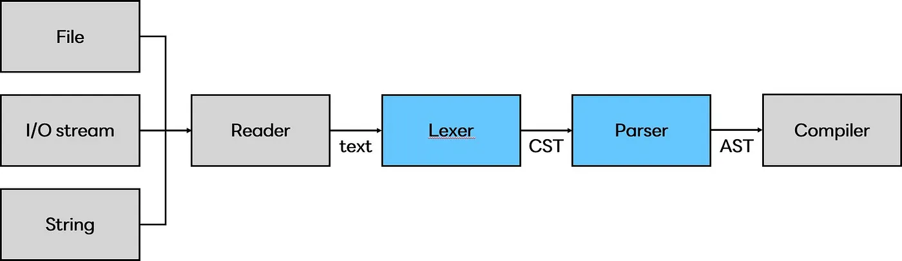
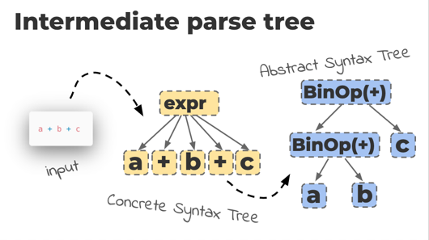
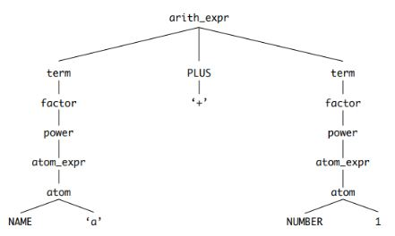
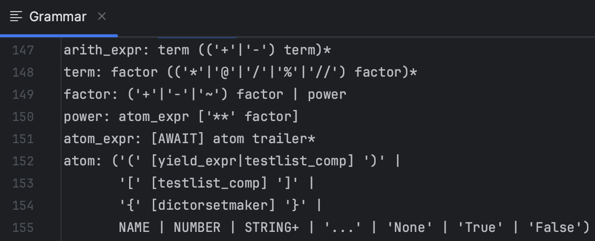
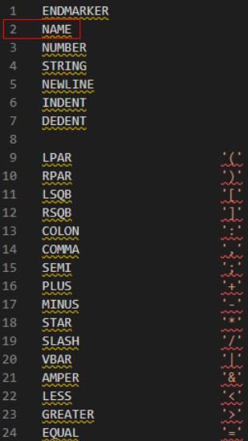
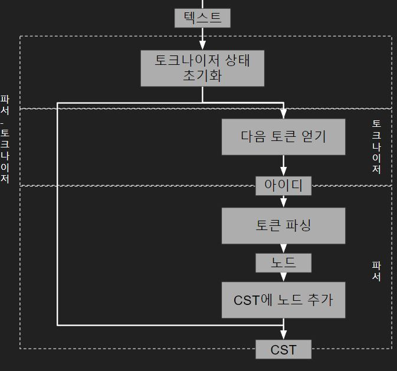
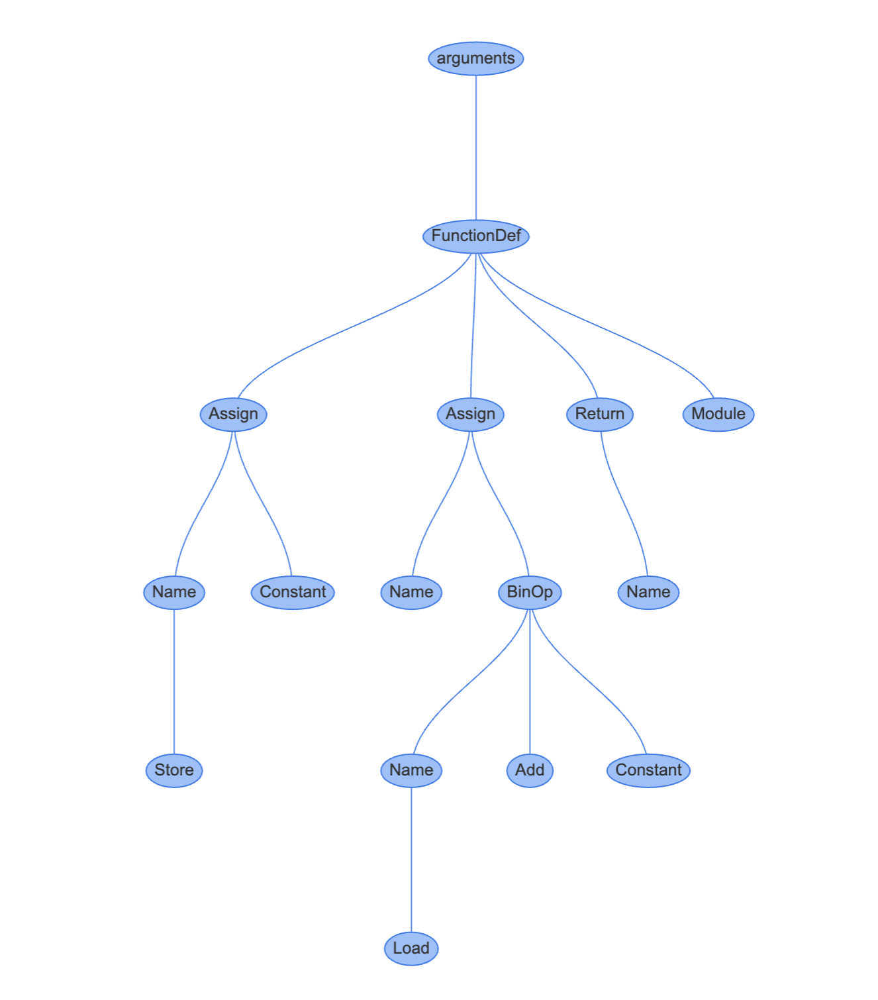
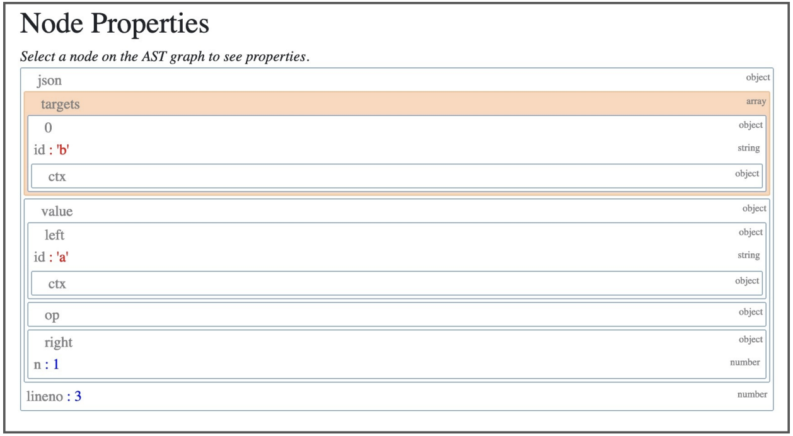
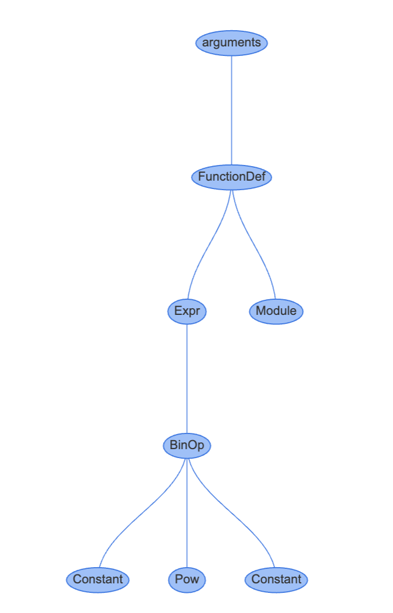
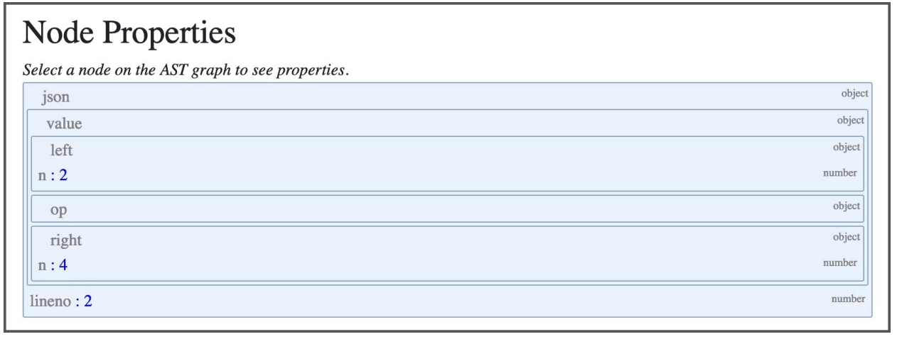

# 6. 렉싱과 파싱

- [렉싱과 파싱](#렉싱과-파싱)
  - [6.0 개요](#60-개요)
  - [6.1 CST 생성](#61-cst-생성)
  - [6.2 파서 \& 토크나이저](#62-파서--토크나이저)
  - [6.3 추상 구문 트리](#63-추상-구문-트리)
  - [6.4 정리](#64-정리)
  - [6.5 ‘거의 같음’ 비교 연산자 추가하기](#65-거의-같음-비교-연산자-추가하기)

## 6.0 개요

> _저번 시간에는 CPython 런타임 구성과 명령줄 문자열, 로컬 모듈, 스크립트 파일, 컴파일된 바이트 코드가 입력으로 들어왔을 때 CPython에서 어떻게 처리하는지 살펴보았습니다.<br/>
> 이번 시간에는 입력 받은 코드를 컴파일 가능한 논리적 구조로 만들어 주는 렉싱과 파싱에 대해 알아봅니다._

파이썬은 문법을 해석하기 위해서 CST(Concrete syntax tree) 와 AST(Abstract syntax tree) 두 가지 구조를 사용하며, 각각 렉서와 파서에 의해 만들어집니다.
<br/>



<!-- <p align="center"></p> -->

##### \*_출처: https://medium.com/@codeinseoul/python-lexer-and-parser-d0dbe676a6e_

<br/>



- CST : 토큰과 심벌에 대한 **문맥(context)이 없는** 트리 집합
- AST : 파이썬 문법과 문장들에 대한 **문맥(context)이 있는** 트리 집합

잠깐! 책에서 '렉서'와 '파서+토크나이저' 두 용어를 혼용하고 있습니다. 이를테면 CST를 생성하는 건 렉서 혹은 파서+토크나이저라고 하는 식입니다. 그렇다면 두 용어는 동일한 뜻을 가진 단어일까요?

#### 🤔 파서+토크나이저 = 렉서?

```text
세 용어 모두 "컴파일러 이론 용어"입니다.

•Tokenizer: 구문에서 의미있는 요소들을 토큰으로 쪼갬
•Lexer: 토큰의 의미를 분석
•Parser: Lexical analyze 된 후 토큰화된 데이터를 CST라는 구조로 표현

*Lexical analyze?
•Tokenizer를 거치며 의미있는 단위로 쪼개지고, Lexer를 거치며 그 결과의 의미를 분석하는 과정

ex) return 명령어 분석
- return 이라는 단어에서 r, e, t, u, r, n 은 각각 따로놓고 보면 아무 의미도 가지지 않음
- Tokenizer 를 거치며 return 이라는 의미있는 단어가 됨 -> 토큰화
- Lexer 를 거치며 이 토큰은 무언가를 반환하라는 명령어구나! 라고 의미를 분석함
- 해당 토큰은 {type: 명령어, value: "return", child: []} 와 같은 식으로 의미가 분석되어 Parser 에게 전달됨
```

[References]
👉🏻[용어 정의, 사진](https://velog.io/@mu1616/%EC%BB%B4%ED%8C%8C%EC%9D%BC%EB%9F%AC-%EC%9D%B4%EB%A1%A0%EC%97%90%EC%84%9C-%ED%86%A0%ED%81%AC%EB%82%98%EC%9D%B4%EC%A0%80Tokenizer-%EB%A0%89%EC%84%9CLexer-%ED%8C%8C%EC%84%9CParse-%EC%9D%98-%EC%97%AD%ED%95%A0)
👉🏻[return 명령어 예시](https://trumanfromkorea.tistory.com/79)

- 결론: **원칙적으로 파서+토크나이저가 곧 렉서는 아닙니다.** 다만 **렉서, 즉 토큰의 의미를 분석하는 기능의 구현은 언어마다 다르며,** CPython의 렉서는 파서와 토크나이저를 합친 형태로 되어 있다고 이해하면 될 것 같습니다.

<br/>
<br/>
<br/>

## 6.1 CST 생성

파스 트리라고도 부르는 CST 는 작성한 코드를 루트와 순서가 있는 트리로 변환한 결과물입니다. 다음은 a + 1라는 산술식이 CST로 표현된 모습입니다.<br/>

<br/>

파서는 입력 스트림으로 들어오는 토큰들이 파이썬 문법에 맞는 토큰인지 검증하는 동시에 CST를 생성합니다. 검증에는 Grammar 폴더 내 Grammar 파일에 정의돼있는 심볼들을 사용하며, 심볼은 CST 를 구성하는 노드가 됩니다.

아래 사진을 통해 Grammar 파일에 정의된 arith_expr, term, factor, power 등의 심볼이 CST 노드에 대응한다는 사실을 확인할 수 있습니다.

<br/>

또한 <4. 파이썬 언어와 문법>(p.48)에서 나왔던 것처럼, 토큰은 Grammar 폴더의 Tokens 에서 정의하고 있습니다. 이번 시간에는 NAME과 NUMBER 토큰을 예시로 들겠습니다.
<br/>

- NAME 토큰은 변수나 함수, 클래스 모듈의 이름을 표현합니다.
- NUMBER 토큰은 다양한 숫자 형식 값을 표현합니다. 이를테면 '0b10000'로 표현된 숫자를 이진수라고 이해하는데 쓰일 수 있습니다.


<br/>

이 때 python의 symbol과 token 모듈로 컴파일된 심벌과 토큰을 확인할 수 있습니다.
<br/>
<br/>
<br/>

## 6.2 파서-토크나이저

### 6.2.1 연관된 소스 파일 목록

| 파일               | 설명                                                            |
| ------------------ | --------------------------------------------------------------- |
| Python/pythonrun.c | 파서와 컴파일러 실행                                            |
| Parser/parsetok.c  | 파서와 토크나이저 구현                                          |
| Parser/tokenizer.c | 토크나이저 구현                                                 |
| Parser/tokenizer.h | 토큰 상태 등의 데이터 모델을 정의하는 토크나이저 구현 헤더 파일 |
| Include/token.h    | Tools▶︎scripts▶︎generate_token.py에 의해 생성되는 토큰 정의     |
| Include/node.h     | 토크나이저를 위한 CST 노드 인터페이스와 매크로                  |

<br/>
<br/>

### 6.2.2. 파일 데이터를 파서에 입력하기

파서-토크나이저는 PyParser_ASTFromFileObject() 를 통해 파서의 진입점을 찾을 수 있습니다. PyParser_ASTFromFileObject() 은 다음 두 단계를 거쳐 CST -> AST 파싱을 진행합니다.

1. PyParser_ParseFileObject() 를 통해 CST 로 변환
2. PyAST_FromNodeObject() 를 사용해 CST 를 AST 로 변환<br>

PyParser_ParseFileObject() 함수는 2가지 중요한 작업을 수행합니다.<br/>

1. PyTokenizer_FromFile()을 사용해 토크나이저 상태 tok_state를 초기화<br/>
2. parsetok()를 사용해 토큰들을 CST(노드 리스트)로 변환 (Parser/parsetok.c L456:463)

```c
done:
    PyTokenizer_Free(tok);

    if (n != NULL) {
        _PyNode_FinalizeEndPos(n);
    }
    return n;
}
...
```

<br/><br/>

### 6.2.3 파서-토크나이저 흐름

기본적으로 커서가 텍스트 입력 끝에 도달하거나 문법 오류가 발견될 때까지 파서와 토크나이저를 실행합니다 (Parser/parsetok.c L242:253).

```c
#endif

    for (;;) {
        const char *a, *b;
        int type;
        size_t len;
        char *str;
        col_offset = -1;
        int lineno;
        const char *line_start;

        type = PyTokenizer_Get(tok, &a, &b);
        ...
```

<br/>

1. 본격적인 파서-토크나이저 실행 전, 토크나이저에서 사용하는 모든 상태를 저장하는 임시 데이터 구조인 tok_state를 초기화합니다 (Parser/parsetok.c L165:189).

```c
node *
PyParser_ParseFileObject(FILE *fp, PyObject *filename,
                         const char *enc, grammar *g, int start,
                         const char *ps1, const char *ps2,
                         perrdetail *err_ret, int *flags)
                         {
    struct tok_state *tok;
    ...
    if ((tok = PyTokenizer_FromFile(fp, enc, ps1, ps2)) == NULL) {
            err_ret->error = E_NOMEM;
            return NULL;
        }
        if (*flags & PyPARSE_TYPE_COMMENTS) {
            tok->type_comments = 1;
        }
        Py_INCREF(err_ret->filename);
        tok->filename = err_ret->filename;
        return parsetok(tok, g, start, err_ret, flags);
```

코드에서 볼 수 있듯, tok_state는 커서의 현재 위치와 같은 정보를 저장합니다.<br/>

2. tok_get()으로 다음 토큰을 얻고, 해당 토큰의 고유 ID를 파서로 전달합니다 (Parser/tokenizer.c L1171:1185).

```c
/* Get next token, after space stripping etc. */

static int
tok_get(struct tok_state *tok, const char **p_start, const char **p_end)
{
    int c;
    int blankline, nonascii;

    *p_start = *p_end = NULL;
  nextline:
    tok->start = NULL;
    blankline = 0;

    /* Get indentation level */
    if (tok->atbol) {
    ...
  return PyToken_OneChar(c);
}
```

3. 파서는 파서 생성기 오토마타(DFA)로 CST에 노드를 추가합니다 (Parser/parser.c L232:316).

```c
PyParser_AddToken(parser_state *ps, int type, char *str,
                  int lineno, int col_offset,
                  int end_lineno, int end_col_offset,
                  int *expected_ret)
{
  ...
  const dfa *d1 = PyGrammar_FindDFA(ps->p_grammar, nt);
  if ((err = push(&ps->p_stack, nt, d1,
                        arrow, lineno, col_offset,
                        end_lineno, end_col_offset)) > 0) {
                        D(printf(" MemError: push\n"));
                        return err;
                    }
                    D(printf(" Push '%s'\n", d1->d_name));
                    continue;
  ...
  return E_OK;
}

```

전 과정을 도식화하면 아래와 같습니다.

<br/><br/><br/>

## 6.3 추상 구문 트리

*추상 구문 트리 단계*는 CST를 실행 가능한 형태이면서 좀더 논리적인 구조로 변환하는 단계입니다. CST는 코드 파일의 텍스트를 있는 그대로 표현한 구조로, 텍스트로부터 토큰을 추출하여 토큰 종류만 구분해 둔 상태에 불과합니다. 때문에 기본적인 문법 구조는 알 수 있지만 함수, 스코프, 루프 등 상세 정보는 파악이 불가능합니다.
따라서 코드를 컴파일하기 전에 파이썬 언어 구조와 의미 요소를 표현하는 AST 로 변환해야 합니다.<br/>

AST는 CPython 파싱 과정 중 생성하지만 표준 라이브러리의 ast 모듈을 사용해 생성할 수도 있습니다.<br/>

AST의 상세 구현을 보기 전에 파이썬 코드의 기본 요소들이 AST로 어떻게 표현되는지 알아봅시다.<br/>

### 6.3.1 AST 관련 소스 파일 목록

| 파일                  | 용도                                                                                                    |
| --------------------- | ------------------------------------------------------------------------------------------------------- |
| Include▶︎python-ast.h | Parser▶︎asdl_c.py로 생성한 AST 노드 타입 선언                                                           |
| Parser▶︎Python.asdl   | 도메인 특화 언어인 ASDL(Abstract Syntax Description Language)5로 작성된 AST 노드 타입들과 프로퍼티 목록 |
| Python▶︎ast.c         | AST 구현                                                                                                |

> python-ast.h 파일은 Parser▶︎Python.asdl 에서 재생성되며, python ast 모듈이 문법을 재생성할 때 불러와 사용합니다. 때문에 Include▶︎python-ast.h의 파라미터와 이름은 Parser▶︎Python.asdl의 정의를 따릅니다. 그 후 AST 의 진입점인 PyAST_FromNodeObject( ) 는 TYPE(n) 에 대한 switch 문을 실행하고, 결과로 심벌 또는 토큰을 반환합니다.

<br/>
<br/>
<br/>

### 6.3.2 인스타비즈로 AST 시각화하기

인스타비즈는 AST와 CPython code objects를 웹 인터페이스에서 빠르게 시각화해서 볼 수 있는 파이썬 패키지입니다.

pip로 인스타비즈를 설치할 수 있습니다.

```bash
pip install instaviz
```

`instaviz.show()` 함수는 code object 타입의 인자 한개를 받습니다. [code object](https://docs.python.org/3/c-api/code.html)에 대해서는 다음 장(7장 컴파일러)에서 알아볼 것입니다.

일단 간단한 함수를 하나 정의하고 함수 이름을 인자로 넘겨보겠습니다.

```bash
$ python
>>> import instaviz
>>> def foo():
	a = 1
	b = a + 1
	return b
>>> instavize.show(foo)
# 내부적인 구현은 foo.__code__를 통해 컴파일된 함수 바디의 code object가 입력으로 들어갑니다.
```

명령줄에서 웹서버가 포트 8080에서 시작되었다는 출력을 볼 수 있습니다.

해당 포트를 사용 중이라면 instaviz.show(foo, **port=9090**)처럼 비어 있는 포트 번호를 직접 지정하고 실행하면 됩니다.

웹 브라우저에서 함수에 대한 자세한 분석을 확인할 수 있습니다.


다음 그래프는 REPL에서 선언한 함수를 AST로 표현한 모습입니다.

트리의 각 노드 타입은 AST 노드 클래스입니다. ast 모듈에서 찾을 수 있는 노드 클래스들은 모두 `_ast.AST`를 상속합니다. CST와 달리 AST의 노드들은 특정 프로퍼티들을 통해 자식노드와 연결됩니다. `b = a + 1`이 선언된 줄과 연결된 Assign 노드를 클릭해보세요!



Assign 노드는 두 개의 프로퍼티를 가집니다.

1. `targets` 는 값이 할당될 이름의 list입니다.
   - **a, b = 1, 2** 처럼 언패킹을 통해 한 번에 여러 이름에 값을 할당하기 위해 array를 사용합니다.
2. `value`는 이름에 할당할 값입니다. 이 경우에는 BinOp 표현식 a + 1가 할당됩니다.

BinOp 노드는 세 개의 프로퍼티를 가집니다.

- left: 왼쪽 항
- op: 연산자. 이 경우에는 더하기를 뜻하는 Add 노드(+)
- right: 오른쪽 항



## 6.3.3 AST 컴파일

C에서 AST를 컴파일하는 것은 매우 복잡한 작업입니다. `Python/ast.c` 모듈은 5000줄이 넘는 코드로 이루어져 있습니다..

AST의 공개 API는 CST와 파일 이름, 컴파일러 플래그, 메모리 저장 영역을 인자로 받습니다.

반환 타입은 파이썬 모듈을 표현하는 mod_ty 타입입니다. 해당 타입은 `Include/Python-ast.h`에서 정의합니다.

<details>
<summary> Include/Python-ast.h </summary>

```c
typedef struct _mod *mod_ty;
struct _mod {
    enum _mod_kind kind;
    union {
        struct {
            asdl_seq *body;
            asdl_seq *type_ignores;
        } **Module**;

        struct {
            asdl_seq *body;
        } **Interactive**;

        struct {
            expr_ty body;
        } **Expression**;

        struct {
            asdl_seq *argtypes;
            expr_ty returns;
        } **FunctionType**;

    } v;
};
```

</details>

<br/>

mod_ty는 다음 모듈 타입 중 하나를 담는 컨테이너 구조체입니다.

1. Module
2. Interactive
3. Expression
4. FunctionType

모듈 타입들은 `Parser/Python.asdl (AST 노드 타입들과 프로퍼티 목록)` 에서 정의합니다. 해당 파일에서 문장, 표현식, 연산자, 컴프리헨션(comprehension) 타입들도 찾을 수 있습니다.

AST가 생성하는 클래스들과 표준 라이브러리 ast 모듈의 클래스들은 `Parser/Python.asdl`에서 정의하는 타입입니다.

```bash
-- ASDL's 4 builtin types are:
	-- identifier, int, string, constant

module Python
{
    mod = Module(stmt* body, type_ignore* type_ignores)
        | Interactive(stmt* body)
        | Expression(expr body)
        | FunctionType(expr* argtypes, expr returns)

    ...

    expr = BoolOp(boolop op, expr* values)
         | NamedExpr(expr target, expr value)
         | BinOp(expr left, operator op, expr right)
```

ast 모듈은 문법을 다시 생성할 때 <span style="color: blue;">Include/Python-ast.h</span>를 import하는데요. 이 파일은 <span style="color: green;">Parser/Python.asdl</span>에서 자동으로 생성됩니다. 이때, <span style="color: blue;">Include/Python-ast.h</span>의 파라미터와 이름은 <span style="color: green;">Parser/Python.asdl</span>의 정의를 따릅니다. 또, <span style="color: blue;">Include/Python-ast.h</span>의 mod_ty 타입은 <span style="color: green;">Parser/Python.asdl</span>의 Module 정의로부터 생성됩니다.

`Python/ast.c`는 이 헤더 파일에서 제공하는 구조체들을 사용해 필요한 데이터를 가리키는 포인터를 담은 구조체들을 생성합니다.

AST의 진입점인 PyAST_FromNodeObject()는 TYPE(n)에 대한 switch문을 실행합니다. **TYPE()**은 CST 노드의 타입을 결정하는 매크로입니다.

**#define TYPE(n) ((n)->n_type)**

결과로는 심벌 또는 토큰 타입을 반환합니다.

```c
mod_ty
PyAST_FromNodeObject(const node *n, PyCompilerFlags *flags,
                     PyObject *filename, PyArena *arena)
{

	switch (TYPE(n)) {
              case file_input:
                        stmts = _Py_asdl_seq_new(num_stmts(n), arena);
                    ...
              case eval_input: {
                    ...
```

루트 노드의 타입은 항상 Module, Interactive, Expression, FunctionType 중 하나입니다.

- `file_input` 일 경우에는 **Module** 타입입니다.
- REPL 등으로 들어오는 `eval_input`일 경우에는 **Expression** 타입입니다.

`Python/ast.c`에는 각 타입에 대응되는 **ast_for_xxx** C 함수들이 구현되어 있습니다. 이 함수들은 CST의 노드 중에서 해당 statement에 대한 프로퍼티를 갖습니다.

간단한 예시로 2의 4제곱을 뜻하는 2 \*\* 4 같은 제곱에 대한 expression을 살펴보겠습니다. ast_for_power()는 연산자가 Pow(제곱), 좌측은 e(2), 우측은f(4)인 BinOp를 반환합니다.

**Python/ast.c 2716행**

```c
static expr_ty
ast_for_power(struct compiling *c, const node *n)
{
    /* power: atom trailer* ('**' factor)*
     */
    expr_ty e;
    REQ(n, power);
    e = ast_for_atom_expr(c, CHILD(n, 0));
    if (!e)
        return NULL;
    if (NCH(n) == 1)
        return e;
    if (TYPE(CHILD(n, NCH(n) - 1)) == factor) {
        expr_ty f = ast_for_expr(c, CHILD(n, NCH(n) - 1));
        if (!f)
            return NULL;
        e = BinOp(e, Pow, f, LINENO(n), n->n_col_offset,
                  n->n_end_lineno, n->n_end_col_offset, c->c_arena);
    }
    return e;
}
```

이번엔 **instaviz**로 제곱에 대한 AST를 확인해 보겠습니다.

```c
>>> def foo():
	2**4
>>> import instaviz
>>> instaviz.show(foo)
```



AST의 프로퍼티들도 확인해 봅시다.



요약하자면 모든 statement type과 expression에는 ast*for*\*() 생성자 함수가 있습니다.(AST 노드로 변환하는 역할을 담당하는 함수) arguments는 `Parser/Python.asdl`에서 정의하며 표준 라이브러리의 [ast 모듈](https://docs.python.org/3/library/ast.html)을 통해 외부에 제공됩니다.

statement 과 expression이 자식 노드를 가지고 있으면 dfs를 통해 자식 노드에 대한 ast*for*\*() 함수를 먼저 호출합니다.

## 6.4 정리

- AST : 파이썬 문법과 문장들에 대한 _문맥_(context) 있는\* 트리 집합.
- CST : 토큰과 심벌에 대한 _문맥(context)이 없는_ 트리 집합
- 토큰 : 심벌의 종류 중 하나.
- 토큰화 : 텍스트를 토큰들로 변환하는 과정이다.
- 파싱 : 텍스트를 CST 나 AST 로 변환하는 과정이다.

<br/>
<br/>
<br/>

# 6.5 ‘거의 같음’ 비교 연산자 추가하기

파이썬에 새 연산자를 추가해보겠습니다.

파이썬 문법 정의는 Grammar/python.gram에 정의되고 python 토큰은 Grammar/Tokens에 저장되어 있는데요. 모두 `pegen`이라 불리는 파서 생성기의 input이 됩니다. **pegen**은 자동적으로 파이썬 렉서와 파서를 이러한 정의로부터 생성합니다.

~= 심벌을 사용하는 ‘**거의 같음**’ 연산자를 비교 연산자로 새로 추가 해보겠습니다. ‘거의 같음’ 연산자는 다음과 같이 동작합니다.

- 정수와 정수를 비교할 때는 일반 동등 연산자를 사용.

```python
>>> 1 ~= 1
True
>>> 1 ~= 2
False
```

- 정수와 부동 소수점을 비교할 때 부동 소수점은 정수로 변환해 비교.

```python
>>> 1 ~= 1.000000021
True
>>> 1 ~= 1.9
False
```

새 연산자를 추가하려면 먼저 CPython 문법을 변경해야 합니다. 비교 연산자들은 Grammar/python.gram 파일에 `comp_op` 심벌로 정의되어 있습니다.

### Grammar/python.gram

(notation이 [EBNF](https://en.wikipedia.org/wiki/Extended_Backus%E2%80%93Naur_form) 과 [PEG](https://en.wikipedia.org/wiki/Parsing_expression_grammar) 이 섞여 들어있습니다!)

```
comparison[expr_ty]:
    | a=bitwise_or b=compare_op_bitwise_or_pair+ {
        _Py_Compare(a, CHECK(_PyPegen_get_cmpops(p, b)), CHECK(_PyPegen_get_exprs(p, b)), EXTRA) }
    | bitwise_or
compare_op_bitwise_or_pair[CmpopExprPair*]:
    | eq_bitwise_or
    | noteq_bitwise_or
    | lte_bitwise_or
    | lt_bitwise_or
    | gte_bitwise_or
    | gt_bitwise_or
    | notin_bitwise_or
    | in_bitwise_or
    | isnot_bitwise_or
    | is_bitwise_or
    | ale_bitwise_or    <-- 이곳에 추가
eq_bitwise_or[CmpopExprPair*]: '==' a=bitwise_or { _PyPegen_cmpop_expr_pair(p, Eq, a) }
noteq_bitwise_or[CmpopExprPair*]:
    | (tok='!=' { _PyPegen_check_barry_as_flufl(p, tok) ? NULL : tok}) a=bitwise_or {_PyPegen_cmpop_expr_pair(p, NotEq, a) }
lte_bitwise_or[CmpopExprPair*]: '<=' a=bitwise_or { _PyPegen_cmpop_expr_pair(p, LtE, a) }
lt_bitwise_or[CmpopExprPair*]: '<' a=bitwise_or { _PyPegen_cmpop_expr_pair(p, Lt, a) }
gte_bitwise_or[CmpopExprPair*]: '>=' a=bitwise_or { _PyPegen_cmpop_expr_pair(p, GtE, a) }
gt_bitwise_or[CmpopExprPair*]: '>' a=bitwise_or { _PyPegen_cmpop_expr_pair(p, Gt, a) }
notin_bitwise_or[CmpopExprPair*]: 'not' 'in' a=bitwise_or { _PyPegen_cmpop_expr_pair(p, NotIn, a) }
in_bitwise_or[CmpopExprPair*]: 'in' a=bitwise_or { _PyPegen_cmpop_expr_pair(p, In, a) }
isnot_bitwise_or[CmpopExprPair*]: 'is' 'not' a=bitwise_or { _PyPegen_cmpop_expr_pair(p, IsNot, a) }
is_bitwise_or[CmpopExprPair*]: 'is' a=bitwise_or { _PyPegen_cmpop_expr_pair(p, Is, a) }
ale_bitwise_or[CmpopExprPair*]: '~=' a=bitwise_or {_PyPegen_cmpop_expr_pair(p, ALE, a) }
```

compare_op_bitwise_or_pair 식에 `ale_bitwise_or` 를 허용하겠습니다.

이제 ‘~=’ 단말 기호를 포함하는 `ale_bitwise_or` 식을 정의했습니다.

`_PyPegen_cmpop_expr_pair(p, ALE, a)` 함수 호출은 AST에서 ‘거의 같음’ 연산자를 뜻하는 AlE(Almost Equal) 타입 cmpop 노드를 가져옵니다.

다음으로 Grammar/Tokens에 토큰을 추가하겠습니다.

```ABAP
ATEQUAL                 '@='
RARROW                  '->'
ELLIPSIS                '...'
COLONEQUAL              ':='
ALMOSTEQUAL             '~=' # 이곳에 추가
```

변경한 문법과 토큰을 c 코드에 반영하려면 헤더를 다시 생성해야 합니다.

```bash
# mac os / lunux
make regen-token regen-pegen

# window (at root dir)
./PCbuild/build.bat --regen

# makefile이 루트 디렉토리에 없다면 ./configure 후 진행할 것
```

<details>
<summary>각각의 타겟은 어떤 작업을 할까?</summary>

**regen-pegen**

```makefile
regen-pegen:
	@$(MKDIR_P) $(srcdir)/Parser/pegen
	PYTHONPATH=$(srcdir)/Tools/peg_generator $(PYTHON_FOR_REGEN) -m pegen -q c \
		$(srcdir)/Grammar/python.gram \
		$(srcdir)/Grammar/Tokens \
		-o $(srcdir)/Parser/pegen/parse.new.c
	$(UPDATE_FILE) $(srcdir)/Parser/pegen/parse.c $(srcdir)/Parser/pegen/parse.new.c
```

- 문법 파일 변경 후 파서를 재생성
- Grammar/Tokens, Grammar/python.gram 을 `Tools/peg_generator` 입력으로 줘서 `Parser/parser.c` 를 생성합니다.
  **regen-token**

```makefile
regen-token:
	# Regenerate Doc/library/token-list.inc from Grammar/Tokens
	# using Tools/scripts/generate_token.py
	$(PYTHON_FOR_REGEN) $(srcdir)/Tools/scripts/generate_token.py rst \
		$(srcdir)/Grammar/Tokens \
		$(srcdir)/Doc/library/token-list.inc
	# Regenerate Include/token.h from Grammar/Tokens
	# using Tools/scripts/generate_token.py
	$(PYTHON_FOR_REGEN) $(srcdir)/Tools/scripts/generate_token.py h \
		$(srcdir)/Grammar/Tokens \
		$(srcdir)/Include/token.h
	# Regenerate Parser/token.c from Grammar/Tokens
	# using Tools/scripts/generate_token.py
	$(PYTHON_FOR_REGEN) $(srcdir)/Tools/scripts/generate_token.py c \
		$(srcdir)/Grammar/Tokens \
		$(srcdir)/Parser/token.c
	# Regenerate Lib/token.py from Grammar/Tokens
	# using Tools/scripts/generate_token.py
	$(PYTHON_FOR_REGEN) $(srcdir)/Tools/scripts/generate_token.py py \
		$(srcdir)/Grammar/Tokens \
		$(srcdir)/Lib/token.py
```

- 토큰 추가 후 토큰 관련 파일 재생성
- (참고) 보통의 PEG 파서들은 파서가 parsing 과 tokenization 을 모두 하지만 Pegen의 경우는 대화형 모드 지원등의 이유로 커스텀 토크나이저를 사용합니다.

</details>

<br/>

헤드를 다시 생성하면 토크나이저도 자동으로 변경됩니다. `Parser/token.c` 에 **PyToken_TwoChars()** 함수의 case가 변경된 것을 확인할 수 있습니다.

```python
int
PyToken_TwoChars(int c1, int c2)
{

...

case '~':
        switch (c2) {
        case '=': return ALMOSTEQUAL;  <- 추가됨
        }
        break;
}

...

}
```

이제 토크나이저가 새 토큰을 처리할 수 있게 되었습니다. 하지만 아직 AST는 처리하지 못합니다.

현 상태에서 CPython 컴파일을 하려 하면 다음과 같은 메시지와 함께 실패 합니다.

<details>
<summary>문제발생</summary>
  
```c
CmpopExprPair *
_PyPegen_cmpop_expr_pair(Parser *p, cmpop_ty cmpop, expr_ty expr)
{
    assert(expr != NULL);
    CmpopExprPair *a = PyArena_Malloc(p->arena, sizeof(CmpopExprPair));
    if (!a) {
        return NULL;
    }
    a->cmpop = cmpop;
    a->expr = expr;
    return a;
}
```
</details>

<br/>

```bash
$ make -j2 -s

Parser/pegen/**parse.c**:9313:51: error: use of undeclared identifier 'AlE'
            _res = _PyPegen_cmpop_expr_pair ( p , AlE, a );
```

- 이는 `make j2 -s` 커맨드가 타이핑될 때, `Parser/parse.c` 가 컴파일 되는데 이때, ‘AlE’를 인식하지 못해 발생합니다.
- parse.c는 이전에 `make regen-pegen` 때 업데이트 되었습니다.

또, 아직 `Python/ast.c`의 **ast_for_comp_op()**는 **ALMOSTEQUAL**을 올바른 비교 연산자로 인식할 수 없습니다.

`Parser/Python.asdl`에서 정의하는 Compare 표현식은 좌측 표현식 left, 연산자 목록인 ops, 비교할 표현식 목록인 comparators로 이루어져있습니다.

```python
| Compare(expr left, cmpop* ops, expr* comparators)
```

Compare 정의는 cmpop 열거형을 참조합니다.

```python
cmpop = Eq | NotEq | Lt | LtE | Gt | GtE | Is | IsNot | In | NotIn
```

이 열거형은 비교 연산자로 사용할 수 있는 AST 리프 노드의 목록입니다. ‘거의 같음’ 연산자를 비교 연산자로 사용하기 위해 AlE를 추가하겠습니다.

```python
cmpop = Eq | NotEq | Lt | LtE | Gt | GtE | Is | IsNot | In | NotIn | AlE
```

이제 AST를 다시 생성해서 AST 헤더 파일에 변경된 AST를 반영하겠습니다.

```bash
make regen-ast
```

<details>
<summary>regen-ast</summary>

```makefile
.PHONY=regen-ast
regen-ast:
	# Regenerate Include/Python-ast.h and Python/Python-ast.c using Parser/asdl_c.py
	$(MKDIR_P) $(srcdir)/Include
	$(MKDIR_P) $(srcdir)/Python
	$(PYTHON_FOR_REGEN) $(srcdir)/Parser/asdl_c.py \
		$(srcdir)/Parser/Python.asdl \
		-H $(srcdir)/Include/Python-ast.h.new \
		-C $(srcdir)/Python/Python-ast.c.new

	$(UPDATE_FILE) $(srcdir)/Include/Python-ast.h $(srcdir)/Include/Python-ast.h.new
	$(UPDATE_FILE) $(srcdir)/Python/Python-ast.c $(srcdir)/Python/Python-ast.c.new
```

- Python-ast.h , Python-ast.c 재생성
- (참고)

```
UPDATE_FILE=python3.9 $(srcdir)/Tools/scripts/update_file.py
```

</details>

</br>

`Include/Python-ast.h`에서 비교 연산자를 정의하는 열거형인 **\_cmpop**에 AlE가 추가된 것을 확인할 수 있습니다.

```python
typedef enum _cmpop { Eq=1, NotEq=2, Lt=3, LtE=4, Gt=5, GtE=6, Is=7, IsNot=8,
                      In=9, NotIn=10, AlE=11 } cmpop_ty;
```

AST는 `ALMOSTEQAUL` 토큰이 비교 연산자 **AlE**라는 것을 아직은 알 수 없습니다. 토큰을 연산자로 인식할 수 있게 AST C 코드를 수정하겠습니다.

`Python/ast.c` 의 **ast_for_comp_op()**로 이동해서 연산자 토큰에 대한 switch 문을 찾아보겠습니다.

해당 switch문은 \_cmpop 열거형 값 중 하나를 반환하는데요. 여기에 ALMOSTEQUAL 토큰일 경우 AlE 비교 연산자를 반환하는 case를 추가합니다.

### Python/ast.c

```c
static cmpop_ty
ast_for_comp_op(struct compiling *c, const node *n)
{
    /* comp_op: '<'|'>'|'=='|'>='|'<='|'!='|'in'|'not' 'in'|'is'
               |'is' 'not'
    */
    REQ(n, comp_op);
    if (NCH(n) == 1) {
        n = CHILD(n, 0);
        switch (TYPE(n)) {
            case LESS:
                return Lt;
            case GREATER:
                return Gt;
            case ALMOSTEQUAL: // ALMOSTEQUAL 토큰을 인식
                return AlE; // AST 노드 AlE를 반환
                ...
```

이제 토크나이저와 AST 모두 코드를 파싱할 수 있지만 아직 저희는 연산자에 대한 동작을 구현하지 않았기 때문에 컴파일러는 이 연산자를 실행하는 방법을 모르는 상태입니다.

AST로 나타낸 ‘거의 같음’ 연산자를 확인해 보려면 `ast.parse()`가 반환한 값에서 첫 번째 연산자를 출력해봅시다.

```python
>>> import ast
>>> m = ast.parse('1 ~= 2')
>>> m.body[0].value.ops[0]
<_ast.AlE object at ~~~>
```

AST가 코드를 올바르게 파싱했다면 비교 연산자 AlE타입의 객체가 출력될 것입니다.

다음 장에서는 Cpython 컴파일러가 동작하는 방식을 알아보고 ‘거의 같음’ 연산자의 동작을 구현할 예정입니다.
