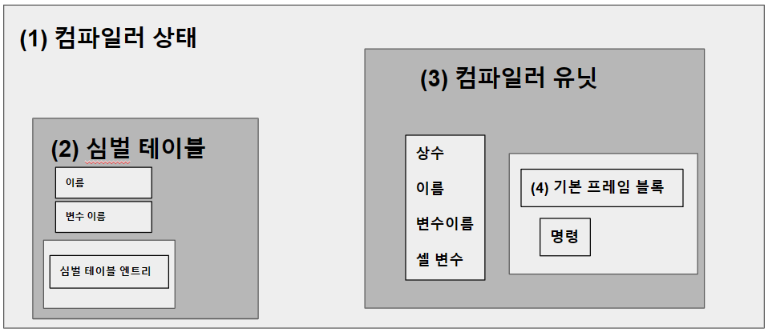
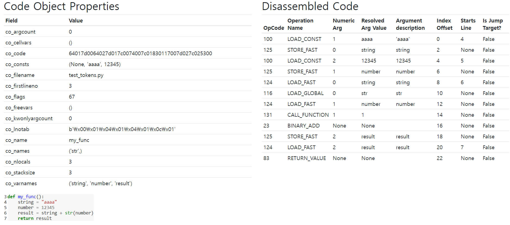
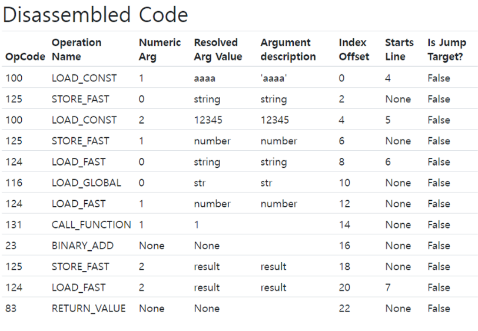

# 7. 컴파일러
  
파이썬 코드를 파싱하면 연산자, 함수, 클래스, 이름 공간을 포함하는 AST가 생성   
AST를 CPU 명령으로 바꾸는 것이 **컴파일러**

## 컴파일 과정

컴파일 과정을 그림으로 표현  
앞장에서 본 렉싱과 파서를 통하여 생성한 AST를 컴파일러를 통하여 CFG(Control Flow Graph)로 변환   
어셈블러를 통하여 CFG의 노드를 순서대로 **바이트 코드로 변환** 후 **실행**

### 컴파일과 관련된 소스

| 파일                | 목적              |
|-------------------|-----------------|
| Python/compile.c  | 컴파일러의 구현        |
| Include/compile.h | 컴파일러 API와 타입 정의 |

PyAST_CompileObject() CPython 컴파일러의 주 진입점


**컴파일러 상태**는 심벌 테이블을 담는 타입  
**심벌 테이블**은 변수 이름을 포함하고 추가로 하위 심벌 테이블을 포함할 수 있음   
**컴파일러 타입**에는 컴파일러 유닛도 포함   
각 **컴파일러 유닛**은 이름, 변수 이름, 상수, 셀(cell) 변수들을 포함   
컴파일러 유닛은 **기본 프레임 블록**을 포함
기본 프레임 블록은 **바이트코드 명령**을 포함

## 컴파일러 인스턴스 생성
컴파일러를 실행하기 앞서 전역 컴파일러 상태가 생성  
compiler 타입은 컴파일러 플래그, 스택, PyArena 등 컴파일러를 위한 다양한 프로퍼티를 포함   
컴파일러 상태는 심벌 테이블 등의 다른 구조체도 포함
```cpp
struct compiler {
    PyObject *c_filename;
    struct symtable *c_st;
    PyFutureFeatures *c_future; /* pointer to module's __future__ */
    PyCompilerFlags *c_flags;

    int c_optimize;              /* optimization level */
    int c_interactive;           /* true if in interactive mode */
    int c_nestlevel;
    int c_do_not_emit_bytecode;  /* The compiler won't emit any bytecode
                                    if this value is different from zero.
                                    This can be used to temporarily visit
                                    nodes without emitting bytecode to
                                    check only errors. */

    PyObject *c_const_cache;     /* Python dict holding all constants,
                                    including names tuple */
    struct compiler_unit *u; /* compiler state for current block */
    PyObject *c_stack;           /* Python list holding compiler_unit ptrs */
    PyArena *c_arena;            /* pointer to memory allocation arena */
};
```
PyAST_CompileObject()가 다음과 같이 컴파일러 상태 초기화

모듈에 문서화 문자열(\_\_doc\_\_)이 없다면 빈 문서화 문자열 생성   
\_\_annotations\_\_ 프로퍼티도 동일 작업 수행
스택 트레이스 및 예외 처리에 필요한 파일 이름을 컴파일러 상태에 설정  
인터프리터가 사용한 메모리 할당 아레나(arena)를 컴파일러의 메모리 할당 아레나로 설정 (메모리 할당자는 9장 메모리 관리 참고)   
코드 컴파일 전 퓨처 플래그들을 설정

## 퓨처 플래그와 컴파일러 플래그
컴파일러 기능 설정
1. 환경 변수 명령줄 플래그를 담는 구성 상태
2. 모듈 소스 코드의 \_\_future\_\_ 문

**퓨처 플래그**는 Python 2와 3 간 이식 지원을 위해 사용

**컴파일러 플래그**는 실행 환경에 의존적, 실행 방식을 변경 할 수 있음   
예시로 -O 플래그는 디버그 용도의 assert 문을 비활성화 하는 최적화를 진행   
PYTHONOPTIMIZE=1 환경 변수로도 활성화 가능

## 심벌 테이블
코드 컴파일 전 PySymtable_BuildObject() API로 심벌 테이블 생성   
전역, 지역 등 이름 공간 목록을 컴파일러에 제공  
컴파일러는 심벌 테이블에서 얻은 이름 공간에서 스코프를 결정, 참조를 실행

```cpp
struct symtable {
    PyObject *st_filename;          /* name of file being compiled,
                                       decoded from the filesystem encoding */
    struct _symtable_entry *st_cur; /* current symbol table entry */
    struct _symtable_entry *st_top; /* symbol table entry for module */
    PyObject *st_blocks;            /* dict: map AST node addresses
                                     *       to symbol table entries */
    PyObject *st_stack;             /* list: stack of namespace info */
    PyObject *st_global;            /* borrowed ref to st_top->ste_symbols */
    int st_nblocks;                 /* number of blocks used. kept for
                                       consistency with the corresponding
                                       compiler structure */
    PyObject *st_private;           /* name of current class or NULL */
    PyFutureFeatures *st_future;    /* module's future features that affect
                                       the symbol table */
    int recursion_depth;            /* current recursion depth */
    int recursion_limit;            /* recursion limit */
};
```
컴파일러당 하나의 symtable 인스턴스만 사용, 공간 관리 중요   
두 클래스가 동일한 이름의 메서드를 가지고 있을 경우 모듈에서 어떤 메서드를 호출할지 정해주는 것  
하위 스코프의 변수를 상위 스코프에서 사용하지 못하게 하는 것  
위 두 가지가 symtable의 역할   

### 심벌 테이블 구현
symtable.c 에서 찾을 수 있다   
주 인터페이스는 PySymtable_BuildObject()    
mod_ty 타입(Module, Interactive, Expression, FunctionType)에 따라 모듈 내의 문장을 순회   
mod_ty 타입인 AST의 노드의 분기를 재귀적으로 탐색하며 symtable의 엔트리로 추가
```cpp
struct symtable *
PySymtable_BuildObject(mod_ty mod, PyObject *filename, PyFutureFeatures *future)
{
    struct symtable *st = symtable_new();
    asdl_seq *seq;
    int i;
    PyThreadState *tstate;
    int recursion_limit = Py_GetRecursionLimit();
    int starting_recursion_depth;
...
    st->st_top = st->st_cur;
    switch (mod->kind) {
    case Module_kind:
        seq = mod->v.Module.body;
        for (i = 0; i < asdl_seq_LEN(seq); i++)
            if (!symtable_visit_stmt(st,
                        (stmt_ty)asdl_seq_GET(seq, i)))
                goto error;
        break;
    case Expression_kind:
        if (!symtable_visit_expr(st, mod->v.Expression.body))
            goto error;
        break;
    case Interactive_kind:
        seq = mod->v.Interactive.body;
        for (i = 0; i < asdl_seq_LEN(seq); i++)
            if (!symtable_visit_stmt(st,
                        (stmt_ty)asdl_seq_GET(seq, i)))
                goto error;
        break;
    case FunctionType_kind:
        PyErr_SetString(PyExc_RuntimeError,
                        "this compiler does not handle FunctionTypes");
        goto error;
    }
...
```
모듈의 각 문을 순회, symtable_visit_stmt() 를 호출   
Parser → Python.asdl에서 정의한 모든문 타입에 대한 case를 가지고 있는 거대한 swich 문   

각 문 타입마다 심벌을 처리하는 함수 존재   
함수 정의문 타입을 처리하는 함수는 다음 처리를 위한 로직이 있다
- 현재 재귀 깊이가 제귀 제한을 넘지 않았는지 검사
- 함수가 함수 객체로 넘겨지거나 호출될 수 있도록 함수 이름 심벌 테이블에 추가
- 기본 인자 중 리터럴이 아닌 인자는 심벌 테이블에서 찾음
- 타입 힌트 처리
- 함수 데코레이터 처리

마지막으로 symtable_enter_block()이 함수 블록을 방문해 인자와 함수 본문 처리

이렇게 생성된 심벌 테이블은 컴파일러로 넘김

## 핵심 컴파일 과정

```c
 // Python/compile.c
 
 * This file compiles an abstract syntax tree (AST) into Python bytecode.
 *
 * The primary entry point is PyAST_Compile(), which returns a
 * PyCodeObject.  The compiler makes several passes to build the code
 * object:
 *   1. Checks for future statements.  See future.c
 *   2. Builds a symbol table.  See symtable.c.
 *   3. Generate code for basic blocks.  See compiler_mod() in this file.
 *   4. Assemble the basic blocks into final code.  See assemble() in
 *      this file.
 *   5. Optimize the byte code (peephole optimizations).  See peephole.c
```

- PyAST_CompileObject()에 컴파일러 상태와 symtable, AST로 파싱된 모듈이 준비되면 컴파일이 시작됨
    - 컴파일러 상태(future.c), 심벌 테이블(symtable.c), AST(parser.c)를 Control Flow Graph로 변환
    - 논리 오류나 코드 오류를 탐지해 실행 단계를 런타임 예외로부터 보호함

### python에서 컴파일러 사용하기

- 내장 함수인 compile()로 컴파일러를 직접 호출할 수 있음

```python
>>> co = compile("b + 1", "test.py", "eval") # compile는 code object를 반환함
>>> co
<code object <module> at 0x7f6f8e8e2040, file "test.py", line 1>
>>> co.co_code # 컴파일된 코드는 co_code 속성에 담김
b'e\x00d\x00\x17\x00S\x00'
```

- 컴파일된 코드를 바이트코드 명령어 형태로 보기 위해서는 바이트코드 역어셈블러 모듈 dis를 사용하면 됨

```python
>>> import dis
>>> dis.dis(co.co_code) # 컴파일된 코드는 바이트코드 명령어 순서로 실행됨
          0 LOAD_NAME                0 (0)
          2 LOAD_CONST               0 (0)
          4 BINARY_ADD
          6 RETURN_VALUE
```

- instaviz 모듈을 이용해서도, code object와 bytecode를 확인할 수 있음



### 컴파일러 C API 간단 설명

- compiler_mod 는 compiler와 mod를 입력으로 받아서 최종적으로 코드 객체를 반환함
- compiler_mod 내의 compiler_body를 통해서 일련의 명령을 담고 있는 블록 리스트를 얻음
- compiler_mod 내의 assemble는 일련의 명령을 담고 있는 블록 리스트를 입력으로 받아서 코드 객체를 반환함
- assemble 내의 dfs를 통해서 일련의 명령을 담고 있는 블록 리스트를 입력으로 받아서 Control Flow Graph 형태로 변환함
- assemble 내의 makecode를 통해서 Control Flow Graph 형태를 입력으로 받아서 코드 객체를 반환함
- makecode 내의 PyCode_Optimize를 통해서 핍홀 최적화된 바이트코드를 반환함
- makecode 내의 PyCode_NewWithPosOnlyArgs를 통해서 최적화된 바이트 코드를 코드 객체를 반환함

### 컴파일러 C API

- AST 모듈 컴파일의 진입점인 compiler_mod(struct compiler *c, mod_ty mod)는 모듈 타입에 따라 다른 컴파일러 함수를 사용함
- mod가 Module일 경우 모듈은 컴파일러 유닛으로 컴파일되어 c_stack 프로퍼티에 저장됨
- 컴파일러 유닛 스택에서 PyCodeObject를 생성하기 위해 assemble() 을 실행함

```c
// Python/compile.c

static PyCodeObject *
compiler_mod(**struct compiler *c**, **mod_ty mod**)
{
    **PyCodeObject *co;
    int addNone = 1;
    static PyObject *module;**
    if (!module) {
        module = PyUnicode_InternFromString("<module>");
        if (!module)
            return NULL;
    }
    /* Use 0 for firstlineno initially, will fixup in assemble(). */
    if (!compiler_enter_scope(c, module, COMPILER_SCOPE_MODULE, mod, 0))
        return NULL;
    **switch (mod->kind) {
    case Module_kind:
        if (!compiler_body(c, mod->v.Module.body)) {
            compiler_exit_scope(c);
            return 0;
        }
        break;**
    case Interactive_kind:
        if (find_ann(mod->v.Interactive.body)) {
            ADDOP(c, SETUP_ANNOTATIONS);
        }
        c->c_interactive = 1;
        VISIT_SEQ_IN_SCOPE(c, stmt,
                                mod->v.Interactive.body);
        break;
    case Expression_kind:
        VISIT_IN_SCOPE(c, expr, mod->v.Expression.body);
        addNone = 0;
        break;
    default:
        PyErr_Format(PyExc_SystemError,
                     "module kind %d should not be possible",
                     mod->kind);
        return 0;
    }
    **co = assemble(c, addNone);**
    compiler_exit_scope(c);
    return co;
}
```

- compiler_body() 는 모듈의 각 문(함수, 클래스, for, while …)을 순회하면 방문함
- AST 노드 타입을 확인하는 asdl_seq_GET() 호출을 통해 이 문의 타입이 결정됨

```c
// Python/compile.c

static int
compiler_body(struct compiler *c, asdl_seq *stmts)
{
    int i = 0;
    stmt_ty st;
    PyObject *docstring;

    /* Set current line number to the line number of first statement.
       This way line number for SETUP_ANNOTATIONS will always
       coincide with the line number of first "real" statement in module.
       If body is empty, then lineno will be set later in assemble. */
    if (c->u->u_scope_type == COMPILER_SCOPE_MODULE && asdl_seq_LEN(stmts)) {
        st = (stmt_ty)asdl_seq_GET(stmts, 0);
        SET_LOC(c, st);
    }
    /* Every annotated class and module should have __annotations__. */
    if (find_ann(stmts)) {
        ADDOP(c, SETUP_ANNOTATIONS);
    }
    if (!asdl_seq_LEN(stmts))
        return 1;
    /* if not -OO mode, set docstring */
    if (c->c_optimize < 2) {
        docstring = _PyAST_GetDocString(stmts);
        if (docstring) {
            i = 1;
            st = (stmt_ty)asdl_seq_GET(stmts, 0);
            assert(st->kind == Expr_kind);
            VISIT(c, expr, st->v.Expr.value);
            if (!compiler_nameop(c, __doc__, Store))
                return 0;
        }
    }
    **for (; i < asdl_seq_LEN(stmts); i++)
        VISIT(c, stmt, (stmt_ty)asdl_seq_GET(stmts, i));
    return 1;**
}
```

- **VISIT** 매크로는 각 문 타입에 해당하는 ****Python/compile.c의 함수를 호출함

```c
// Python/compile.c

#define VISIT(C, TYPE, V) {\
    if (!compiler_visit_ ## TYPE((C), (V))) \
        return 0; \
}
```

- 모든 문을 포괄하는 stmt 타입의 경우 컴파일러는 compiler_visit_stmt를 호출해 Parser/Python.asdl에 정의된 하위문 타입들로 전환함
- 예를 들어 파이썬 for문이 들어오면 compiler_visit_stmt()는 compiler_for()를 호출함
- 모든 문과 표현식 타입에는 해당 타입에 대한 compiler_*() 함수가 존재하며, 간단한 타입들은 인라인으로 바이트코드 명령어를 생성하고, 더 복잡한 문 타입들은 다른 함수를 호출함

```c
// Python/compile.c

static int
compiler_visit_stmt(struct compiler *c, stmt_ty s)
{
    Py_ssize_t i, n;

    /* Always assign a lineno to the next instruction for a stmt. */
    SET_LOC(c, s);

    switch (s->kind) {
    case FunctionDef_kind:
        return compiler_function(c, s, 0);
    case ClassDef_kind:
        return compiler_class(c, s);
    case Return_kind:
        return compiler_return(c, s);
    case Delete_kind:
        VISIT_SEQ(c, expr, s->v.Delete.targets)
        break;
    case Assign_kind:
        n = asdl_seq_LEN(s->v.Assign.targets);
        VISIT(c, expr, s->v.Assign.value);
        for (i = 0; i < n; i++) {
            if (i < n - 1)
                ADDOP(c, DUP_TOP);
            VISIT(c, expr,
                  (expr_ty)asdl_seq_GET(s->v.Assign.targets, i));
        }
        break;
    case AugAssign_kind:
        return compiler_augassign(c, s);
    case AnnAssign_kind:
        return compiler_annassign(c, s);
    **case For_kind:
        return compiler_for(c, s);**
    case While_kind:
        return compiler_while(c, s);
    case If_kind:
        return compiler_if(c, s);
    case Raise_kind:
        n = 0;
        if (s->v.Raise.exc) {
            VISIT(c, expr, s->v.Raise.exc);
            n++;
            if (s->v.Raise.cause) {
                VISIT(c, expr, s->v.Raise.cause);
                n++;
            }
        }
        ADDOP_I(c, RAISE_VARARGS, (int)n);
        break;
    case Try_kind:
        return compiler_try(c, s);
    case Assert_kind:
        return compiler_assert(c, s);
    case Import_kind:
        return compiler_import(c, s);
    case ImportFrom_kind:
        return compiler_from_import(c, s);
    case Global_kind:
    case Nonlocal_kind:
        break;
    case Expr_kind:
        return compiler_visit_stmt_expr(c, s->v.Expr.value);
    case Pass_kind:
        break;
    case Break_kind:
        return compiler_break(c);
    case Continue_kind:
        return compiler_continue(c);
    case With_kind:
        return compiler_with(c, s, 0);
    case AsyncFunctionDef_kind:
        return compiler_function(c, s, 1);
    case AsyncWith_kind:
        return compiler_async_with(c, s, 0);
    case AsyncFor_kind:
        return compiler_async_for(c, s);
    }

    return 1;

```

- 컴파일러는 일련의 명령을 담고 있는 블록을 컴파일러 상태로 내보냄
    - 명령 구조체는 명령 코드와 인자, 문장이 위치한 줄번호를 포함함
        
        
        
    - 점프 명령일 경우 점프할 블록에 대한 포인터도 포함함
        - 점프 명령은 한 명령에서 다른 명령으로의 점프를 실행하면, 절대 점프 방식(코드 객체 상에서 정확한 명령의 위치를 대상으로 사용)과 상대 점프 방식(다른 명령을 기준으로 점프 대상을 지정)의 점프 명령을 사용할 수 있음
- 컴파일 단계가 끝나면, 블록 리스트가 완성되고, 각 프레임 블록은 명령 리스트와 다음 블록을 가리키는 포인터를 가짐
- 어셈블러는 기본 프레임 블록들에 깊이 우선 탐색(DFS)를 실행하고, 명령들을 단일한 바이트 코드 시퀀스로 병합함

```c
// Python/compile.c

static PyCodeObject *
assemble(struct compiler *c, int addNone)
{
    basicblock *b, *entryblock;
    struct assembler a;
    int i, j, nblocks;
    PyCodeObject *co = NULL;

    /* Make sure every block that falls off the end returns None.
       XXX NEXT_BLOCK() isn't quite right, because if the last
       block ends with a jump or return b_next shouldn't set.
     */
    if (!c->u->u_curblock->b_return) {
        NEXT_BLOCK(c);
        if (addNone)
            ADDOP_LOAD_CONST(c, Py_None);
        ADDOP(c, RETURN_VALUE);
    }

    nblocks = 0;
    entryblock = NULL;
    for (b = c->u->u_blocks; b != NULL; b = b->b_list) {
        nblocks++;
        entryblock = b;
    }

    /* Set firstlineno if it wasn't explicitly set. */
    if (!c->u->u_firstlineno) {
        if (entryblock && entryblock->b_instr && entryblock->b_instr->i_lineno)
            c->u->u_firstlineno = entryblock->b_instr->i_lineno;
        else
            c->u->u_firstlineno = 1;
    }
    if (!assemble_init(&a, nblocks, c->u->u_firstlineno))
        goto error;
    **dfs(c, entryblock, &a, nblocks);**

    /* Can't modify the bytecode after computing jump offsets. */
    assemble_jump_offsets(&a, c);

    /* Emit code in reverse postorder from dfs. */
    for (i = a.a_nblocks - 1; i >= 0; i--) {
        b = a.a_postorder[i];
        for (j = 0; j < b->b_iused; j++)
            if (!assemble_emit(&a, &b->b_instr[j]))
                goto error;
    }

    if (_PyBytes_Resize(&a.a_lnotab, a.a_lnotab_off) < 0)
        goto error;
    if (_PyBytes_Resize(&a.a_bytecode, a.a_offset * sizeof(_Py_CODEUNIT)) < 0)
        goto error;

    **co = makecode(c, &a);**
 error:
    assemble_free(&a);
    return co;
}
```

- 어셈블러는 기본 프레임 블록 그래프를 DFS로 탐색하는데, 기본 프레임 블록 그래프는 트리 구조인 CST와 AST와 노드가 명령을 담는 헝태의 그래프임
- 어셈블러는 DFS를 사용해 기본 프레임 블록 그래프를 Control Flow Graph 형태로 변환함

```c
// Python/compile.c

static void
dfs(struct compiler *c, basicblock *b, struct assembler *a, int end)
{
    int i, j;

    /* Get rid of recursion for normal control flow.
       Since the number of blocks is limited, unused space in a_postorder
       (from a_nblocks to end) can be used as a stack for still not ordered
       blocks. */
    for (j = end; b && !b->b_seen; b = b->b_next) {
        b->b_seen = 1;
        assert(a->a_nblocks < j);
        a->a_postorder[--j] = b;
    }
    while (j < end) {
        b = a->a_postorder[j++];
        for (i = 0; i < b->b_iused; i++) {
            struct instr *instr = &b->b_instr[i];
            if (instr->i_jrel || instr->i_jabs)
                dfs(c, instr->i_target, a, j);
        }
        assert(a->a_nblocks < j);
        a->a_postorder[a->a_nblocks++] = b;
    }
}
```

- makecode는 compiler와 assembler를 입력으로 받아서 코드 객체를 생성함
- PyCode_NewWithPosOnlyArgs()를 실행하기 전에 PyCode_Optimize()를 통해서 Python/peephole.c에서 제공하는 바이트코드 최적으로 진행한다
    - 바이트코드 명령을 확인하고 특정 시나리오에 해당될 경우 해당 명령을 다른 명령으로 교체해주는 작업을 함, 예를 들어 return 문 뒤의 도달할 수 없는 명령을 제거하는 것
    - 핍홀 최적화는 소규모의 명령 집합을 동등하거나 더 나은 성능을 제공하는 하나의 명령어나 더 짧은 명령어로 변환하는 방식으로 이루어짐

```c
static PyCodeObject *
makecode(struct compiler *c, struct assembler *a)
{
    PyObject *tmp;
    PyCodeObject *co = NULL;
    PyObject *consts = NULL;
    PyObject *names = NULL;
    PyObject *varnames = NULL;
    PyObject *name = NULL;
    PyObject *freevars = NULL;
    PyObject *cellvars = NULL;
    PyObject *bytecode = NULL;
    Py_ssize_t nlocals;
    int nlocals_int;
    int flags;
    int posorkeywordargcount, posonlyargcount, kwonlyargcount, maxdepth;

    consts = consts_dict_keys_inorder(c->u->u_consts);
    names = dict_keys_inorder(c->u->u_names, 0);
    varnames = dict_keys_inorder(c->u->u_varnames, 0);
    if (!consts || !names || !varnames)
        goto error;

    cellvars = dict_keys_inorder(c->u->u_cellvars, 0);
    if (!cellvars)
        goto error;
    freevars = dict_keys_inorder(c->u->u_freevars, PyTuple_GET_SIZE(cellvars));
    if (!freevars)
        goto error;

    if (!merge_const_tuple(c, &names) ||
            !merge_const_tuple(c, &varnames) ||
            !merge_const_tuple(c, &cellvars) ||
            !merge_const_tuple(c, &freevars))
    {
        goto error;
    }

    nlocals = PyDict_GET_SIZE(c->u->u_varnames);
    assert(nlocals < INT_MAX);
    nlocals_int = Py_SAFE_DOWNCAST(nlocals, Py_ssize_t, int);

    flags = compute_code_flags(c);
    if (flags < 0)
        goto error;

    **bytecode = PyCode_Optimize(a->a_bytecode, consts, names, a->a_lnotab);**
    if (!bytecode)
        goto error;

    tmp = PyList_AsTuple(consts); /* PyCode_New requires a tuple */
    if (!tmp)
        goto error;
    Py_DECREF(consts);
    consts = tmp;
    if (!merge_const_tuple(c, &consts)) {
        goto error;
    }

    posonlyargcount = Py_SAFE_DOWNCAST(c->u->u_posonlyargcount, Py_ssize_t, int);
    posorkeywordargcount = Py_SAFE_DOWNCAST(c->u->u_argcount, Py_ssize_t, int);
    kwonlyargcount = Py_SAFE_DOWNCAST(c->u->u_kwonlyargcount, Py_ssize_t, int);
    maxdepth = stackdepth(c);
    if (maxdepth < 0) {
        goto error;
    }
    **co = PyCode_NewWithPosOnlyArgs(posonlyargcount+posorkeywordargcount,
                                   posonlyargcount, kwonlyargcount, nlocals_int,
                                   maxdepth, flags, bytecode, consts, names,
                                   varnames, freevars, cellvars, c->c_filename,
                                   c->u->u_name, c->u->u_firstlineno, a->a_lnotab);**
 error:
    Py_XDECREF(consts);
    Py_XDECREF(names);
    Py_XDECREF(varnames);
    Py_XDECREF(name);
    Py_XDECREF(freevars);
    Py_XDECREF(cellvars);
    Py_XDECREF(bytecode);
    return co;
}
```

## 예제: ‘거의 같음’ 연산자 구현하기

- 6장 예제에서 이어서 진행
- Include/object.h 수정 ← **PyObject의 비교 함수에서 참조할 수 있도록 Py_AlE 연산자에 대한 #define 정의를 추가해야 함**
    
    ```c
    // Include/object.h
    
    /* Rich comparison opcodes */
    #define Py_LT 0
    #define Py_LE 1
    #define Py_EQ 2
    #define Py_NE 3
    #define Py_GT 4
    #define Py_GE 5
    **#define Py_AlE 6 // PyObject의 비교 함수에서 참조할 수 있도록, Py_AlE 연산자에 대한 #define 정의를 추가**
    
    /*
     * Macro for implementing rich comparisons
     *
     * Needs to be a macro because any C-comparable type can be used.
     */
    #define Py_RETURN_RICHCOMPARE(val1, val2, op)                               \
        do {                                                                    \
            switch (op) {                                                       \
            case Py_EQ: if ((val1) == (val2)) Py_RETURN_TRUE; Py_RETURN_FALSE;  \
            case Py_NE: if ((val1) != (val2)) Py_RETURN_TRUE; Py_RETURN_FALSE;  \
            case Py_LT: if ((val1) < (val2)) Py_RETURN_TRUE; Py_RETURN_FALSE;   \
            case Py_GT: if ((val1) > (val2)) Py_RETURN_TRUE; Py_RETURN_FALSE;   \
            case Py_LE: if ((val1) <= (val2)) Py_RETURN_TRUE; Py_RETURN_FALSE;  \
            case Py_GE: if ((val1) >= (val2)) Py_RETURN_TRUE; Py_RETURN_FALSE;  \
            **case Py_AlE: if ((val1) == (val2)) Py_RETURN_TRUE; Py_RETURN_FALSE;  \ // 비교 연산을 구현하기 위한 매크로에 Py_AlE에 대한 case를 추가**
            default:                                                            \
                Py_UNREACHABLE();                                               \
            }                                                                   \
        } while (0)
    ```
    
- Objects/object.c 수정 ← **Py_AlE도 사용할 수 있도록 해야 함**
    
    ```c
    // Objects/object.c
    
    /* Map rich comparison operators to their swapped version, e.g. LT <--> GT */
    **int _Py_SwappedOp[] = {Py_GT, Py_GE, Py_EQ, Py_NE, Py_LT, Py_LE, Py_AlE}; // Py_AlE를 연산자 타입의 값으로 사용할 수 있도록 함**
    
    **static const char * const opstrings[] = {"<", "<=", "==", "!=", ">", ">=", "~="}; // ~=를 클래스에 구현되지 않았을 때 에러메시지를 표시하는데 사용할 수 있도록 함**
    ....
    
    PyObject *
    PyObject_RichCompare(PyObject *v, PyObject *w, int op)
    {
        PyThreadState *tstate = _PyThreadState_GET();
    
        **assert(Py_LT <= op && op <= Py_AlE); // Py_AlE의 값인 6도 혀용할 수 있도록 수정, 기존에는 0 ~ 5 사이의 값을 확인했지만, 이제는 0 ~ 6 사이의 값을 확인함**
        if (v == NULL || w == NULL) {
            if (!_PyErr_Occurred(tstate)) {
                PyErr_BadInternalCall();
            }
            return NULL;
        }
        if (_Py_EnterRecursiveCall(tstate, " in comparison")) {
            return NULL;
        }
        PyObject *res = do_richcompare(tstate, v, w, op);
        _Py_LeaveRecursiveCall(tstate);
        return res;
    }
    ```
    
- Lib/opcode.py 수정 ← **~= 를 비교 연산자로 사용할 수 있게 함**
    
    ```python
    # Lib/opcode.py
    
    try:
        from _opcode import stack_effect
        __all__.append('stack_effect')
    except ImportError:
        pass
    
    **cmp_op = ('<', '<=', '==', '!=', '>', '>=', '~=') # 비교 연산자 리스트에 ~= 를 추가**
    ```
    
- Python/compile.c 수정 ← **Py_AlE의 바이트 코드를 생성할 수 있도록 함**
    
    ```python
    static int compiler_addcompare(struct compiler *c, cmpop_ty op)
    {
        int cmp;
        switch (op) {
        case Eq:
            cmp = Py_EQ;
            break;
        case NotEq:
            cmp = Py_NE;
            break;
        case Lt:
            cmp = Py_LT;
            break;
        case LtE:
            cmp = Py_LE;
            break;
        case Gt:
            cmp = Py_GT;
            break;
        case GtE:
            cmp = Py_GE;
            break;
        **case AlE:
            cmp = Py_AlE; // PyCmp_AlE인 BinOp 노드를 처리할 수 있도록 수정
            break;**
        case Is:
            ADDOP_I(c, IS_OP, 0);
            return 1;
        case IsNot:
            ADDOP_I(c, IS_OP, 1);
            return 1;
        case In:
            ADDOP_I(c, CONTAINS_OP, 0);
            return 1;
        case NotIn:
            ADDOP_I(c, CONTAINS_OP, 1);
            return 1;
        default:
            Py_UNREACHABLE();
        }
        ADDOP_I(c, COMPARE_OP, cmp);
        return 1;
    }
    ```
    
- Objects/floatobject.c 수정 ← **거의 같음 연산자의 로직을 추가함**
    
    ```c
     // Objects/floatobject.c
     
     Compare:
        switch (op) {
        case Py_EQ:
            r = i == j;
            break;
        case Py_NE:
            r = i != j;
            break;
        case Py_LE:
            r = i <= j;
            break;
        case Py_GE:
            r = i >= j;
            break;
        case Py_LT:
            r = i < j;
            break;
        case Py_GT:
            r = i > j;
            break;
        **case Py_AlE: { // 거의 같음 연산자를 수행할 수 있도록 추가
            double diff = fabs(i - j);
            double rel_tol = 1e-9;
            double abs_tol = 0.1;
            r = (((diff <= fabs(rel_tol * j)) || 
                  (diff <= fabs(rel_tol * i))) || 
                  (diff <= abs_tol));
            }
            break;**
        }
        return PyBool_FromLong(r);
    ```
    
- Python/ceval.c 수정 ← **거의 같음 연산자의 평가 루프를 추가함**
    
    ```c
    // Python/ceval.c 
    
    case TARGET(COMPARE_OP): {
        **assert(oparg <= Py_AlE); // 평가 루프 수정, 자세한 내용은 다음 장에서 다룸**
        PyObject *right = POP();
        PyObject *left = TOP();
        PyObject *res = PyObject_RichCompare(left, right, oparg);
        SET_TOP(res);
        Py_DECREF(left);
        Py_DECREF(right);
        if (res == NULL)
            goto error;
        PREDICT(POP_JUMP_IF_FALSE);
        PREDICT(POP_JUMP_IF_TRUE);
        DISPATCH();
    }
    ```
    
- 결과
    
    ```bash
    make regen-token regen-pegen
    make regen-ast
    make -j2 -s
    ./python
    
    # 결과
    >>> 1.0 ~= 1.01
    True
    >>> 1.0 == 1.01
    False
    >>> 1.1 ~= 1.101
    True
    >>> 1.1 == 1.101
    False
    >>> 1.0 ~= 1.5
    False
    
    # 추가로 COMPARE_OP에 ~=가 추가되었음을 알 수 있음
    >>> co = compile("1.0 ~= 1.01", "test.py", "eval")
    >>> import dis
    >>> dis.dis(co.co_code)
              0 LOAD_CONST               0 (0)
              2 LOAD_CONST               1 (1)
              4 COMPARE_OP               6 (~=)
              6 RETURN_VALUE
    ```
    

## 정리 (python 3.13.0 기준)

- 소스 코드 → 리더 → 렉서 → 파서 → 컴파일러 → 어셈블러 → 코드 객체 (컴파일은 모듈 단위로 진행됨)
    - 리더는 소스 코드를 입력 받아 텍스트 형태로 반환함
    - 렉서는 텍스트를 입력 받아 토큰 형태(Concrete Syntax Tree)로 반환함 ([`Parser/lexer/`](https://github.com/python/cpython/blob/main/Parser/lexer/) and [`Parser/tokenizer/`](https://github.com/python/cpython/blob/main/Parser/tokenizer/))
        - 여기서 반환된 토큰은 단순히 토큰의 종류만 구분된 상태로, 파이썬 언어 구조와 의미 요소를 반영하고 있지 않음
    - 파서는 토큰(Concrete Syntax Tree)을 입력 받아 Abstract Syntax Tree로 반환함([`Parser/parser.c`](https://github.com/python/cpython/blob/main/Parser/parser.c))
        - 여기서 반환된 Abstract Syntax Tree는 파이썬 언어 구조와 의미 요소를 반영하고 있음
    - 컴파일러는 Abstract Syntax Tree을 입력 받아 instruction sequence로 형태로 변환([`Python/compile.c`](https://github.com/python/cpython/blob/main/Python/compile.c))한 후 Control Flow Graph를 구성([`Python/flowgraph.c`](https://github.com/python/cpython/blob/main/Python/flowgraph.c))하고 최적화를 진행함
        - Control Flow Graph는 논리적 실행 순서를 나타내지만, CPU가 실행하기 위한 명령어 구조는 아님
    - 어셈블러는 Control Flow Graph를 입력 받아 bytecode 형태로 변환함([`Python/assemble.c`](https://github.com/python/cpython/blob/main/Python/assemble.c))
        - bytecode는 Control Flow Graph를 CPU에서 실행 가능한 명령으로 순차적으로 나열한 형태임
- 컴파일 과정을 통해서 생성된 코드 객체는 인터프리터로 넘겨저 실행되거나, .pyc 파일에 캐시됨

# References

- [https://devguide.python.org/internals/parser/](https://devguide.python.org/internals/parser/#)
- [https://devguide.python.org/internals/compiler/](https://devguide.python.org/internals/compiler/)
- [https://stackoverflow.com/questions/6889747/is-python-interpreted-or-compiled-or-both](https://stackoverflow.com/questions/6889747/is-python-interpreted-or-compiled-or-both)
