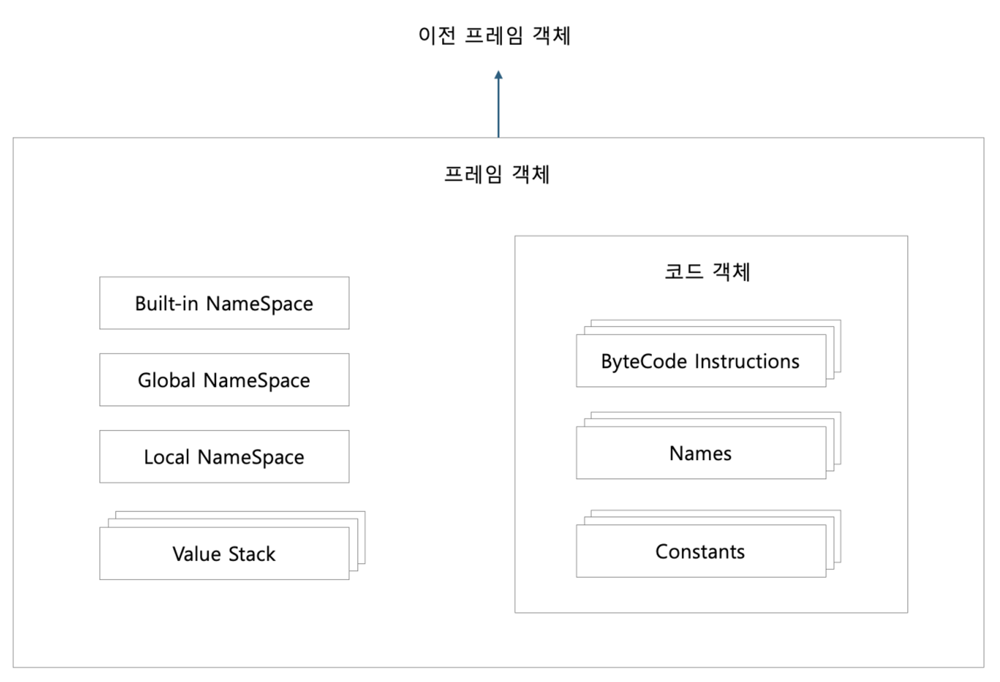
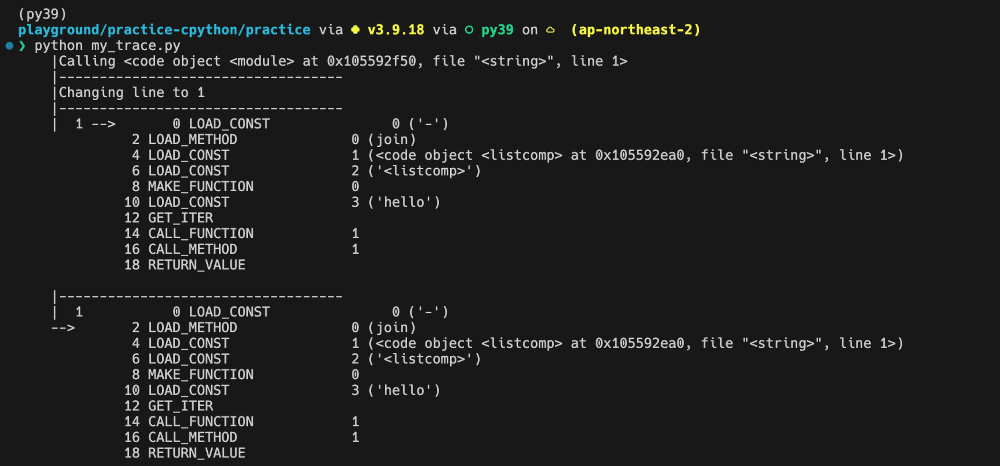

# 8. 평가 루프

- [평가 루프](#평가-루프)
  - [8.0 개요](#80-개요)
  - [8.1 스레드 상태 생성하기](#81-스레드-상태-생성하기)
  - [8.2 프레임 객체 생성하기](#82-프레임-객체-생성하기)
    - [프레임 객체 초기화 API](#프레임-객체-초기화-api)
  - [8.3 프레임 실행](#83-프레임-실행)
    - [프레임 실행 추적](#프레임-실행-추적)
  - [8.4 값 스택](#84-값-스택)
    - [값 스택 시뮬레이션: 바이트 코드 명령 예제, BINARY_OR](#값-스택-시뮬레이션-바이트코드-명령-예제-binary_or)
    - [바이트코드 예측](#바이트코드-예측)
  - [8.6 요약](#86-요약)


## 8.0 개요
지금까지는 파이썬으로 작성된 코드들을 파싱하여, 어떻게 구문 분석을 실시하고, 코드 객체로 컴파일 하는지에 대해 알아보았습니다.   
컴파일된 코드 객체는 바이트 코드로 표현된 연산 리스트를 포함하게 됩니다.  
이번 장에서는 값 스택 이라는 개념을 소개하는데,   
컴파일된 코드 객체의 바이트 코드 연산들은 값 스택에서 변수를 생성하고 변경하여 사용하게 됩니다.  
CPython 에서 코드는 **평가 루프** 라는 개념을 통해 루프(Loop)를 돌며 실행되게 됩니다.


<br/>

  

다음은 이번 장을 통해 살펴볼 개념들입니다.
<br/>

1. 평가 루프를 통해 코드 객체를 입력 받아, **프레임 객체**를 생성하게 되며,
2. 인터프리터는 최소 한개의 스레드를 가지게 됩니다.
3. 각 스레드는 스레드의 상태를 나타내는 **스레드 상태**를 가지게 되며,
4. 1번에서 만들어진 프레임 객체는 **각 스레드**에서 실행되게 됩니다.
5. 값 스택을 통해, 만들어진 변수를 참조할 수 있습니다.

<br/>
<br/>
<br/>


## 8.1 스레드 상태 생성하기
프레임을 실행하려면 스레드에 연결해야 합니다 (스레드에서 생성하기 떄문).   
인터프리터 상태에서 인터프리터는 스레드들을 연결 리스트의 형태로 스레드들을 관리하게 됩니다.

앞서 설명하였듯이, 스레드는 각자 고유의 스레드 상태를 가지게 되는데,  
스레드 상태를 나타내는 PyThreadState 가 그 상태를 나타내게 됩니다.


위의 PyThreadState는 _ts 의 별칭으로 사용되게 됩니다.   
코드를 살펴보게 되면, 고유 식별자, 다른 스레드 상태와 연결된 연결 리스트,  
인터프리터의 상태, 재귀 깊이 등을 나타내는 값들로 이루어져 있습니다.

<br/>

조금만 자세히 들여다보자면, 각 스레드는 스레드 상태(`PyThreadState`)를 가지게 되고,  
스레드 상태는 `PyInterpreterState` 내부에서 연결 리스트로 관리한다는 것을 알 수 있습니다.

``` c
/* Include/pystate.h */

/* struct _ts is defined in cpython/pystate.h */
typedef struct _ts PyThreadState;
/* struct _is is defined in internal/pycore_interp.h */
typedef struct _is PyInterpreterState;
```

<br>

``` c
/* Include/internal/pycore_interp.h */

// The PyInterpreterState typedef is in Include/pystate.h.
struct _is {

    struct _is *next;
    struct _ts *tstate_head;
    
    /* skip */
}
```

<br><br><br>


## 8.2 프레임 객체 생성하기
AST 를 거쳐 컴파일된 객체는 프레임 객체에 최종적으로 삽입되게 됩니다.   
파이썬 타입인 프레임 객체는 C 와 파이썬 코드 양쪽에서 참조할 수 있도록 설계되었습니다.

프레임 객체는 **코드 객체의 명령** 을 실행하는데 필요한 런타임 데이터를 포함하고,  
런타임 데이터에는 **전역 변수, 지역 변수, 내장 모듈 등**이 포함됩니다.
<br/>
<br/>
<br/>
다음은 프레임 타입 객체 PyFrameObject 가 가진 프로퍼티입니다.


<br>

다음은 프로퍼티를 가진 CPython 의 코드 입니다.


인터프리터에 의해 만들어진 `PyFrameObject`는 초기화 과정을 거치게 되는데,   
`PyEval_EvalCode()` 라는 함수 안에서 초기화 과정을 거치게 됩니다. 

<br/>


`_PyEval_EvalCode()` 함수를 따라 프레임에 대한 데이터들이 추가되고, 프레임이 해석되며, 코드가 실행되게 됩니다.

<br><br>

### 프레임 객체 초기화 API
프레임 객체를 초기화하는 API인 `PyEval_EvalCode()`는 코드 객체를 평가하기 위한 진입점입니다.  
 
`PyEval_EvalCode()`는 내부 함수` _PyEval_EvalCode()` 를 감싸는 Wrapper 함수입니다.   
`PyEval_EvalCode()`는 아래와 같은 호출 스택을 가집니다.

|호출 스택|
|:---:|
|`_PyEval_EvalCode`|
|`_PyEval_EvalCodeWithName`|
|`PyEval_EvalCodeEx`|
|`PyEval_EvalCode`|

<br>

`_PyEval_EvalCode()`는 인터프리터 루프와 프레임 객체 동작의 상당 부분을 정의합니다.  
`PyEval_EvalCode()`는 아래와 같으며 3개의 인자를 받습니다.

``` c 
/* Python/ceval.c */

PyObject *
PyEval_EvalCode(PyObject *co, PyObject *globals, PyObject *locals)
{
    return PyEval_EvalCodeEx(co,
                      globals, locals,
                      (PyObject **)NULL, 0,
                      (PyObject **)NULL, 0,
                      (PyObject **)NULL, 0,
                      NULL, NULL);
}
```
- `co` : 코드 객체
- `globals`, `locals` : 지역 및 전역 변수

<br>

`_PyEval_EvalCode()`는 다양한 인자를 받는다.

```c
/* Python/ceval.c */

_PyEval_EvalCode(PyThreadState *tstate,
           PyObject *_co, PyObject *globals, PyObject *locals,
           PyObject *const *args, Py_ssize_t argcount,
           PyObject *const *kwnames, PyObject *const *kwargs,
           Py_ssize_t kwcount, int kwstep,
           PyObject *const *defs, Py_ssize_t defcount,
           PyObject *kwdefs, PyObject *closure,
           PyObject *name, PyObject *qualname)
```

- `tstate` : 코드를 평가할 스레드의 상태를 나타냄 (PyThreadState*)
- `_co` : 프레임 객체에 삽입할 코드 객체 (PyCodeObject*)
- `globals` : 전역 변수, 변수명을 키로 사용 (PyObject*-dict)
- `locals` : 지역 변수, 변수명을 키로 사용 (PyObject*-dict)

위 4개의 인자를 제외한 인자는 선택 인자로 기본 API에서는 사용하지 않습니다.

<br>

여기까지 주요 흐름을 정리하자면 다음과 같습니다.  
1. 스레드 상태가 유효한지 확인한다.
2. 프레임 객체를 선언하고 그 반환값을 초기화하는 등 초기화 작업을 진행한다.
3. 프레임 객체를 생성한다.
    ``` c
    /* Python/ceval.c */

    PyObject *
    _PyEval_EvalCode(PyThreadState *tstate,
              PyObject *_co, PyObject *globals, PyObject *locals,
              PyObject *const *args, Py_ssize_t argcount,
              PyObject *const *kwnames, PyObject *const *kwargs,
              Py_ssize_t kwcount, int kwstep,
              PyObject *const *defs, Py_ssize_t defcount,
              PyObject *kwdefs, PyObject *closure,
              PyObject *name, PyObject *qualname)
    {
        /* skip */

        /* Create the frame */
        f = _PyFrame_New_NoTrack(tstate, co, globals, locals);
        if (f == NULL) {
            return NULL;
        }
        
        /* skip */
    }
    ```
4. 인자와 변수를 처리한다.
5. 제너레이터 객체와 코루틴 객체를 처리한다.
6. 프레임을 실행하고 결과를 저장한다.
7. 프레임 객체의 참조 수를 확인하고 관련 객체들을 해제한다.
8. 결과를 반환한다.


<br><br>

여기서 `_PyFrame_New_NoTrack()`에 조금만 자세히 알아보도록 합시다.
`_PyFrame_New_NoTrack()`는 `_PyEval_EvalCode()`의 기본 인자 4가지를 받습니다.

```c
/* Objects/frameobject.c */

PyFrameObject* _Py_HOT_FUNCTION
_PyFrame_New_NoTrack(PyThreadState *tstate, PyCodeObject *code,
                     PyObject *globals, PyObject *locals)
```

아래 과정을 통해 새로운 PyFrameObject를 생성하여 반환한다.
- 프레임의 f_back 프로퍼티를 스레드 상태의 마지막 프레임으로 설정한다.
- f_builtins 프로퍼티를 설정 → PyModule_GetDict() 로 builtins 모듈에서 내장 함
수들을 불러온다.
- f_code 프로퍼티에 평가 중인 코드 객체를 설정한다.
- f_valuestack 프로퍼티에 빈 값 스택을 설정한다.
- f_stackpop 에 f_valuestack 을 가리키는 포인터를 설정한다.
- 전역 이름 공간 프로퍼티인 f_globals 에 인자로 받은 globals 를 설정한다.
- 지역 이름 공간 프로퍼티인 f_locals 에 새 딕셔너리를 설정한다.
- TraceBack에 줄 번호를 표시하기 위해 f_lineno 를 코드 객체의 co_firstlineno 로 설
정한다.
- 나머지 프로퍼티는 기본값으로 설정한다.

<br><br>

위 과정을 모두 거쳐 생성된 프레임 객체(`PyFrameObject`)는 다음과 같습니다.  



<br>

|요소|설명|
|---|---|
|Built-in NameSpace|`len`, `print`와 같은 내장 함수 및 예외 등을 포함한다.|
|Global NameSpace|모듈 레벨에서 정의한 변수, 함수, 클래스 등을 포함한다.|
|Local NameSpace|함수나 메소드 호출에서 생성됨. 함수 내부에서 정의된 지역 변수를 포함한다.|
|Value Stack|코드의 실행 중 발생하는 연산을 위한 임시 저장소 역할을 한다. <br> 대부분의 연산들은 이 스택을 통해 수행된다.|
|Code Object|실행 가능한 ByteCode와 <br> 이와 관련된 메타데이터(파일 이름, 줄 번호 등)을 포함한다.|

<br>

|요소|설명|
|---|---|
|ByteCode Instructions|컴파일 후 생성된 ByteCode, 기계어 명령에 해당한다.|
|Names|함수, 변수, 클래스 등의 식별자를 포함하는 리스트이다. <br> 코드 실행 중 이름 참조 시 사용된다.|
|Constants|실행 중 변경되지 않는 값들을 포함함. <br> 코드 내에서 직접 사용되는 Literal 값을 의미한다. (숫자, 문자열, 튜플 등)|

<br>

아래 코드를 예시로 살펴봅시다.

```c
def sample():
    x = 5
    print(x)

    return 4.29
```
- `x`, `print`는 Names에 저장됩니다.
- `4.29`는 Constants에 저장됩니다.
- 해당 값들은 바이트코드에서 참조될 때, Names와 Constants에 저장된 인덱스를 통해 참조됩니다.

<br><br><br>

## 8.3 프레임 실행
6장 7장에서 살펴보았듯이, 코드 객체는 실행할 바이트 코드를   
이진 인코딩한 결과와 심벌 테이블, 변수 목록을 포함하게 됩니다.

그리고 변수가 지역인지 전역인지는   
함수나 모듈 또는 블록이 호출된 방법에 따라 런타임에 결정되는데,  
이 정보는 `_PyEval_EvalCode()`에 의해 프레임에 추가됩니다.  

`_PyEval_EvalFrameDefault()`는 **기본 프레임 평가 함수**이며,  
이 함수가 모든 것을 통합하는 역할을 수행합니다.

<br>

간단히 말해, 파이썬 프로그램이 실행될 때,   
각각의 코드 객체는 실행을 위해 ‘프레임’이라는 단위로 관리되고  
`_PyEval_EvalFrameDefault()`는 이러한 프레임들을 하나씩 받아서  
순차적으로 명령을 실행하게 됩니다.


<br><br>

### 프레임 실행 추적
Python 3.7 부터는 현재 쓰레드에서 추적 어트리뷰트를 활성화해서  
단계적으로 프레임을 실행할 수 있습니다.  

`PyFrameObject` 타입은 `PyObject *` 타입의 `f_trace` 프로퍼티를 가지는데,  
이 프로퍼티 값은 파이썬 함수를 가리키는 포인터입니다.  

아래 예제는 전역 추적 함수로 `my_trace()`를 설정해서  
현재 프레임에서 스택을 가져오고, 역어셈블된 명령 코드를 출력하며,   
디버깅을 위한 정보를 추가합니다.

``` python
import io
import sys
import dis
import traceback

def my_trace(frame, event, args):
	frame.f_trace_opcodes = True
	stack = traceback.extract_stack(frame)
	pad = "  "*len(stack) + "|"
	if event == 'opcode':
		with io.StringIO() as out:
			dis.disco(frame.f_code, frame.f_lasti, file=out)
			lines = out.getvalue().split('\\n')
			[print(f"{pad}{l}") for l in lines]
	elif event == 'call':
		print(f"{pad}Calling {frame.f_code}")
	elif event == 'return':
		print(f"{pad}Returning {args}")
	elif event == 'line':
		print(f"{pad}Changing line to {frame.f_lineno}")
	else:
		print(f"{pad}{frame} ({event} - {args})")
	print(f"{pad}-----------------------------------")
	return my_trace

sys.settrace(my_trace)

# 데모용 코드 실행
eval('"-".join([letter for letter in "hello"])')
```



<br>

`sys.settrace()`는 인자로 전달받은 함수를 현재 스레드 상태의 기본 추적 함수로 설정합니다.  
이 호출 이후 생성된 모든 새 프레임의 `f_trace`가 전달된 함수로 설정됩니다.

이 토막 코드는 각 스택에서 코드를 출력하고 실행 전에 다음 명령을 가리킵니다.  
> 전체 ByteCode 명령 목록은 dis 모듈 문서에서 찾을 수 있다.

``` python
import dis
dis.__dict__
... 
Copyright (c) 1991-1995 Stichting Mathematisch Centrum, Amsterdam.
All Rights Reserved., 'credits':     Thanks to CWI, CNRI, BeOpen.com, Zope Corporation and a cast of thousands
    for supporting Python development.  See www.python.org for more information., 'license': Type license() to see the full license text, 'help': Type help() for interactive help, or help(object) for help about object., '_': None}, 'sys': <module 'sys' (built-in)>, 'types': <module 'types' from '/Users/wooy0ng/miniconda3/envs/py39/lib/python3.9/types.py'>, 'collections': <module 'collections' from '/Users/wooy0ng/miniconda3/envs/py39/lib/python3.9/collections/__init__.py'>, 'io': <module 'io' from '/Users/wooy0ng/miniconda3/envs/py39/lib/python3.9/io.py'>, 'cmp_op': ('<', '<=', '==', '!=', '>', '>='), 'hasconst': [100], 'hasname': [90, 91, 95, 96, 97, 98, 101, 106, 108, 109, 116, 160], 'hasjrel': [93, 110, 122, 143, 154], 'hasjabs': [111, 112, 113, 114, 115, 121], 'haslocal': [124, 125, 126], 'hascompare': [107], 'hasfree': [135, 136, 137, 138, 148], 'opname': ['<0>', 'POP_TOP', 'ROT_TWO', 'ROT_THREE', 'DUP_TOP', 'DUP_TOP_TWO', 'ROT_FOUR', '<7>', '<8>', 'NOP', 'UNARY_POSITIVE', 'UNARY_NEGATIVE', 'UNARY_NOT', '<13>', '<14>', 'UNARY_INVERT', 'BINARY_MATRIX_MULTIPLY',
...
```


<br><br><br>

## 8.4 값 스택 
값 스택은 코어 평가 루프 안에서 생성되게 됩니다.   
이 스택은 PyObject 인스턴스를 가르키는 포인터가 들어있는 리스트입니다.   

값 스택의 포인터는 변수나 함수 참조 등   
어떠한 파이썬 객체라도 가르킬 수 있다는 특징이 있습니다.

> 평가루프에서 바이트코드 명령은 값 스택으로부터 입력을 취합니다.

<br/>

값 스택이라는 이름처럼 파이썬의 각 프레임 오브젝트 들은 스택처럼 값을 계산해나가면,  
PyFrameObject 들을 생성 소멸 해 나가면서   
각 명령 코드에 의해 스택 크기의 변화량을 반환합니다. 


<br><br>

### 값 스택 시뮬레이션 (바이트코드 명령 예제: BINARY_OR)
값 스택은 코어 평가 루프 안에서 생성됩니다.  
이 스택은 `PyObject` 인스턴스를 가리키는 포인터가 들어 있는 리스트입니다.  

값 스택의 포인터는 변수나 함수 참조 등 어떠한 파이썬 객체라도 가리킬 수 있습니다.  
평가 루프에서 ByteCode 명령은 값 스택으로부터 입력을 취합니다.

<br>

예를 들어 or 문을 사용한 파이썬 코드를 살펴보도록 합시다.

``` python
if left or right:
	pass
```
컴파일러는 이 `or` 문을 `BINARY_OR` 명령으로 컴파일합니다.

<br>

``` c
static int
binop(struct compiler *c, operator_ty op)
{
	switch (op) {
	case Add:
		return BINARY_ADD;
	...
	case BitOr:
		return BINARY_OR;
	}
}
```
평가 루프는 `BINARY_OR`일 경우에 값 스택에서 `left`와 `right` 두 개의 값을 꺼낸 후  
꺼낸 객체들을 인자로 `PyNumber_Or`를 호출합니다.

그 후 연산 결과인 `res`를 스택의 맨 위에 추가합니다.

``` c
	...
	case TARGET(BINARY_OR): {
		PyObject *right = POP();
		PyObject *left = TOP();
		PyObject *res = PyNumber_Or(left, right);
		Py_DECREF(left);
		Py_DECREF(right);
		SET_TOP(res);
		if (res == NULL)
			goto error;
		DISPATCH();
	}

```

<br><br>

### 바이트코드 예측
리스트 객체의 `append()` 메소드를 예로 들어보자.

``` python
my_list = []
my_list.append(obj)
```

앞의 예시에서 `obj`는 리스트 끝에 추가하려는 객체입니다.  
리스트 추가 연산은 다음 두 연산을 포함합니다.  

1. `LOAD_FAST`: `obj`를 프레임의 `locals`에서 값 스택의 맨 위로 올린다.
2. `LIST_APPEND`: 객체를 리스트에 추가한다.

<br>

여기에서 바이트코드 명령인 `LOAD_FAST`은 설명은 다음과 같습니다.

- **목적**: 지역 변수 `obj`를 값 스택의 맨 위로 로드한다.
- **과정**:
    1. `GETLOCAL()`을 사용하여 `obj`의 포인터를 얻는다.
    2. 언바운드 지역 변수 에러를 처리한다 (변수가 정의되지 않은 경우).
    3. 객체의 레퍼런스 카운터를 증가시킨다.
    4. 포인터를 값 스택에 푸시한다.
    5. `FAST_DISPATCH` 매크로를 통해 다음 명령으로 빠르게 이동한다.

다음은 `LOAD_FAST`를 처리하는 코드입니다.

``` c
// Python/ceval.c
	...
	case TARGET(LOAD_FAST): {
		PyObject *value = GETLOCAL(oparg);		// 1.
		if (value == NULL) {
			format_exc_check_arg(
				PyExc_UnboundLocalError,
				UNBOUNDLOCAL_ERROR_MSG,
				PyTuple_GetItem(co->co_varnames, oparg));
			goto error;						// 2.
		}
		Py_INCREF(value);				// 3.
		PUSH(value);					// 4.
		FAST_DISPATCH();				// 5.
	}
	...

```

<br>

`obj`에 대한 포인터를 값 스택의 맨 위에 추가하면 다음 명령인 `LIST_APPEND`가 실행됩니다.  
`LIST_APPEND`에 대한 설명은 다음과 같습니다.

- **목적**: 값 스택에서 객체를 꺼내 리스트의 끝에 추가한다.
- **과정**:
    1. 값 스택에서 객체의 포인터를 꺼낸다 (`POP()`).
    2. 리스트 객체의 포인터를 스택에서 가져온다 (`PEEK(oparg)`).
    3. `PyList_Append()` 함수를 호출하여 객체를 리스트에 추가한다.
    4. 예외 처리를 수행하고, 에러 발생 시 에러 처리 루틴으로 이동한다.
    5. `PREDICT(JUMP_ABSOLUTE)`를 통해 다음 예상 명령으로 빠르게 이동한다.

```c
...
        case TARGET(LIST_APPEND): {
            PyObject *v = POP();
            PyObject *list = PEEK(oparg);
            int err;
            err = PyList_Append(list, v);
            Py_DECREF(v);
            if (err != 0)
                goto error;
            PREDICT(JUMP_ABSOLUTE);   // <-- 예측에 성공한다면 goto 문으로 바뀜
            DISPATCH();
        }
...
```

`PREDICT`는 다음 명령이 `JUMP_ABNSOULTE`일 것이라고 예측하는 구문입니다.  
이 매크로는 바로 다음에 실행될 것이라고 예측되는  
연산의 `case` 문으로 점프하도록 컴파일러가 생성한 `goto` 문을 포함합니다.  

즉, CPU가 루프를 돌지 않고 예측한 명령으로 바로 점프할 수 있습니다.  

> 자주 함께 등장하는 명령 코드들에 대해서는 첫 번째 명령을 실행할 때 두 번째 명령을 함께 예측할 수 있습니다.   
예를 들어 COMPARE_OP 실행 후에는 POP_JUMP_IF_FALSE 또는 POP_JUMP_IF_TRUE가 실행되는 경우가 많습니다.  
> 
> 
> 명령 코드에 대한 통계를 수집하려면 2가지 선택지가 있습니다.  
> 
> 1. 예측을 활성화하고 일부 명령 코드가 조합된 것 처럼 결과를 해석한다.
> 2. 예측을 비활성화하고 각 명령 코드에 대한 실행 빈도 카운터가 독립적으로 갱신되도록 한다.
> 
> 계산된 `goto`를 사용할 수 있으면 `CPU`가 각 명령어 코드에 대해 별도의 분기 예측 정보를 기록할 수 있기 때문에 CPython 단에서 명령 코드 예측은 비활성화됩니다.
>

<br>

*※ 계산된 Goto*  
switch 문 내에서 각 case 라벨로 점프하는 대신  
goto문을 이용해서 점프하는 방식

<br>

*※ 명령 코드 예측 관련 코드 (Python/ceval.c)*

``` c
#define PREDICT_ID(op)          PRED_##op

#if defined(DYNAMIC_EXECUTION_PROFILE) || USE_COMPUTED_GOTOS
#define PREDICT(op)             if (0) goto PREDICT_ID(op)
#else
#define PREDICT(op) \\
    do { \\
        _Py_CODEUNIT word = *next_instr; \\
        opcode = _Py_OPCODE(word); \\
        if (opcode == op) { \\
            oparg = _Py_OPARG(word); \\
            next_instr++; \\
            goto PREDICT_ID(op); \\
        } \\
    } while(0)
#endif
```

- `opcode`: 다음 바이트코드
- `op`: 예측할 바이트 코드

<br>

다음에 바이트 코드가 예측한 바이트와 동일하다면  
`goto`문을 통해 코드의 실행 흐름을 바꾸는 방식입니다.

<br/>
<br/>
<br/>

## 8.6 요약
CPython 의 실행 중, 생성되는 파이썬 객체인 PyFrameObject 의 평가 루프에 대해서 알아보았으며,  
프레임이 어떻게 생성되고 소멸되는지 알아보는 장이었습니다.  

코어 평가 루프는 컴파일 된 파이썬 코드 그리고 그 기반이 되는 C 확장 모듈과 라이브러리,  
 시스템 호출간의 인터페이스로서, 그 중요성을 잘 설명해주는 챕터였습니다.