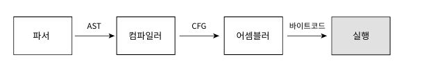
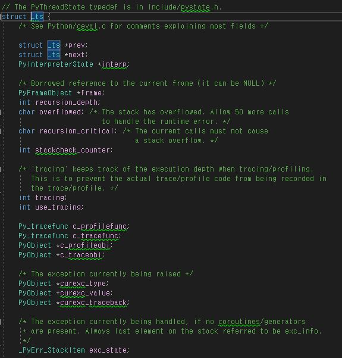
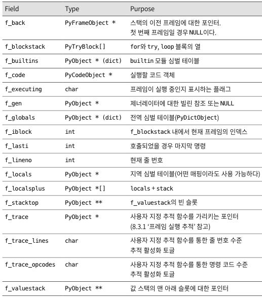

# 8. 평가 루프

- [평가 루프](#평가-루프)
  - [8.0 개요](#80-개요)
  - [8.1 스레드 상태 생성하기](#81-스레드-상태-생성하기)
  - [8.2 프레임 객체 생성하기](#82-프레임-객체-생성하기)
  - [8.3 프레임 실행](#83-프레임-실행)
  - [8.4 값 스택](#84-값-스택)
  - [8.6 요약](#86-요약)

## 8.0 개요
지금까지는 파이썬으로 작성된 코드들을 파싱하여, 어떻게 구문 분석을 실시하고, 코드 객체로 컴파일 하는지에 대해 알아보았습니다. 컴파일된 코드 객체는 바이트 코드로 표현된 연산 리스트를 포함하게 됩니다.
이번 장에서는 값 스택 이라는 개념을 소개하는데, 컴파일된 코드 객체의 바이트 코드 연산들은 값 스택에서, 변수를 생성하고 변경하여 사용하게 됩니다.
CPython 에서 코드는 **평가 루프** 라는 개념을 통해 루프(Loop)를 돌며 실행되게 됩니다.

 

  

다음은 이번 장을 통해 살펴볼 개념들입니다.
 

1. 평가 루프를 통해 코드 객체를 입력 받아, **프레임 객체**를 생성하게 되며,
2. 인터프리터는 최소 한개의 스레드를 가지게 됩니다.
3. 각 스레드는 스레드의 상태를 나타내는 **스레드 상태**를 가지게 되며,
4. 1번에서 만들어진 프레임 객체는 **각 스레드**에서 실행되게 됩니다.
5. 값 스택을 통해, 만들어진 변수를 참조할 수 있습니다.

 
 
 

## 8.1 스레드 상태 생성하기
프레임을 실행하려면 스레드에 연결해야 합니다.(스레드에서 생성하기 떄문). 인터프리터 상태에서 인터프리터는 스레드들을 연결 리스트의 형태로 스레드들을 관리하게 됩니다.

앞서 설명하였듯이, 스레드는 각자 고유의 스레드 상태를 가지게 되는데, 스레드 상태를 나타내는 PyThreadState 가 그 상태를 나타내게 됩니다.

위의 PyThreadState는 _ts 의 별칭으로 사용되게 됩니다. 코드를 살펴보게 되면, 고유 식별자, 다른 스레드 상태와 연결된 연결 리스트, 인터프리터의 상태, 재귀 깊이 등을 나타내는 값들로 이루어져 있습니다.

 
 
 

## 8.2 프레임 객체 생성하기
AST 를 거쳐 컴파일된 객체는 프레임 객체에 최종적으로 삽입되게 됩니다. 파이썬 타입인 프레임 객체는 C 와 파이썬 코드 양쪽에서 참조할 수 있도록 설계되었습니다. 프레임 객체는 **코드 객체의 명령** 을 실행하는데 필요한 런타임 데이터를 포함하고, 런타임 데이터에는 **전역 변수, 지역 변수, 내장 모듈 등**이 포함됩니다.
 
 
 
다음은 프레임 타입 객체 PyFrameObject 가 가진 프로퍼티입니다.

다음은 프로퍼티를 가진 CPython 의 코드 입니다.

인터프리터에 의해 만들어진 PyFrameObject 는 초기화 과정을 거치게 되는데, PyEval_EvalCode( ) 라는 함수 안에서 초기화 과정을 거치게 됩니다. 

 

 
 
 

## 8.3 프레임 실행
6장 7장에서 살펴보았듯이, 코드 객체는 실행할 바이트 코드를 이진 인코딩한 결과와 심벌 테이블, 변수 목록을 포함하게 됩니다. 변수가 지역인지 전역인지에 따라 함수나 모듈 또는 블록이 호출된 방법에 따라 런타임에 결정되게 됩니다.

_PyEval_EvalCode( ) 함수를 따라 프레임에 대한 데이터들이 추가되고, 프레임이 해석되며, 코드가 실행되게 됩니다.

 
 
 

## 8.4 값 스택 
값 스택은 코어 평가 루프 안에서 생성되게 됩니다. 이 스택은 PyObject 인스턴스를 가르키는 포인터가 들어있는 리스트입니다. 값 스택의 포인터는 변수나 함수 참조 등 어떠한 파이썬 객체라도 가르킬 수 있다는 특징이 있습니다.

 

값 스택이라는 이름처럼 파이썬의 각 프레임 오브젝트 들은 스택처럼 값을 계산해나가면, PyFrameObject 들을 생성 소멸 해 나가면, 각 명령 코드에 의해 스택 크기의 변화량을 반환합니다. 

 
 
 

## 8.6 요약
CPython 의 실행 중, 생성되는 파이썬 객체인 PyFrameObject 의 평가 루프에 대해서 알아보았으며, 프레임이 어떻게 생성되고 소멸되는지 알아보는 장이었습니다. 코어 평가 루프는 컴파일 된 파이썬 코드 그리고 그 기반이 되는 C 확장 모듈과 라이브러리, 시스템 호출간의 인터페이스로서, 그 중요성을 잘 설명해주는 챕터였습니다.