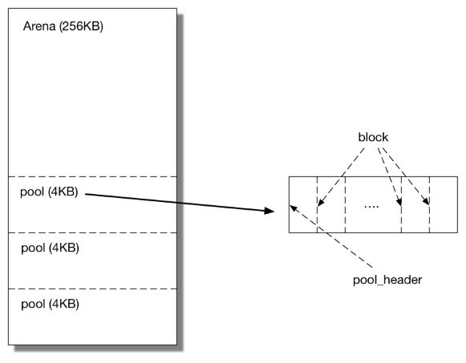
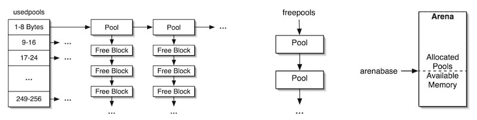

# 9. 메모리 관리

- [메모리 관리](#메모리-관리)
  - [9.0 개요](#90-개요)
  - [9.1 C 메모리 할당](#91-C-메모리-할당)
  - [9.2 파이썬 메모리 관리 시스템의 설계](#92-파이썬-메모리-관리-시스템의-설계)
  - [9.3 CPython 메모리 할당자 (pymalloc)](#93-CPython-메모리-할당자)
  
 

## 9.0 개요

동적 타입 언어인 CPython에서 메모리를 어떻게 할당 하고 해제하는지 그리고 메모리 누수를 관리 하는 방법에 대해서 알아 보겠습니다. 
 

## 9.1 C 메모리 할당

  

CPython을 구현하는 C 언어에서의 메모리 할당은 크게 3가지로 나뉩니다.

1. 정적 메모리 할당(Static) : 컴파일 시간에 필요한 메모리가 계산되고 프로그램이 실행될 때 할당  
2. 자동 메모리 할당(Stack)  : 함수 실행시에 스코프에 필요한 지역 변수가 콜 스택에 할당
3. 동적 메모리 할당(Heap)   : 런타임에 메모리를 동적으로 할당하며 제대로 반환하지 않으면 메모리 누수 발생
 

## 9.2 파이썬 메모리 관리 시스템의 설계

메모리 관점에서 파이썬 언어 설계의 특징

1. 변수의 크기를 컴파일 시간에 정할 수 없음
2. 코어 타입의 크기가 가변적임 (list, dict, int)
3. 타입이 달라도 같은 이름을 재사용 가능

파이썬 객체 메모리는 개발자가 직접 할당 하는 대신 파이썬 언어에서 제공하는 메모리 할당 API에 의해 자동으로 할당됩니다.

메모리 할당 API는 C언어의 동적 메모리 할당에 의존하여 개발되었으며 메모리 누수를 막기 위해 가비지 컬렉션과 참조 카운팅을 사용해 메모리를 자동으로 해제하는 안전장치가 추가되어 있습니다. 

  
[이미지 출처][link01]

[link01]: https://velog.io/@qlgks1/python-%EB%A9%94%EB%AA%A8%EB%A6%AC-%EA%B4%80%EB%A6%AC-memory-optimization

CPython은 세가지 동적 메모리 할당자 도메인을 제공합니다.  

1. PYMEM_DOMAIN_OBJ : 파이썬 객체 메모리 할당 
2. PYMEM_DOMAIN_MEM : 레거시 API용도 https://github.com/python/cpython/blob/89867d2491c0c3ef77bc237899b2f0762f43c03c/Objects/obmalloc.c#L94C32-L94C32
3. PYMEM_DOMAIN_RAW : 시스템 힙, 대용량 메모리, 비 객체 메모리 할당 

PYMEM_DOMAIN_MEM,PYMEM_DOMAIN_OBJ 할당자의 경우 기본 할당자로 pymalloc을 사용하며 GIL이 있는 상태에서 사용됩니다. PYMEM_DOMAIN_RAW의 경우에는 뮤텍스를 사용하여 스레드 안정성을 확보하며 malloc을 사용하여 시스템에서 직접 메모리를 할당 받습니다.

각 도메인은 _Alloc, _Calloc, _Realoc, _Free 인터페이스를 구현합니다.
 

## 9.3 CPython 메모리 할당자 (pymalloc)

CPython의 메모리 할당 요청은 일반적으로 아래 표와 같이 고정된 크기의 작은 메모리를 요구 합니다.

| CPython OBject  | Size |
|------|---|
| PyObject  | 16byte |
| PyASCIIObject  | 42byte |
| PyCompactUnicodeObject | 72byte |
| PyLongObject  | 32byte |

이러한 메모리 사용 패턴에서 메모리 할당을 위해 C언어의 malloc 및 free를 반복적으로 호출하는 경우 시스템 오버헤드를 발생 시키며 프로그램이 장기간 유지되는 경우 메모리 파편화를 유발 할 수 있습니다. 

CPython의 메모리 할당자는 시스템 할당자 위에 구축되어 있지만 CPython에 특화 되어 있습니다. 
메모리 할당 알고리즘은 아레나/풀/블록 으로 계층화된 구조로 메모리를 할당 합니다.

 1. 아레나(Arena)
    - 가장 큰 단위의 메모리 그룹 
    - 256KB 단위로 할당
    - 시스템 페이지 크기에 맞춰 정렬
    - 시스템 힙에 할당
    - 익명 메모리 매핑을 지원 하는 시스템에서 mmap()로 할당
    - 아레나들은 이중 연결 리스트로 연결 되어 있음
    
  
[이미지 출처][link02]

[link02]: https://fanchao01.github.io/blog/2016/10/09/python-obmalloc/
 
 2. 풀(Pool)
    - 메모리 풀에는 같은 크기의 블록들이 저장
    - 풀에 담을 수 있는 블록의 최대 크기는 512byte
    - 풀의 크기는 4096byte(=4KB)로 고정
    - 아레나당 풀 개수도 64개로 고정 (64*4KB = 256KB)
    - 같은 단위를 가지는 풀들은 풀 테이블(이중 연결 리스트)로 연결
    - 풀 테이블은 크기 인덱스 i로 분할
        - 인덱스가 i 일 때 usedpools[i+i]는 크기 단위가 i 인 사용 중인 풀 리스트의 헤더를 가리킴
        - 풀이 포화 상태가 되면 usedpools 리스트에서 제거
        - 풀에 있는 블록이 할당 해제되면 다시 usedpools[] 리스트 맨 앞에 배치되어 다음 할당 요청에 사용
        - 풀의 모든 블록이 할당 해제되면 usedpools 리스트에서 제거되고 freepools 맨 앞으로 이동
    - 풀의 상태
        - 포화 : 모든 블록 할당
        - 사용중 : 일부 블록 할당
        - 미사용 : 풀은 할당 되었지만, 블록은 미 할당
        
  
[이미지 출처][link03]

[link03]: https://www.blog.subhashkumar.in/posts/python-memory-management/

    
  3. 블록(Block)
     - 풀 내부에서 메모리는 블록 단위로 할당 
     - 블록은 고정 크기로 할당, 해제
     - 사용되지 않은 블록은 풀 내부의 freeblock 에 연결
     - 할당 해제된 블록은 freeblock 맨 앞에 연결
     - 풀이 초기화 되면 첫 두 블록은 freeblock 리스트에 연결
     - 블록 할당 과정
         - 인덱스 설정
             - 32bit 시스템에서는 블록 크기가 8byte 단위로 증가하므로 64가지 블록 크기 사용 가능
             - 64bit 시스템에서는 블록 크기가 16byte 단위로 증가하므로 32가지 블록 크기 사용 가능         
             - 할당 요청된 크기에 따라 적합한 크기 인덱스가 결정
             - 할당 요청이 0<x≤512 인 경우 크기 인덱스는 다음과 같이 정의
                 - 32bit 시스템 : $i = ceil(x/8) - 1$
                 - 64bit 시스템 : $i = ceil(x / 16) - 1$
             - 인덱스에 따라 크기에 맞는 풀이 할당 대상으로 결정
        - 풀 확인
             - 할당 가능한 풀이 있는 지 확인하고 사용되지 않은 블록 사용
             - 사용 가능한 풀이 없으면 새 풀을 생성하고 새 풀의 첫 블록을 반환  
